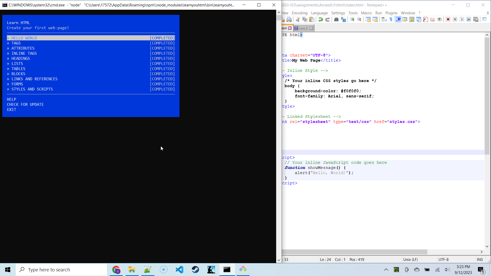
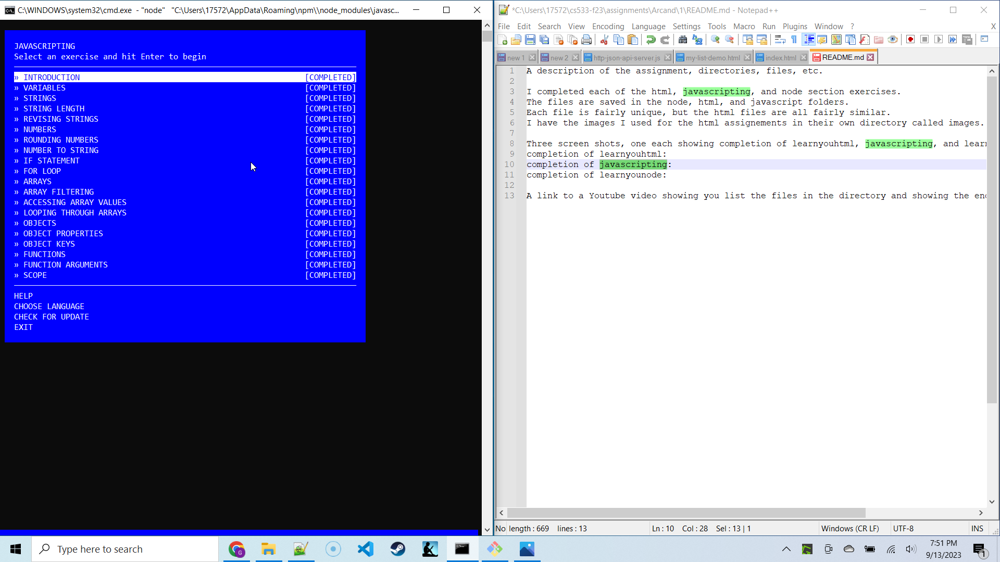
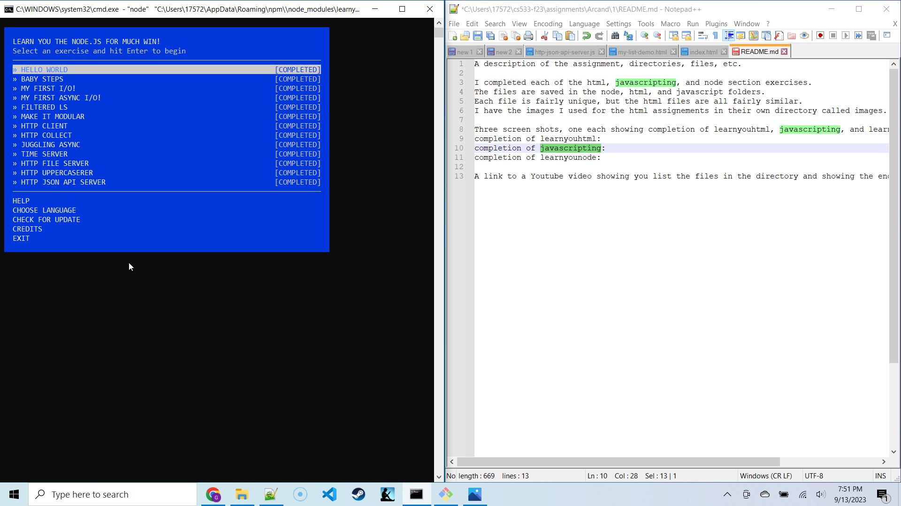

A description of the assignment, directories, files, etc.

I completed each of the html, javascripting, and node section exercises.
The files are saved in the node, html, and javascript folders.
Each file is fairly unique, but the html files are all fairly similar.
I have the images I used for the html assignements in their own directory called images.

Three screen shots, one each showing completion of learnyouhtml, javascripting, and learnyounode.
completion of learnyouhtml: https://drive.google.com/file/d/1pGwLO_qLdpcwhvkLPCQqVyGxISzOHjZH/view?usp=drive_link
completion of javascripting:https://drive.google.com/file/d/1eqh7X5pX37Mb_jFe1IuS5ii48vYXZgPd/view?usp=drive_link
completion of learnyounode: https://drive.google.com/file/d/18EisBEPFAqOAA1fcJC4GKc--YByd6vrH/view?usp=drive_link

A link to a Youtube video showing you list the files in the directory and showing the end screen for each workshop.
https://youtu.be/qpjb88yZsg0