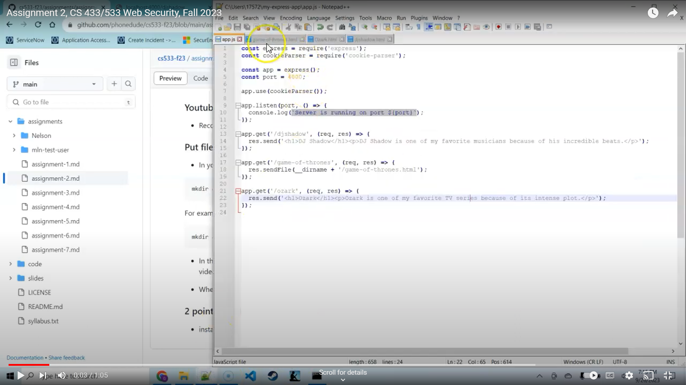
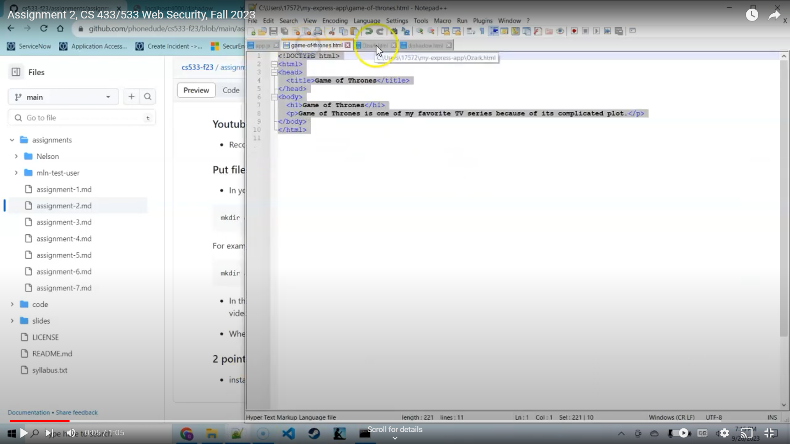
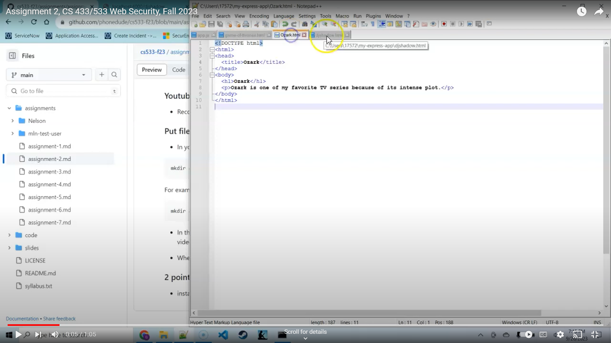
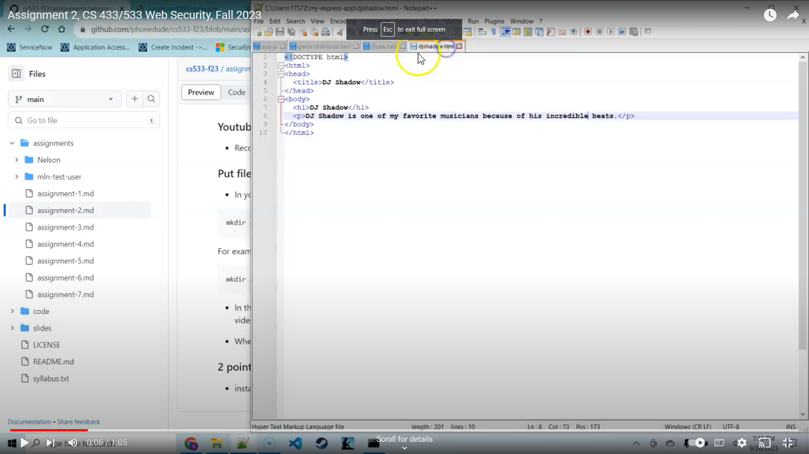
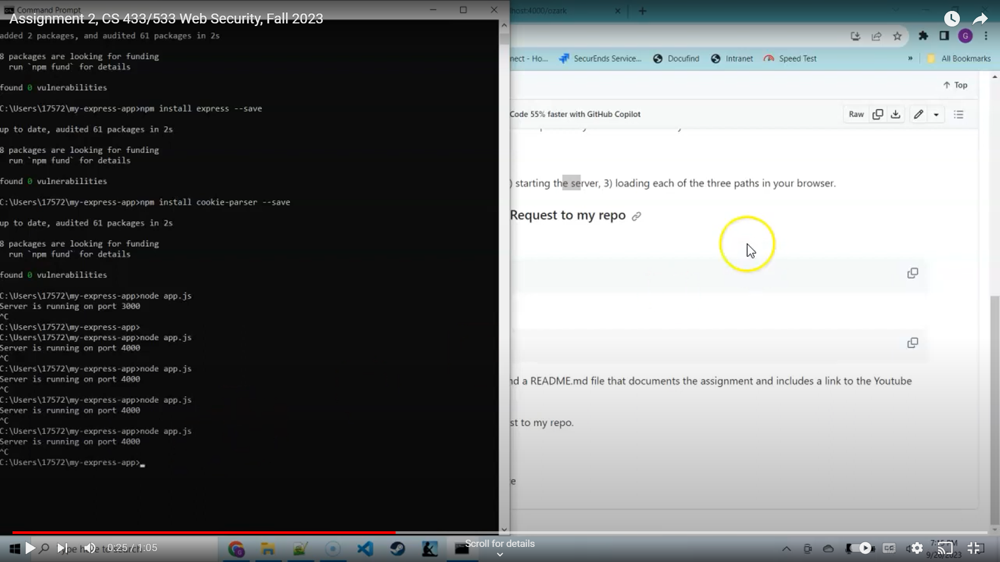
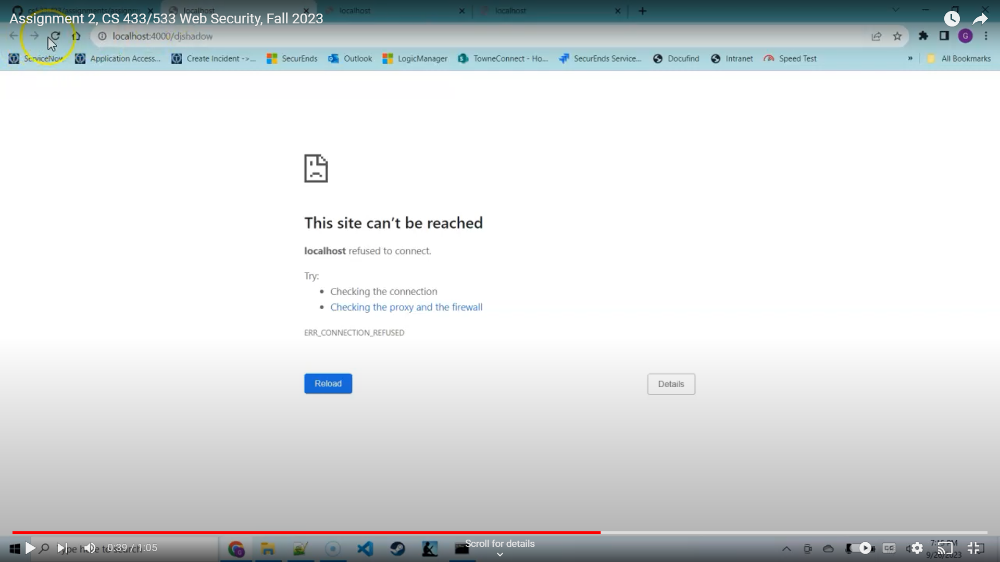
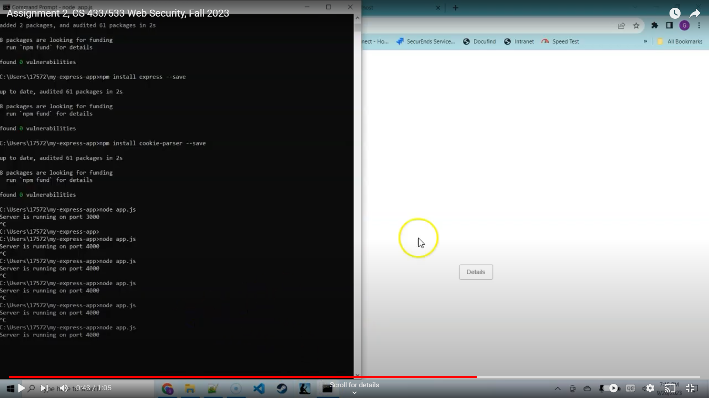
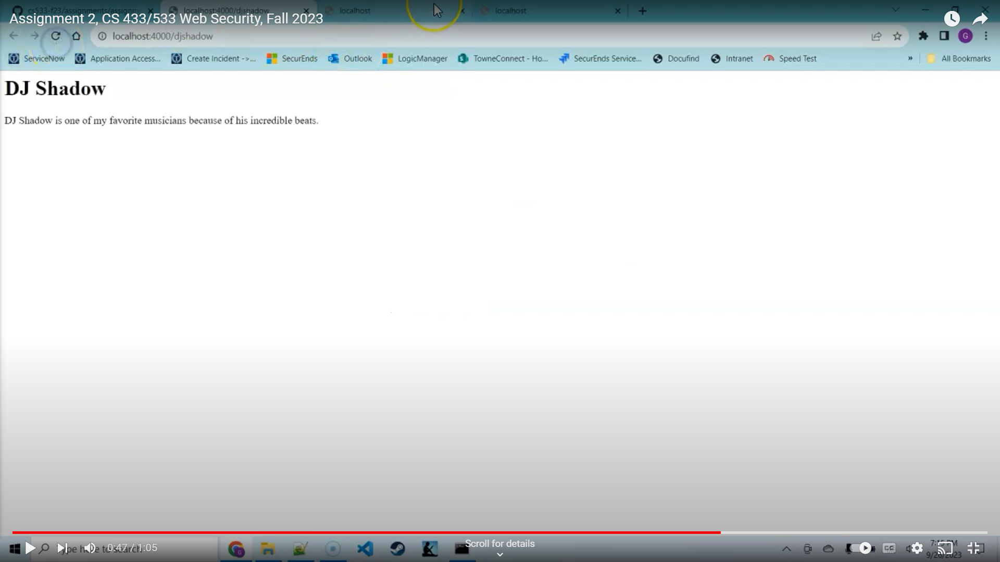
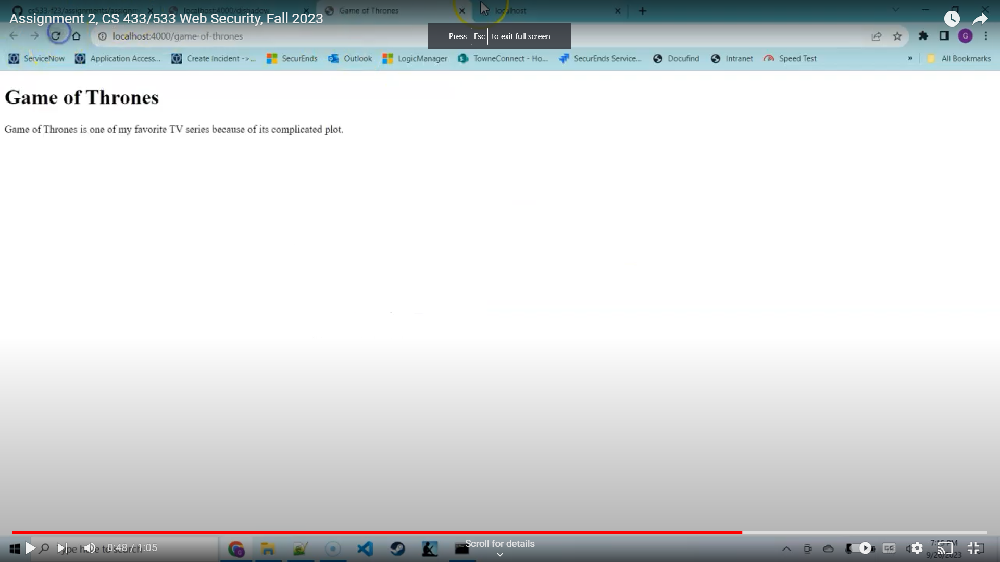
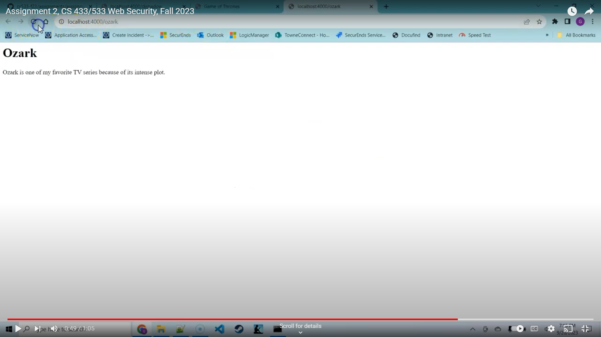

Assignment Description:

Installed node.js, express, and cookie-parser on my local machine.

Set up and ran a server on my local machine
Installed three "paths" on my server, with each path corresponding to a favorite artist, musician, film, or TV series.
My paths were:
localhost:4000/djshadow.html
localhost:4000/game-of-thrones.html
localhost:4000/Ozark.html

The files are saved in the Arcand\2 folder.
The main file is fairly unique, but the html files are all fairly similar.

A link to a Youtube video showing me recording my screen of me 1) viewing the files, 2) starting the server, 3) loading each of the three paths in my browser.
https://www.youtube.com/watch?v=srhbWgJHgXM

Images that document the behavior of the assignment:

Viewing the files

Starting the server

Loading each of the three paths in my browser

