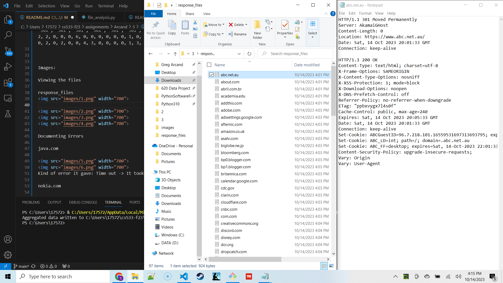
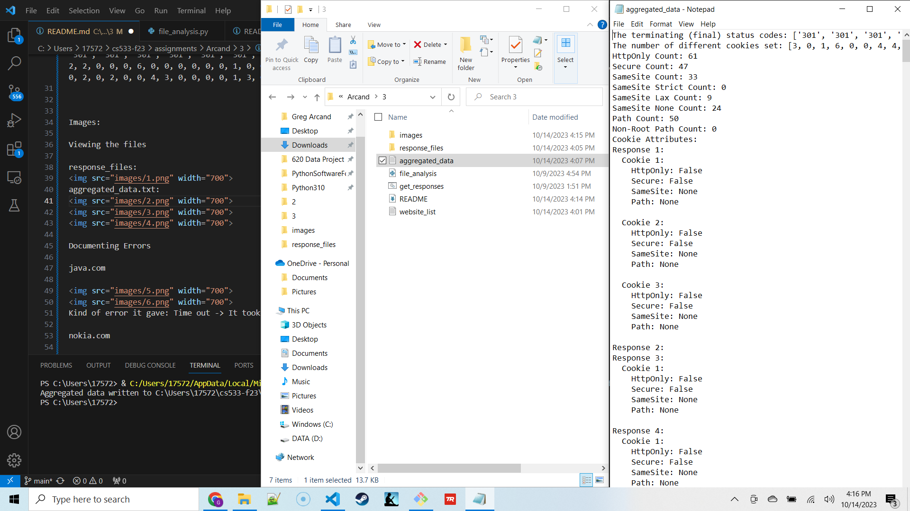
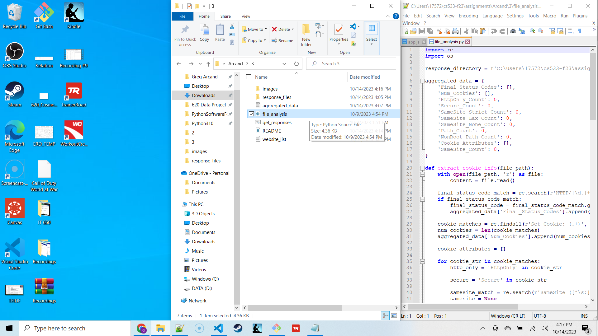
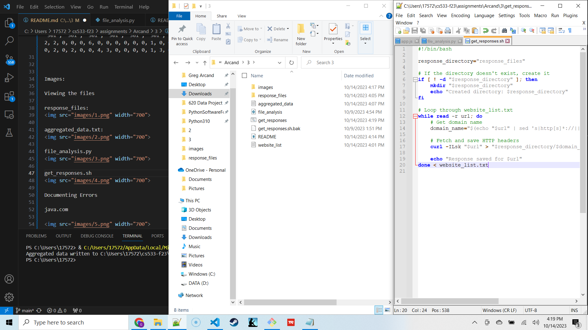
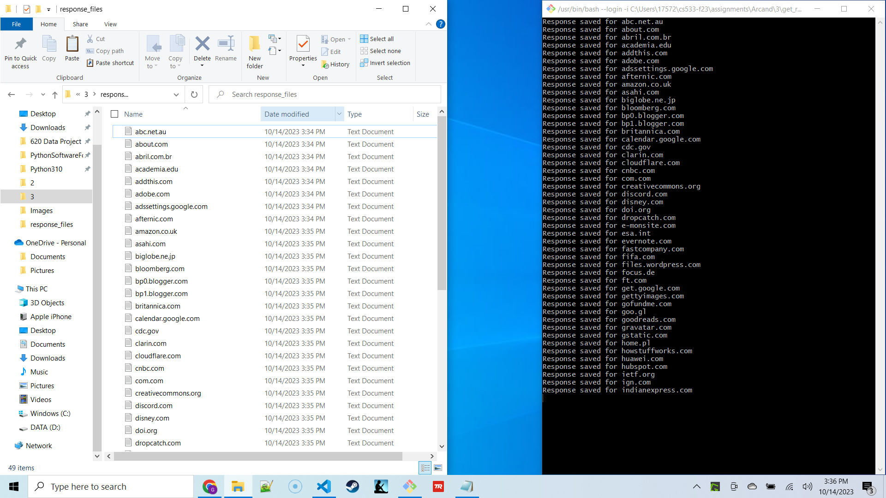
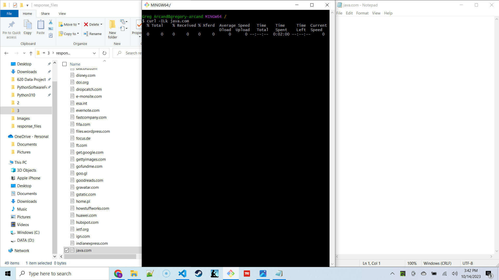
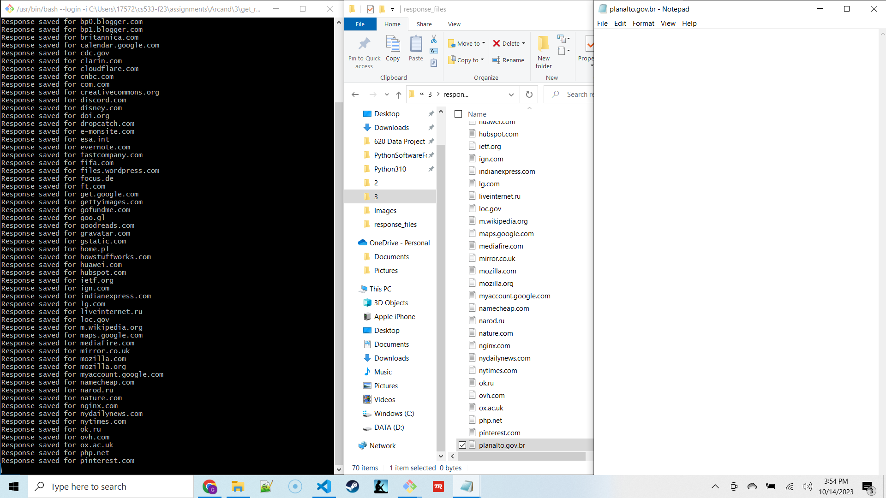
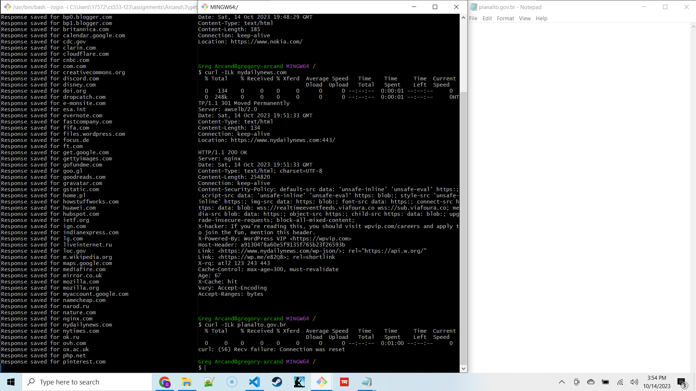

Assignment Description:

I created a README.md report containing a comprehensive table summarizing the cookie practices of the 100 unique, random websites from Mozilla's Top 500 Sites I was assigned. The report includes the following information for each website:

The terminating status codes
The number of cookies set
The HttpOnly, Secure, SameSite (along with the policy), and Path (and its value) cookie attributes.

It also answers the following questions.

How many cookies among the 100 sites set HttpOnly?
How many cookies among the 100 sites set Secure?
How many cookies among the 100 sites set SameSite? Among those that set SameSite, how many are Strict, Lax, and None?
How many cookies among the 100 sites set a Path? How many of those have values other than "/"?

Lastly, I have also provided the Min/Max/Mean/Median number of cookies set across the 100 sites.

The files are saved in the Arcand\3 folder.
aggregated_data.txt is the aggregation of all of the response files created by running get_responses.sh on website_list.txt.
I then ran file_analysis.py on the response files to create aggregated_data.txt.
file_analysis.py parses through the response files to create aggregated_data.txt.
get_responses.sh creates the response files.
The README.md helps explain the assignment and provide documentation.
website_list.txt is a list of the 100 unique, random websites from Mozilla's Top 500 Sites I was assigned excluding sites that give errors.

Here is my table.

| Termination Status Codes | For each site, the number of different cookies that are set. | How many cookies set HttpOnly? | How many cookies set Secure? | How many cookies set SameSite? | How many are Strict? | How many are Lax? | How many are None? | How many cookies set a Path? | How many of those are values other than "/"? | Min number of cookies | Max number of cookies | Mean number of cookies | Median number of cookies |
|--------------------------|-----------------------|------------------------|---------------------|----------------------|----------------|-------------|--------------|--------------------|--------------------------|-------------|-------------|--------------|---------------|
| ['301', '301', '301', '301', '301', '301', '301', '301', '301', '301', '200', '301', '400', '400', '301', '200', '302', '301', '301', '503', '200', '302', '301', '301', '301', '301', '301', '301', '301', '301', '301', '301', '301', '301', '301', '301', '301', '301', '301', '301', '301', '301', '301', '301', '301', '301', '302', '301', '301', '301', '301', '301', '302', '301', '301', '301', '301', '301', '301', '301', '301', '301', '301', '301', '200', '301', '301', '301', '308', '302', '301', '301', '301', '301', '301', '302', '301', '301', '301', '301', '301', '301', '301', '301', '301', '301', '418', '418', '301', '301', '301', '301', '301', '301', '301'] | [3, 0, 1, 6, 0, 0, 4, 4, 0, 0, 0, 1, 0, 0, 0, 1, 3, 2, 2, 0, 0, 0, 6, 0, 0, 0, 0, 0, 0, 1, 0, 0, 0, 1, 3, 0, 4, 0, 3, 0, 0, 0, 0, 0, 3, 0, 1, 0, 0, 0, 0, 0, 5, 3, 3, 0, 0, 3, 3, 0, 4, 0, 0, 7, 3, 0, 0, 2, 0, 4, 0, 0, 0, 0, 0, 3, 3, 0, 2, 0, 2, 0, 0, 4, 3, 0, 0, 0, 0, 1, 3, 0, 3, 6, 0, 1, 12] | 61 | 47 | 33 | 0 | 9 | 24 | 50 | 0 | 0 | 12 | 1.3 | 0 |

Mapping the terminating response codes to sites

| Website                        | Response Code |
| ------------------------------- | ------------- |
| abc.net.au                     | 301           |
| about.com                      | 301           |
| abril.com.br                   | 301           |
| academia.edu                   | 301           |
| addthis.com                    | 301           |
| adobe.com                      | 301           |
| adssettings.google.com         | 301           |
| afternic.com                   | 301           |
| amazon.co.uk                   | 301           |
| asahi.com                      | 301           |
| biglobe.ne.jp                  | 200           |
| bloomberg.com                  | 301           |
| bp0.blogger.com                | 400           |
| bp1.blogger.com                | 400           |
| britannica.com                 | 301           |
| calendar.google.com            | 200           |
| cdc.gov                        | 302           |
| clarin.com                     | 301           |
| cloudflare.com                 | 301           |
| cnbc.com                       | 503           |
| com.com                        | 200           |
| creativecommons.org            | 302           |
| discord.com                    | 301           |
| disney.com                     | 301           |
| doi.org                        | 301           |
| dropcatch.com                  | 301           |
| e-monsite.com                  | 301           |
| esa.int                        | 301           |
| evernote.com                   | 301           |
| fastcompany.com                | 301           |
| fifa.com                       | 301           |
| files.wordpress.com            | 301           |
| focus.de                       | 301           |
| ft.com                         | 301           |
| get.google.com                 | 301           |
| gettyimages.com                | 301           |
| gofundme.com                   | 301           |
| goo.gl                         | 301           |
| goodreads.com                  | 301           |
| gravatar.com                   | 301           |
| gstatic.com                    | 301           |
| home.pl                        | 301           |
| howstuffworks.com              | 301           |
| huawei.com                     | 301           |
| hubspot.com                    | 301           |
| ietf.org                       | 301           |
| ign.com                        | 302           |
| indianexpress.com              | 301           |
| lg.com                         | 301           |
| liveinternet.ru                | 301           |
| loc.gov                        | 301           |
| m.wikipedia.org                | 301           |
| maps.google.com                | 302           |
| mediafire.com                  | 301           |
| mirror.co.uk                   | 301           |
| mozilla.com                    | 301           |
| mozilla.org                    | 301           |
| myaccount.google.com           | 301           |
| namecheap.com                  | 301           |
| narod.ru                       | 301           |
| nature.com                     | 301           |
| nginx.com                      | 301           |
| nydailynews.com                | 301           |
| nytimes.com                    | 301           |
| ok.ru                         | 200           |
| ovh.com                        | 301           |
| ox.ac.uk                       | 301           |
| php.net                        | 301           |
| pinterest.com                  | 308           |
| play.google.com                | 302           |
| plus.google.com                | 301           |
| pt.wikipedia.org               | 301           |
| reg.ru                        | 301           |
| ru.wikipedia.org               | 301           |
| sakura.ne.jp                   | 301           |
| sky.com                        | 302           |
| slideshare.net                 | 301           |
| soundcloud.com                 | 301           |
| springer.com                   | 301           |
| ssl-images-amazon.com          | 301           |
| support.google.com             | 301           |
| t.co                          | 301           |
| techcrunch.com                 | 301           |
| ted.com                       | 301           |
| themeforest.net                | 301           |
| twitter.com                    | 301           |
| uol.com.br                     | 418           |
| vk.com                        | No Terminating Response Code: Details:C:\Users\17572\cs533-f23\assignments\Arcand\4>curl -ILk vk.com HTTP/1.1 418 Server: kittenx Date: Mon, 16 Oct 2023 18:39:28 GMT Content-Length: 0 Connection: keep alive X-Frontend: front224006 Access-Control-Expose-Headers: X-Frontend |
| vkontakte.ru                   | 301           |
| wa.me                         | 301           |
| wikihow.com                    | 301           |
| www.wix.com                   | 301           |
| yadi.sk                       | 301           |
| youtu.be                      | 301           |
| ytimg.com                     | 301           |
| zendesk.com                   | No Terminating Response Code: Details:C:\Users\17572\cs533-f23\assignments\Arcand\4>curl -ILk zendesk.com HTTP/1.1 301 Moved Permanently Server: nginx Date: Mon, 16 Oct 2023 18:37:16 GMT Content-Type: text/html Content-Length: 162 Connection: keep-alive Location: https://www.zendesk.com/ X-Zendesk-Zorg: yes X-Request-ID: bee6e8b1606edec2a1b44fe230cf0e35  HTTP/1.1 403 Forbidden Date: Mon, 16 Oct 2023 18:37:16 GMT Content-Type: text/html; charset=UTF-8 Content-Length: 4542 Connection: keep-alive X-Frame-Options: SAMEORIGIN Referrer-Policy: same-origin Cache-Control: max-age=15 Expires: Mon, 16 Oct 2023 18:37:31 GMT Set-Cookie: __cf_bm=WPaVuOXqTsrpoLs.Djj_LLucdhpNnYMozdiOdMu7fIw-1697481436-0-AeOOx2nWLakgFZSHzXNXPmhqt7+hTdaRBGL/RCBKUn9ABVB42lyBFp/OL+iu+KGMO1M4ULZnBL16uj8ImW7zwQg=; path=/; expires=Mon, 16-Oct-23 19:07:16 GMT; domain=.www.zendesk.com; HttpOnly; Secure; SameSite=None Strict-Transport-Security: max-age=0; preload Server: cloudflare CF-RAY: 817269851d4a1771-IAD |
| zoom.us                       | No Terminating Response Code: Details:C:\Users\17572\cs533-f23\assignments\Arcand\4>curl -ILk zoom.com HTTP/1.1 307 Temporary Redirect Server: zoom Date: Mon, 16 Oct 2023 18:32:02 GMT Content-Type: text/html Content-Length: 163 Connection: keep-alive Location: https://zoom.us/  HTTP/1.1 200 OK Date: Mon, 16 Oct 2023 18:32:02 GMT Content-Type: text/html;charset=utf-8 Connection: keep-alive x-zm-trackingid: v=2.0;clid=aw1;rid=WEB_b20d12b4fd9aa544d3305bbbe5477018 x-content-type-options: nosniff content-security-policy: upgrade-insecure-requests; default-src https://*.zoom.us https://zoom.us blob: 'self'; img-src https: about: blob: data: 'self'; style-src https: safari-extension: chrome-extension: 'unsafe-inline' data: 'self'; font-src https: safari-extension: chrome-extension: blob: data: 'self'; connect-src * about: blob: data: 'self'; media-src * rtmp: blob: data: 'self'; frame-src https: ms-appx-web: zoommtg: zoomus: wvjbscheme: zoomprc: data: blob: 'self'; object-src 'none'; base-uri 'none';script-src 'self' 'strict-dynamic' 'nonce-1GG6si3WQM2my2ImTOifwg' 'unsafe-inline' blob: https:; x-frame-options: SAMEORIGIN set-cookie: zm_aid=; Max-Age=0; Expires=Thu, 01 Jan 1970 00:00:10 GMT; Domain=zoom.us; Path=/; Secure; HttpOnly x-zm-zoneid: VA content-language: en-US strict-transport-security: max-age=31536000; includeSubDomains x-xss-protection: 1; mode=block referrer-policy: strict-origin-when-cross-origin Cache-Control: private, max-age=0 CF-Cache-Status: DYNAMIC Set-Cookie: zm_haid=; Max-Age=0; Expires=Thu, 01 Jan 1970 00:00:10 GMT; Domain=zoom.us; Path=/; Secure; HttpOnly Set-Cookie: zm_tmaid=; Max-Age=0; Expires=Thu, 01 Jan 1970 00:00:10 GMT; Domain=zoom.us; Path=/; Secure; HttpOnly Set-Cookie: zm_htmaid=; Max-Age=0; Expires=Thu, 01 Jan 1970 00:00:10 GMT; Domain=zoom.us; Path=/; Secure; HttpOnly Set-Cookie: cred=F8BB807F4D9B6039C95339E243014BCF; Path=/; Secure; HttpOnly Set-Cookie: _zm_page_auth=aw1_c_4kHYn2wKTcmy_Kez5-ol5g; Domain=zoom.us; Path=/; Secure; HttpOnly Set-Cookie: _zm_ssid=aw1_c_K-xVIY6RTducrbU8ONGH-w; Domain=zoom.us; Path=/; Secure; HttpOnly Set-Cookie: _zm_mtk_guid=f70a9a75da924c6180b712e965f5262c; Max-Age=63072000; Expires=Wed, 15 Oct 2025 18:32:02 GMT; Domain=zoom.us; Path=/; Secure Set-Cookie: _zm_csp_script_nonce=1GG6si3WQM2my2ImTOifwg; Domain=zoom.us; Path=/; Secure; HttpOnly Set-Cookie: _zm_currency=USD; Max-Age=86400; Expires=Tue, 17 Oct 2023 18:32:02 GMT; Domain=zoom.us; Path=/; Secure Set-Cookie: _zm_visitor_guid=f70a9a75da924c6180b712e965f5262c; Max-Age=31536000; Expires=Tue, 15 Oct 2024 18:32:02 GMT; Domain=zoom.us; Path=/; Secure Set-Cookie: __cf_bm=8ag5629z16dlQn6NBVwfibUwPp66IcXk4lGAeG6MRB4-1697481122-0-AUejeJw39dN8WrpwP0UkMFcsNKIIFomf1ZvWz5M2fwUlP1wvf5QavcY3hluu7zfkH2k0qiMJy8PIXKRQA6jB8cA=; path=/; expires=Mon, 16-Oct-23 19:02:02 GMT; domain=.zoom.us; HttpOnly; Secure; SameSite=None Report-To: {"endpoints":[{"url":"https:\/\/a.nel.cloudflare.com\/report\/v3?s=zZHQnf4mLiOzjRBHvQlndmCubgD5mhk8VL26SqNiMtYKQul9dMjlrl9x4ZqkWsKpaE6i0qxzWFP30LEPqcJlQNxhmNDepM2dOm8RMMjOgy1Le4ZGqGATWN5BNA7eKGkVEmabQGg%3D"}],"group":"cf-nel","max_age":604800} NEL: {"success_fraction":0.01,"report_to":"cf-nel","max_age":604800} Server: cloudflare CF-RAY: 817261d6dbab9c88-IAD alt-svc: h3=":443"; ma=86400 |

Images:

Viewing the files

response_files:

aggregated_data.txt:

file_analysis.py

get_responses.sh

Sites that give errors are not included in my numerical reporting.
Separate list of sites that give errors:

java.com

Kind of error it gave: Time out -> It took longer than 60 seconds to load.

nokia.com

Kind of error it gave: Time out -> It took longer than 60 seconds to load.

planalto.gov.br

Kind of error it gave: Connection reset -> Connection Reset (curl: (56) Recv failure: Connection was reset).