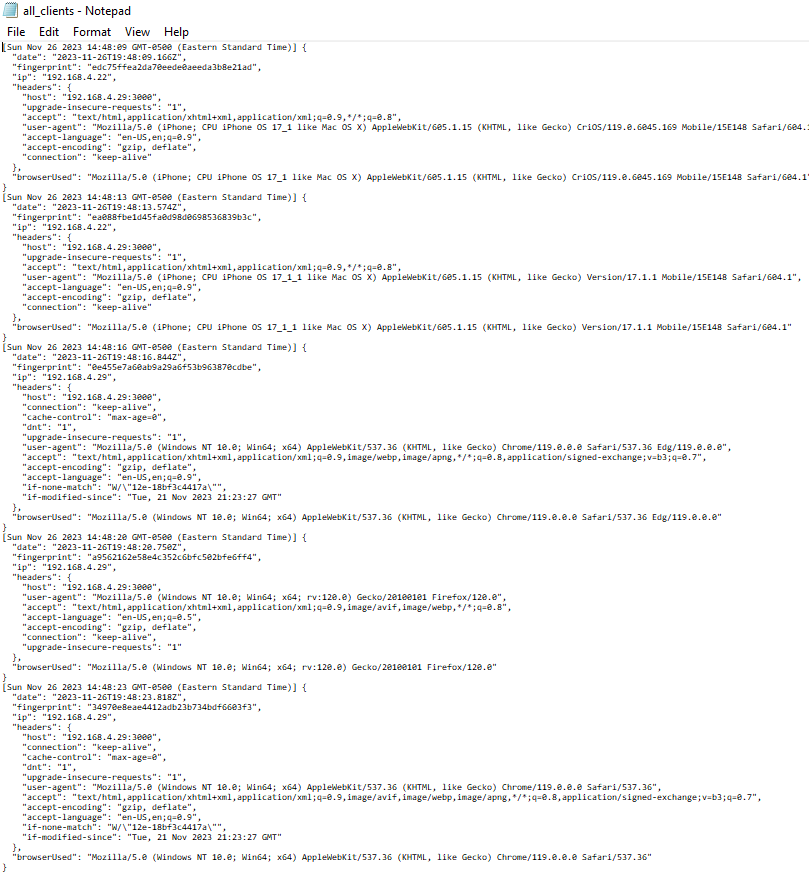
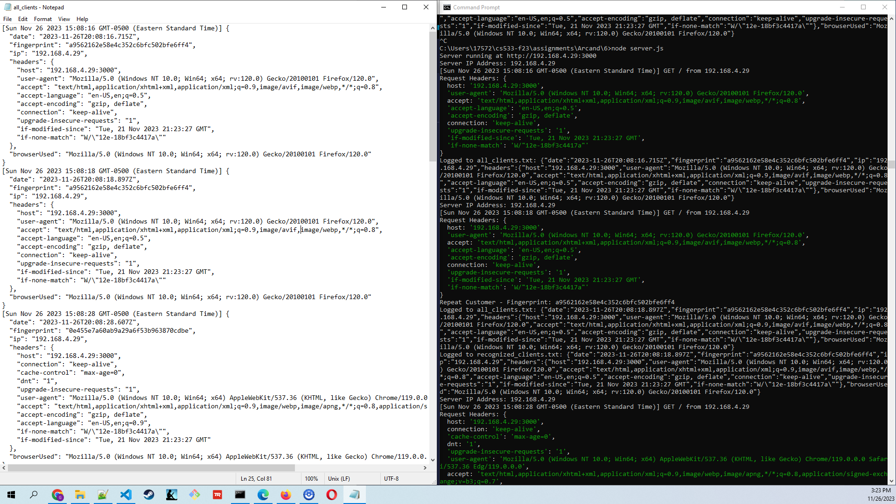
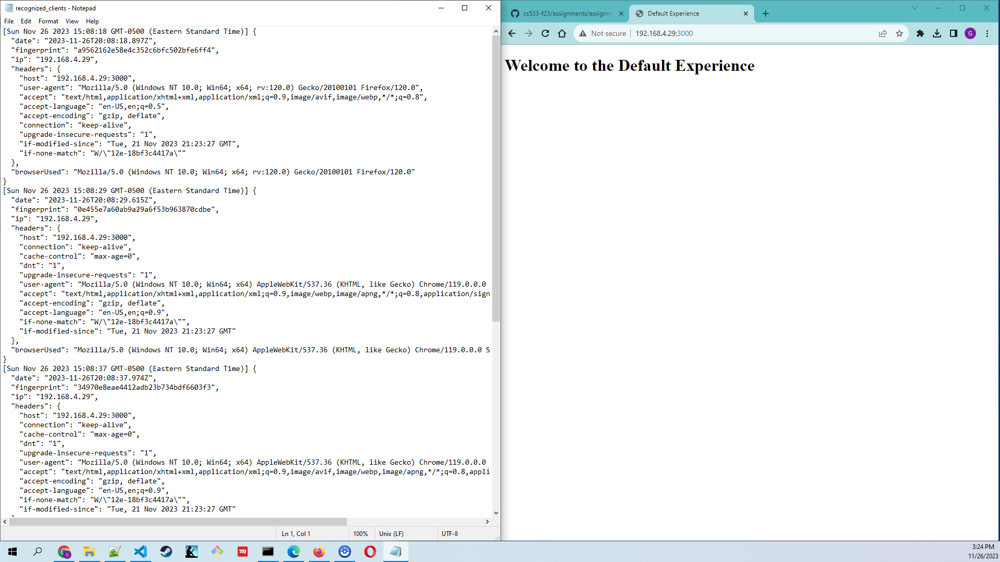
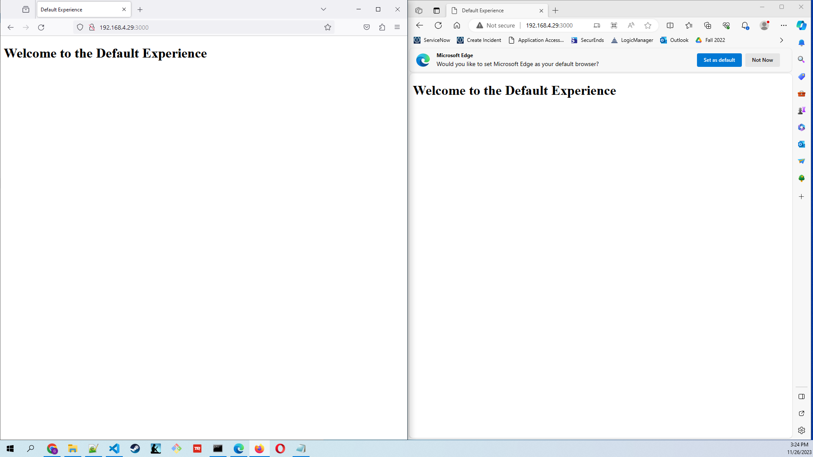
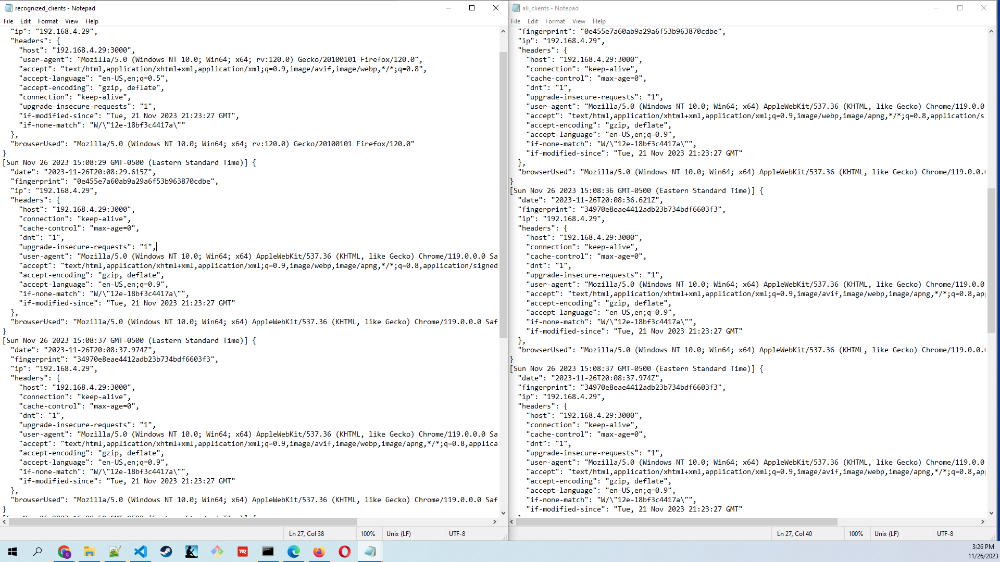
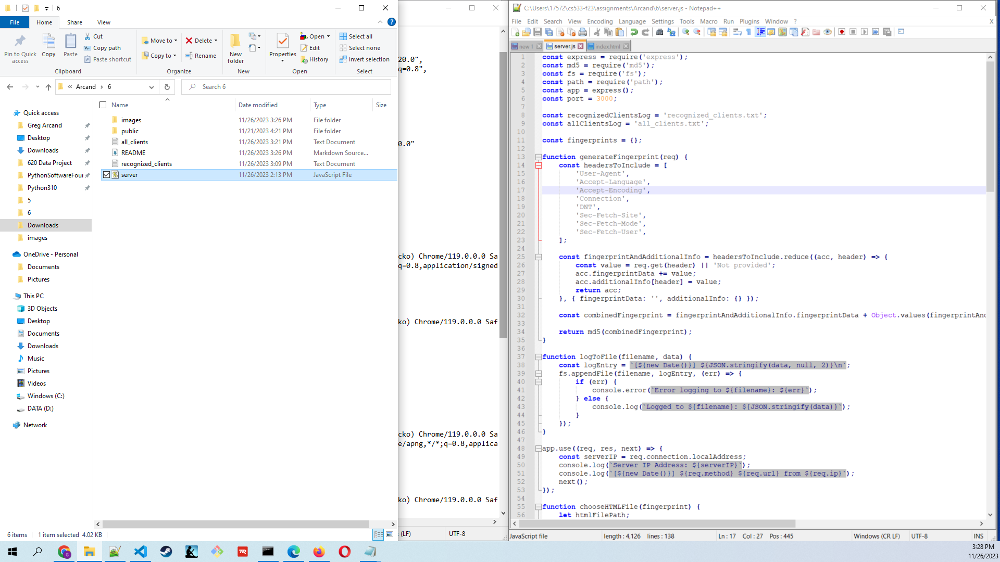
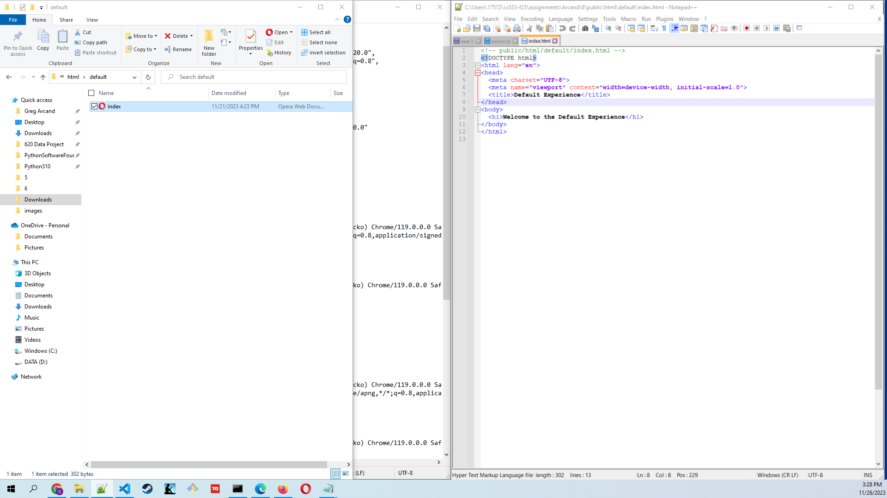

## Assignment 6
## CS 533: Web Security

Assignment 6 is focused on demonstrating and exploring issues related to fingerprinting.
To that end, I created a README.md report for this assignment containing links to the code, a short description of the fingerprinting algorithm, a screenshot of the 5 fingerprints, as well as a link to the Youtube video demonstrating the clients connecting and being recognized by the server.

Links to the code:
https://github.com/phonedude/cs533-f23/tree/main/assignments/Arcand/6/server.js
https://github.com/phonedude/cs533-f23/tree/main/assignments/Arcand/6/public/html/default/index.html

Short description of the fingerprinting algorithm:
The fingerprinting algorithm generates a unique identifier for clients by combining selected HTTP headers, thereby facilitating the identification of individual users based on their header information for tracking and customization purposes.

Screenshot of the 5 fingerprints:

Link to the Youtube video demonstrating the clients connecting and being recognized by the server:
https://www.youtube.com/watch?v=l5yTJCrB5bY

The files are saved in the Arcand\6 folder.

README.md is a well-organized and informative report for this assignment in the directory 6\ containing links to the code, a short description of the fingerprinting algorithm, a screenshot of the 5 fingerprints, as well as a link to the Youtube video demonstrating the clients connecting and being recognized by the server.

all_clients.txt is a text file and server-side log in the directory 6\ of all logged clients

server.js is a javascript file in the directory 6\ that was used to start the server and writes the fingerprints out to a server-side log and recognizes the client when it visits again.

recognized_clients.txt is a text file and server-side log in the directory 6\ of all recognized clients.

index.html is a html file in the directory 6\public\html\default\ that helps demonstrate and explore issues related to fingerprinting.

My report for each section is as follows:

## Fingerprint at least 5 different clients

For this part of the assignment I wrote server side code for my Express server that fingerprints browsers (as per week 7's lecture).
The server writes these fingerprints out to a server-side log and recognizes the client when it visits again.
For different clients, I used different browsers as well as a different device on my local network (phone).

Images showing the behavior of the project and viewing the files:

