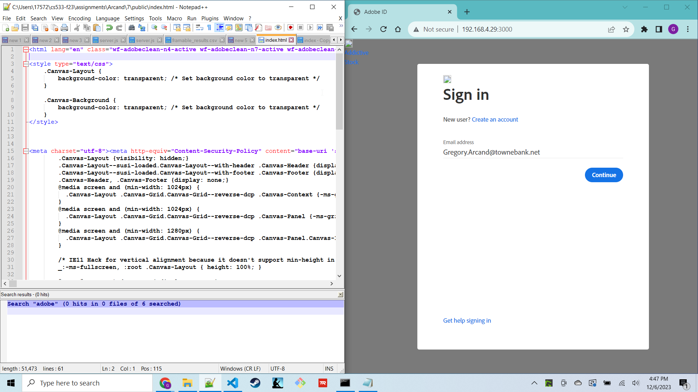
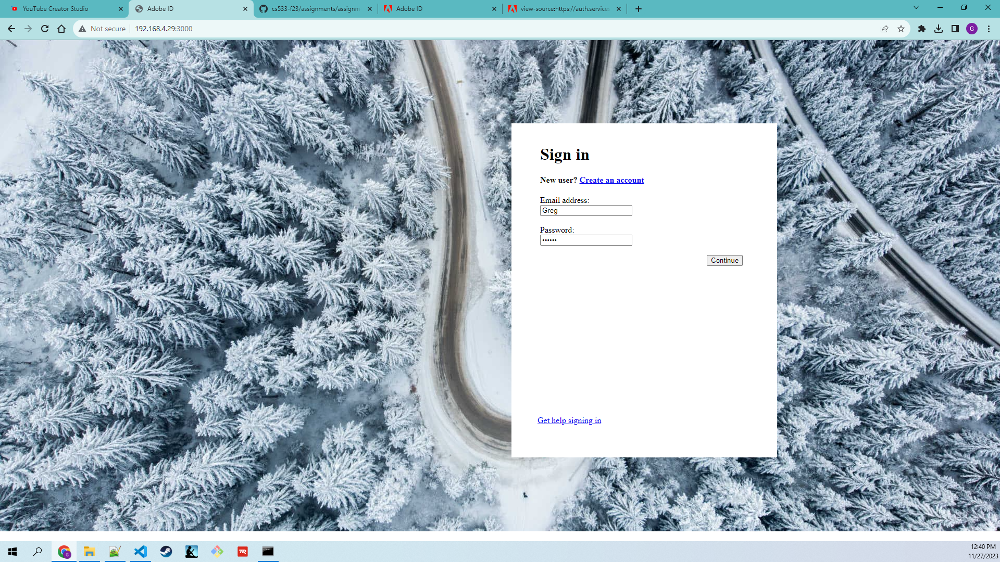
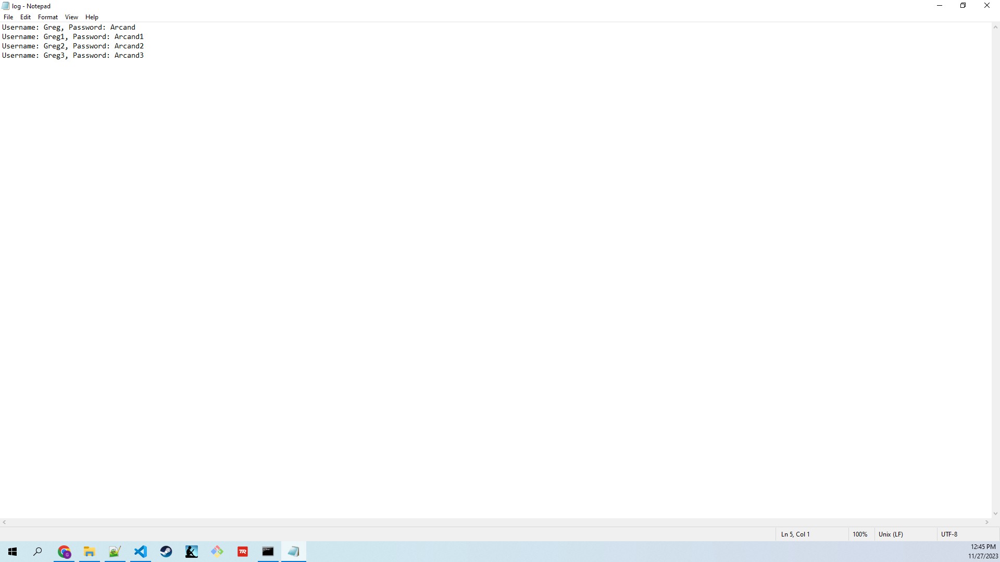
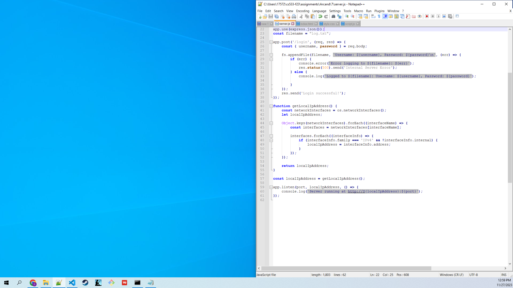
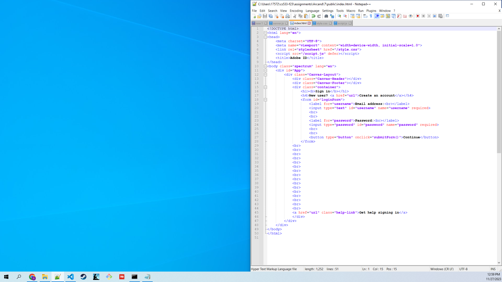
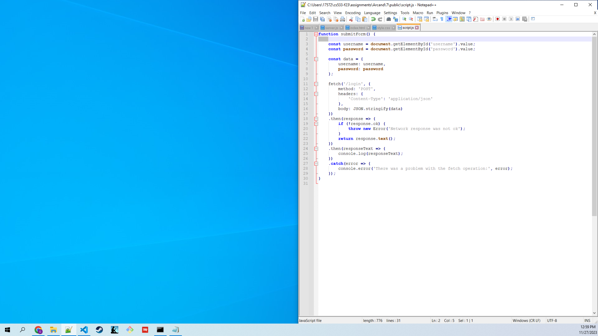
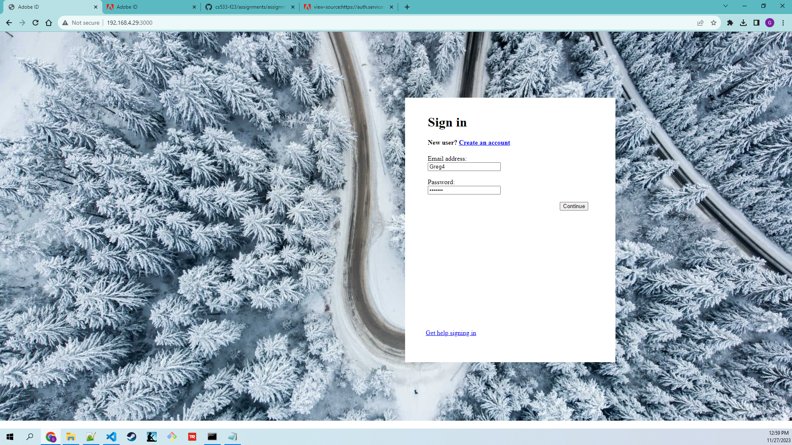
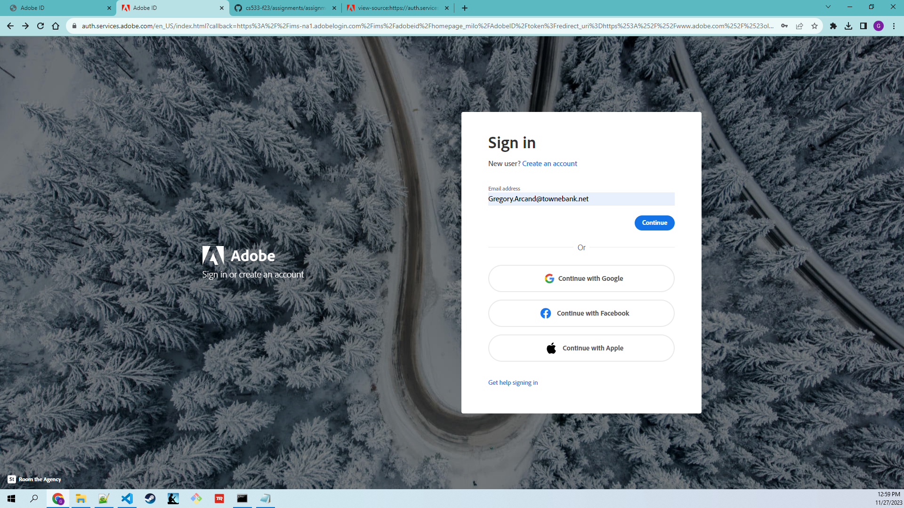
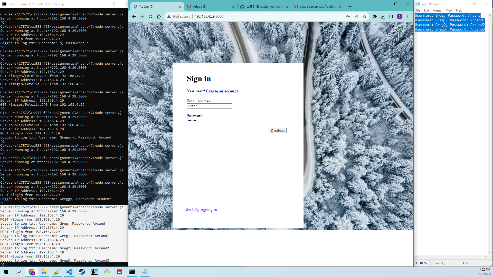

## Assignment 7
## CS 533: Web Security

Update:
_________________________________________________________________________________________________________________________
Domain: adobe.com

URL: https://auth.services.adobe.com/en_US/index.html?callback=https%3A%2F%2Fims-na1.adobelogin.com%2Fims%2Fadobeid%2Fhomepage_milo%2FAdobeID%2Ftoken%3Fredirect_uri%3Dhttps%253A%252F%252Fwww.adobe.com%252F%2523old_hash%253D%2526from_ims%253Dtrue%253Fclient_id%253Dhomepage_milo%2526api%253Dauthorize%2526scope%253DAdobeID%252Copenid%252Cgnav%26state%3D%257B%2522jslibver%2522%253A%2522v2-v0.39.0-39-g71c9b5a%2522%252C%2522nonce%2522%253A%25223689732575255653%2522%257D%26code_challenge_method%3Dplain%26use_ms_for_expiry%3Dtrue&client_id=homepage_milo&scope=AdobeID%2Copenid%2Cgnav&state=%7B%22jslibver%22%3A%22v2-v0.39.0-39-g71c9b5a%22%2C%22nonce%22%3A%223689732575255653%22%7D&relay=2ee38296-b862-4a53-9b4f-4ec48924fe53&locale=en_US&flow_type=token&idp_flow_type=login&s_p=google%2Cfacebook%2Capple&response_type=token&code_challenge_method=plain&redirect_uri=https%3A%2F%2Fwww.adobe.com%2F%23old_hash%3D%26from_ims%3Dtrue%3Fclient_id%3Dhomepage_milo%26api%3Dauthorize%26scope%3DAdobeID%2Copenid%2Cgnav&use_ms_for_expiry=true#/

Saved the DOM from the browser dev tools and built from that:

_________________________________________________________________________________________________________________________

Assignment 7 is focused on demonstrating and exploring issues related to phishing.
To that end, I created a README.md report for this assignment containing links to the code, a short discussion of any issues I encountered making the site "display" correctly from my server (if any), screen shots of the site rendered in my browser, the log file of harvested user names and passwords, and a Youtube video of my site in operation.

Links to the code:
https://github.com/phonedude/cs533-f23/tree/main/assignments/Arcand/7/server.js
https://github.com/phonedude/cs533-f23/tree/main/assignments/Arcand/7/public/index.html
https://github.com/phonedude/cs533-f23/tree/main/assignments/Arcand/7/public/script.js
https://github.com/phonedude/cs533-f23/tree/main/assignments/Arcand/7/public/style.css

a short discussion of any issues I encountered making the site "display" correctly from my server:

N/A: I did not encounter any issues making the site "display" correctly from my server.

Screen shots of the site rendered in my browser, and the log file of harvested user names and passwords

Screen shots of the site rendered in my browser:

Screen shots of the log file of harvested user names and passwords:

The log file of harvested user names and passwords:

Username: Greg, Password: Arcand
Username: Greg1, Password: Arcand1
Username: Greg2, Password: Arcand2
Username: Greg3, Password: Arcand3

A Youtube video of my site in operation:
https://www.youtube.com/watch?v=lv0X0x6AQhQ

The files are saved in the Arcand\7 folder.

README.md is a well-organized and informative report for this assignment in the directory 7\ containing links to the code, a short discussion of any issues I encountered making the site "display" correctly from my server (if any), screen shots of the site rendered in my browser, the log file of harvested user names and passwords, and a Youtube video of my site in operation.

log.txt is a text file and log file in the directory 7\ of all login information sent to my local node server when the login button is pushed.

server.js is a javascript file in the directory 7\ that was used to start the server and serves one of my 100 web sites that offers logging in from the previous assignments from my own node server on my machine to create a convincing phishing site.

script.js is a javascript file in the directory 7\public\ that is used to help send the login information to my local node server and record it in a log file.

index.html is a html file in the directory 7\public\ that helps demonstrate and explore issues related to phishing.

style.css is a css file in the directory 7\public\ that helps style index.html.

Images showing the behavior of the project by documenting and demonstrating the operation of my phishing site and viewing the files:

