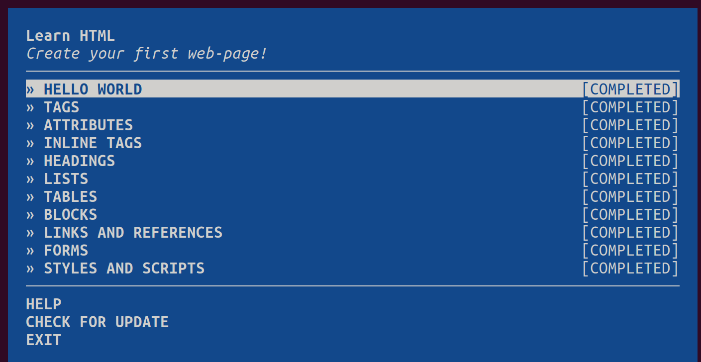
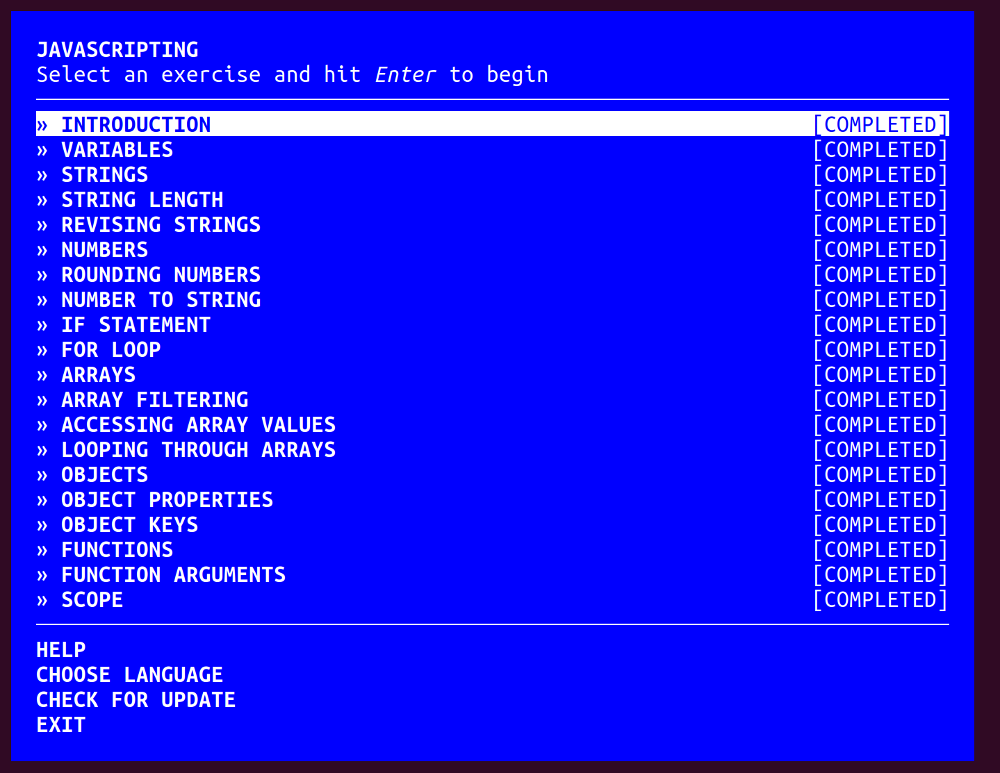
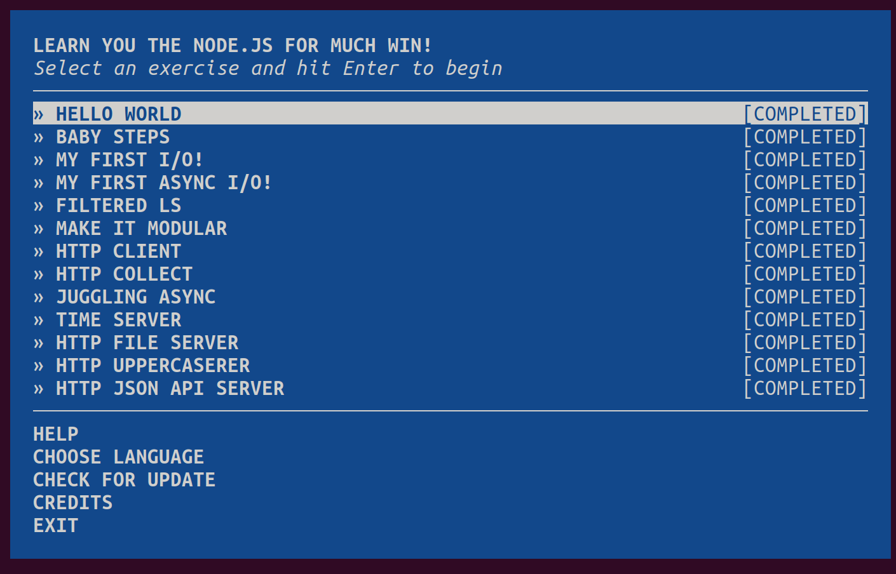

# CS 533 Assignment 1 

## Overview of files 
In completion of this assignment, I created the following three directories 
- html
- javascript
- node  

These contain the files used to complete the learnyouhtml, javascripting, and learnyounode workshops respectively.  
The img directory contains the screenshots of the completed workshops. 

## Screenshots of completed workshops 
  
  
  

## Link to demonstration video  
[Youtube link](https://youtu.be/ljnCn422jws?si=tv-gMwXNe94VMOS5)