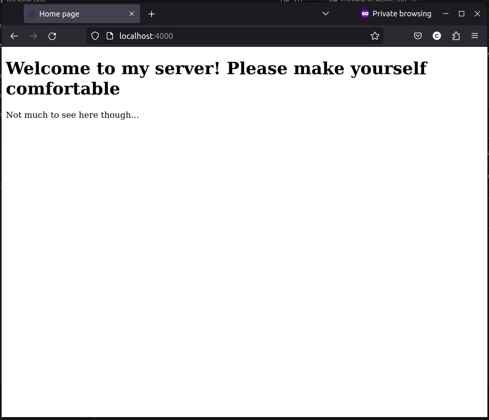
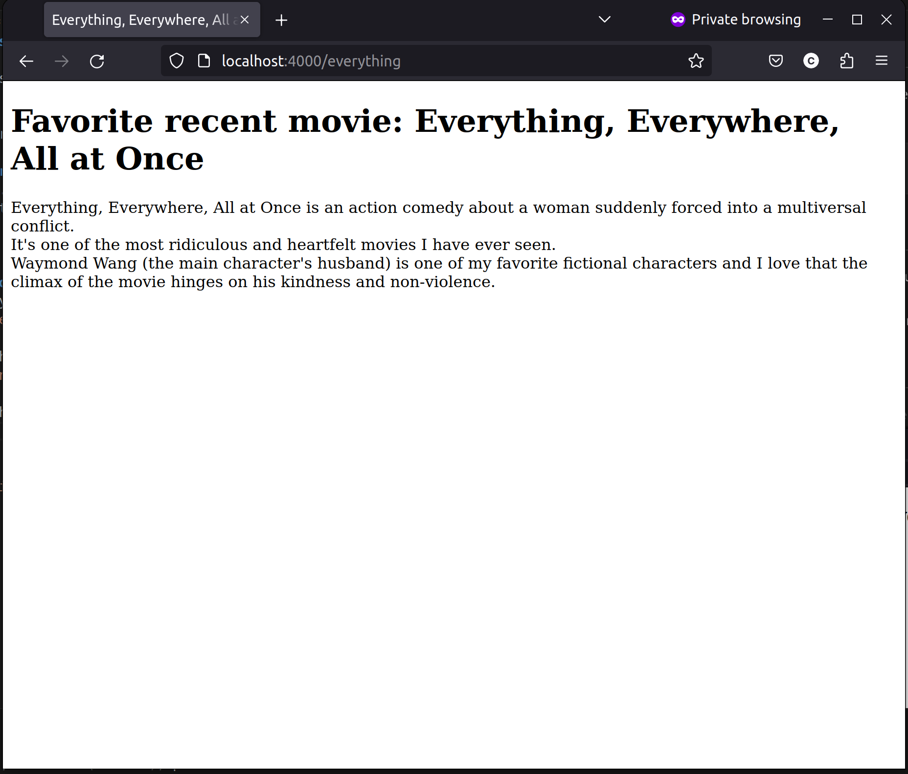
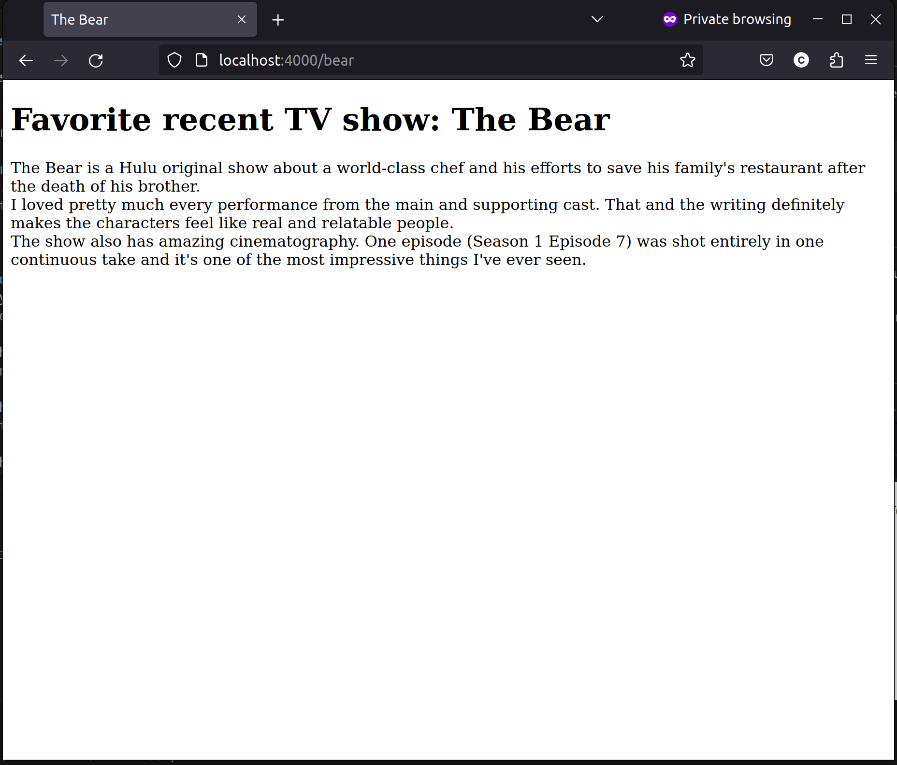

# CS 533 Assignment 2  

In this assignment, I set up an HTTP server utilizing the express package in node.js. It is run by executing the following command:
```
node server.js
```
## Directory contents
The server.js file is a JavaScript file that runs the HTTP server with express. It is set up to serve the included html files at appropriate paths.  
The server also serves a favicon.ico file (an ODU emblem).  

## Images of rendered pages
Below is my homepage that will be rendered if no path is given.  


Below is the page located at /everything.  
  

Below is the page located at /jukebox.  


Below is the page located at /bear.  



## Youtube video
[Youtube link](https://youtu.be/hQ9vE34eTN4)
