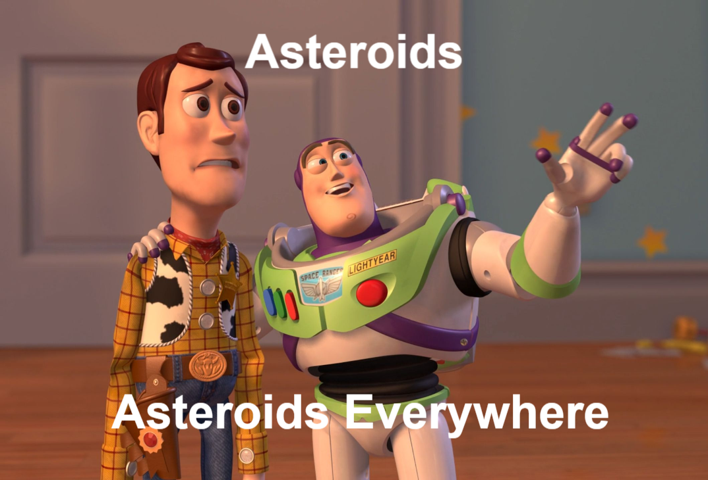

# CS 533 Assignment 4  
This assignment was divided into two parts. The report and all files for the framable assignment can be found in the framable directory. The report and all files for the frame path attack assignment can be found in the frame-path-attack directory.  

## Extra credit: Parsers, parsers, everywhere!  
The title for slide 65 in the week 5 lecture slide deck was "Parsers, parsers, everywhere!" This format (X, X, everywhere) was popularized by a meme of Woody and Buzz Lightyear from Toy Story. An example is shown below. 
  
While the phrase itself has uncertain origins, an early appearance of the format occurs in the literary work, "The Rime of the Ancient Mariner," by English poet Samuel Taylor in 1798. In it, he wrote "Water, water, everywhere."