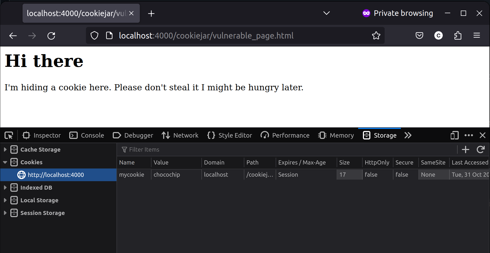
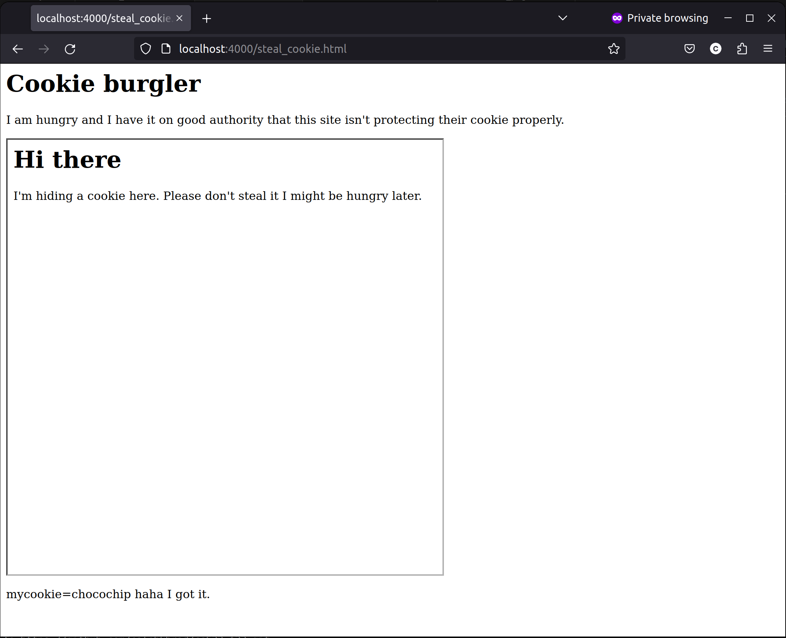

# Assignment 4 - Frame path attack  
In this assignment, I was tasked with demonstrating that the path variable for cookies is unsuitable for security. So, I chose to create some simple HTML pages hosted on a node server to show how an iframe could be used to steal a cookie from a site, regardless of what the path variable is set to.  

## Youtube video  
https://youtu.be/k9wFY-nl6UI

## Page with vulnerable cookie  
I wrote a page called [vulnerable_page.html](cookiejar/vulnerable_page.html) and stored it in the cookiejar directory. This page used inline Javascript to store a cookie. In the image of the page below, I included the Firefox storage tab to show that the site stored a cookie with value chocochip. You can also see that the only protection on it is the path attribute.  

  

## Malicious page to steal the vulnerable cookie  
I wrote another page called [steal_cookie.html](steal_cookie.html). This page used an iframe to embed the vulnerable website. In order to steal the cookie from the embedded site, I used inline Javascript to get the cookie from the loaded content. I wrote it to wait five seconds, then add the cookie and its value to the DOM to show that the cookie was stolen and accessible by the malicious site. An image of the site after it loaded the cookie is shown below.  

