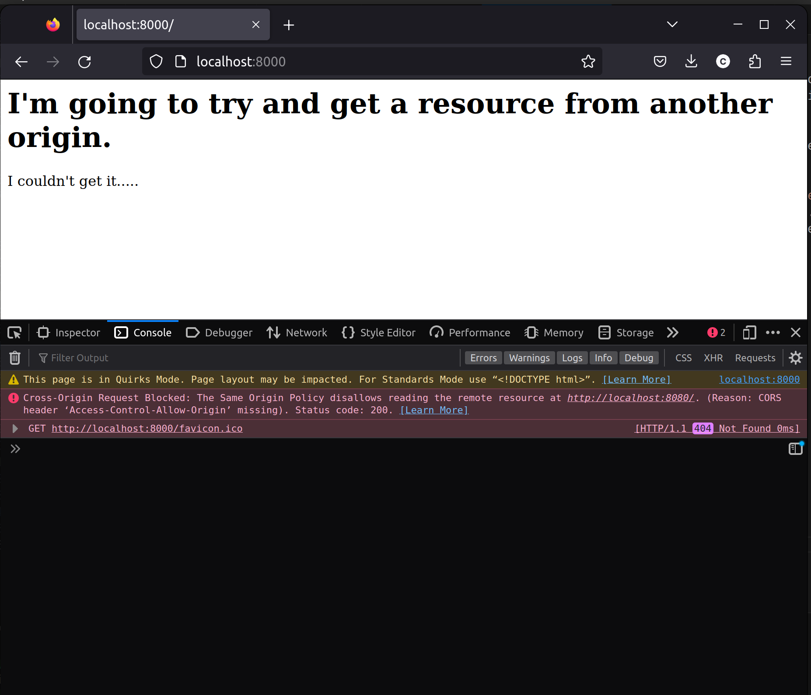
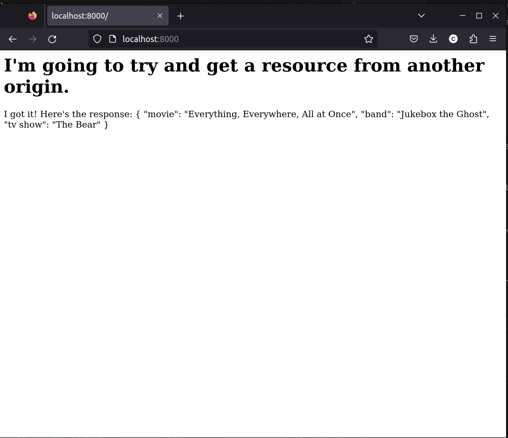
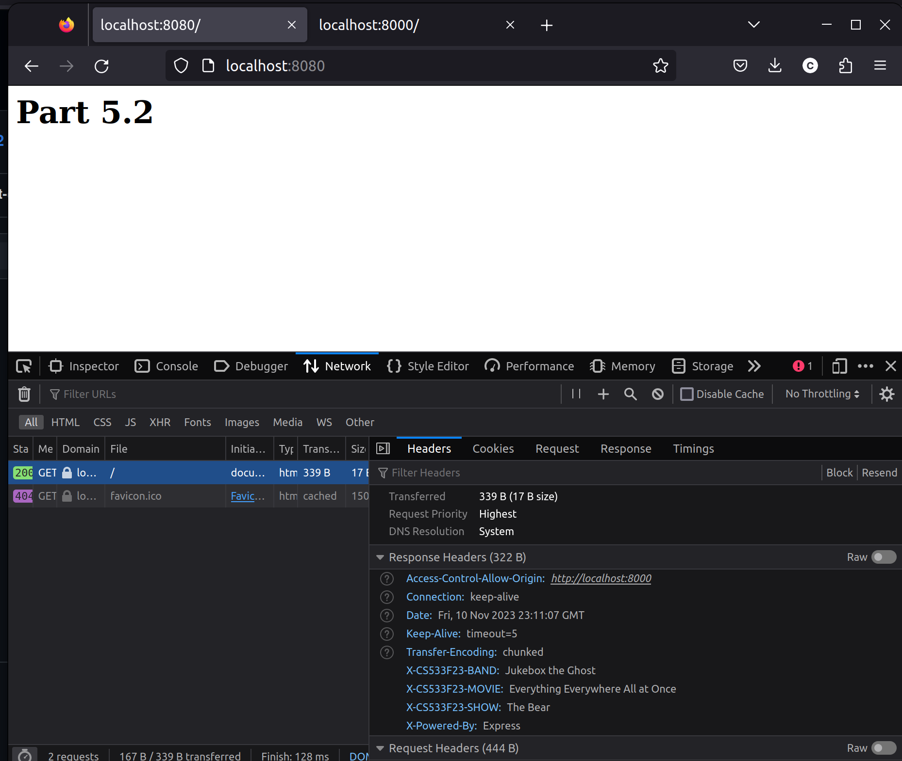
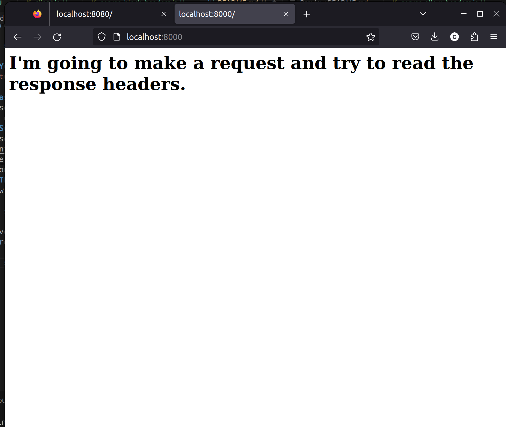
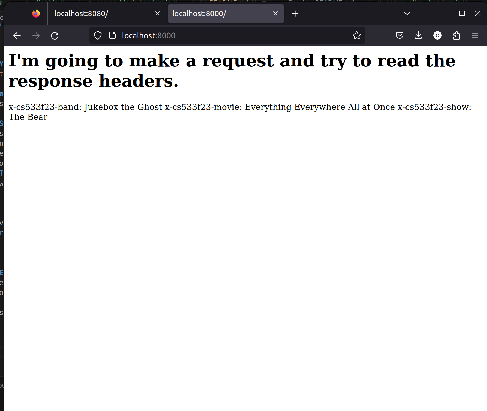
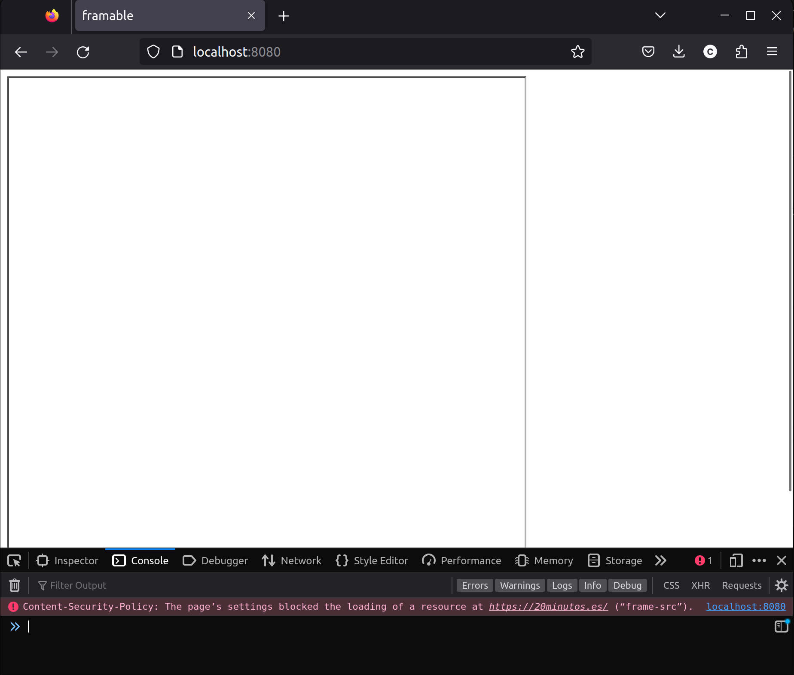

# CS 533 Assignment 5  
For this assignment, I was given three different tasks related to the Same-Origin policy, Cross-Origin Resource Sharing (CORS) and the Content Security Policy (CSP). All reports for these parts are compiled here. The necessary files are organized in directories 5.1, 5.2, and 5.3.  

## Task 5.1: Blocking and reading responses from another origin  
In this task, I created two simple node servers meant to run on separate ports simultaneously. One to serve a JSON response, and another meant to serve an HTML with Javascript that makes an HTTP request to the first server.  
### Server setup  
I setup one server ([serve_json_blocked.js](5.1/serve_json_blocked.js)) with just one route to serve a JSON file ([favoritethings.json](5.1/favoritethings.json)). I set it up to run on port 8080. I then setup another server ([client.js](5.1/client.js)) to serve an HTML ([client.html](5.1/client.html)) containing Javascript that sends a request to port 8080. This server runs on port 8000. The Javascript to make the request is shown below.  
```
    const http = new XMLHttpRequest();
    const url = "http://localhost:8080";
    http.open("GET", url);
    http.send()
    setTimeout( () => {
        const p = document.createElement('p')
        if (http.responseText != "") {
            p.innerHTML = "I got it! Here's the response: " + http.responseText;
        }
        else {
            p.innerHTML = "I couldn't get it.....";
        }
        document.body.appendChild(p)
    }, 3000)
}
```  
This works to send a request, and appends the response body to the DOM if it isn't empty.  
### The request getting blocked  
When accessing the server on port 8000, I got an empty response from the other server. The page, and the console log is shown below.  

  

The console shows that the request did not succeed due to the request being a Cross-Origin request, violating the Same-Origin policy. Basically, since the request is coming from a different source than the origin, the request gets rejected.  

### Setting up the JSON server to allow the request  
To get around the Same-Origin policy, all I needed to do was add an Access-Control-Allow-Origin header with the url of the client to the server's response. I did this with a line of Javascript in the client's route, shown below.  
```
res.setHeader('Access-Control-Allow-Origin', 'http://localhost:8000')
```
The corrected JSON server code can be found in [serve_json_allow.json](5.1/serve_json_allow.js). With this response header, the browser can successfully make the request, and append it to the DOM, shown below.  

  

### Youtube demonstration  
[Youtube link for 5.1 demonstration](https://youtu.be/HLRiCvhPSlQ)  

## Task 5.2: Blocking and reading HTTP response headers from another origin  
The second task for this assignment was related to demonstrating some custom HTTP response headers and how they can't be read by a cross origin server, and then demonstrating how they can be made to be read.  
### Server setup  
The servers and content used here were very similar to the first part of the assignment. My client files ([client.js](5.2/client.js) and [client.html](5.2/client.html)) were made to serve a page on port 8000. That page makes a request to the server on port 8080 ([server_block_headers.js](5.2/server_block_headers.js)), which is just a simple page that sets custom response headers. The client server waits a few seconds, then attempts to display the response headers from the request to port 8080.  
### The headers being blocked  
Below shows the server on port 8080, which sends the custom response headers.  

  

However, when I attempt to load the page on port 8000, which is supposed to request from port 8080 and insert the response headers to the DOM, doesn't show the response headers.  

  

### Exposing the response headers  
To rectify this, I created another server on port 8080 ([server_allow_headers.js](5.2/server_allow_headers.js)). I added an Access-Control-Expose-Headers response header to expose the headers by adding the code shown below.  
```
res.setHeader('Access-Control-Expose-Headers', 'X-CS533F23-MOVIE, X-CS533F23-BAND, X-CS533F23-SHOW');
```  

Now, when I load the client server, the page is able to load the response headers, as shown below.  

  

### Youtube video demonstration  
Here's the link to my video demonstration: https://youtu.be/8O_A3UuzVGo  

## 5.3: Embedding from another site  
In this part of the assignment, I needed to demonstrate the embedding of one of the framable sites from Assignment 4. I then needed to show how the server could block the embeddming.  
### A site that allows iframe embedding  
I chose the site 20minutos.es from Assignment 4. It is framable. The file [server_allow.js](5.3/server_allow.js) does not make any attempt to block the framing, so it goes through, as shown below.  

  

### Blocking the embedding with a Content-Security-Policy header  
In order to block the embedding, I created another server in [server_block.js](5.3/server_block.js) that was the same as before, only it set a Content-Security-Policy header. This was done with the Javascript code shown below.  
```
res.setHeader('Content-Security-Policy', "frame-src 'self'" )
```  

With this header set, the iframe embedding will now be blocked due to a violation of the Content-Security-Policy, as shown below.  

  

### Youtube video demonstration  
Here's the link to my video demonstration: https://youtu.be/FoPTTH8NygQ  

