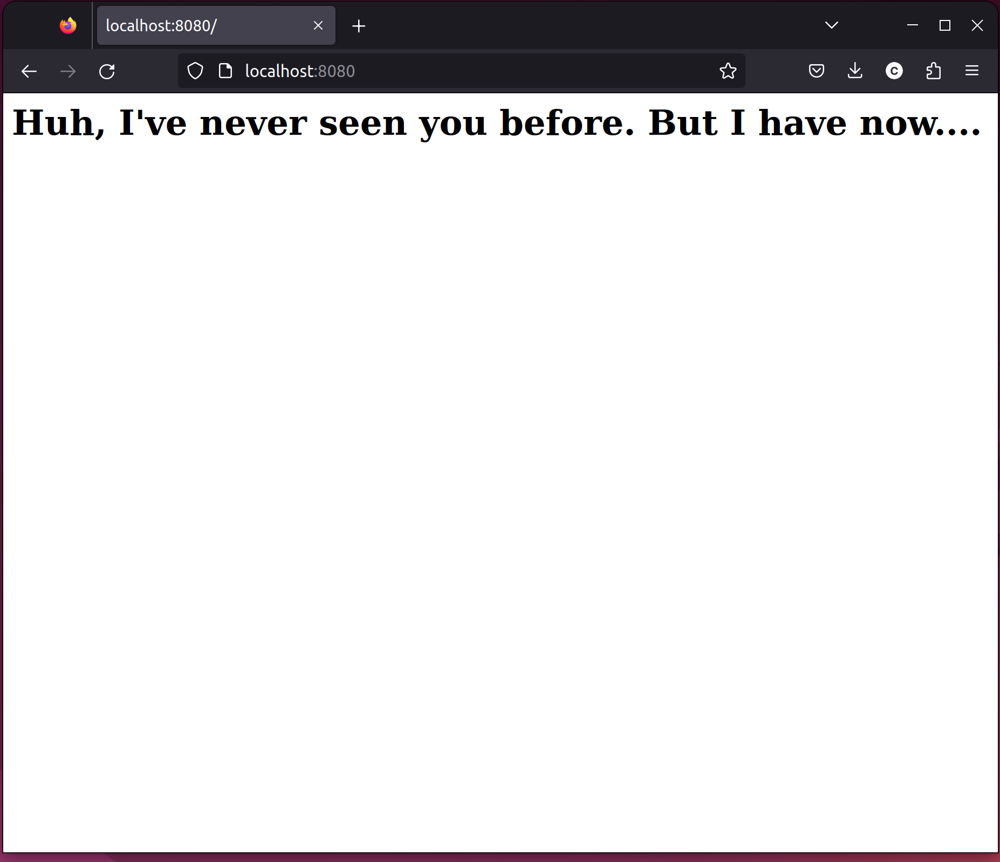
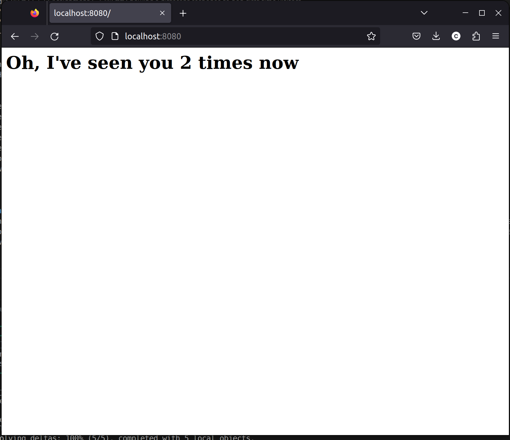

# CS 533 Assignment 6  
Due: November 29, 2023  

In this assignment, I was tasked with creating a simple Node server capable of fingerprinting all of of its visitors using 3 of the request headers that they send. I also needed to create a log of each visitor, and detect whether or not a client has visited before. Lastly, I needed to demonstrate the server's fingerprinting capabilities by fingerprinting 5 different clients.   

## Server that fingerprints its visitors  
I setup a very simple Node server with only one route at the root. Upon visiting the server, it gets the user-agent, accept, and accept-language headers from the request. It then takes the values of those headers, concatenates them, and hashes the result with the md5 algorithm. The code to implement this is shown below (the full server code is in [server.js](server.js)).  
```
const userAgent = req.headers['user-agent'];
const acceptHeader = req.headers['accept'];
const acceptLanguage = req.headers['accept-language'];
const userHash = md5(userAgent + acceptHeader + acceptLanguage);
```  

## Storing the client hashes
Once the hash is computed, the server checks the hash against a JSON log file ([fingerprintlog.json](fingerprintlog.json)) that gets loaded as a JSON object. The log contains hashes as keys, and also contains the headers used to compute each hash. Lastly, it also contains the number of times the client with this hash accessed the site. An example JSON object in the log file is shown below.  

```
"12abab197da18dbaf2cd2f49708e57cc": {
    "User Agent": "Mozilla/5.0 (X11; Ubuntu; Linux x86_64; rv:109.0) Gecko/20100101 Firefox/119.0",
    "Accept": "text/html,application/xhtml+xml,application/xml;q=0.9,image/avif,image/webp,*/*;q=0.8",
    "Accept Language": "en-US,en;q=0.5",
    "Times Visited": 18
    }
```  

If the hash doesn't exist in the log file, then the client hasn't visited before, so their information is added to the log file. A message is also written to the HTML response, indicating that the user hasn't visited before. The code is shown below, as well as an image of it being served to a Web browser.

```
fingerPrintLog[userHash] = {}
fingerPrintLog[userHash]['User Agent'] = userAgent;
fingerPrintLog[userHash]['Accept'] = acceptHeader;
fingerPrintLog[userHash]['Accept Language'] = acceptLanguage;
fingerPrintLog[userHash]['Times Visited'] = 1;
console.log('This person has not visited before!')
res.write("<h1>Huh, I've never seen you before. But I have now....</h1>")
```  
  

## Showing a different response to non-first-time visitors  
If the hash does exist in the log file, then the client has visited before. In this case, I increment the Times Visited counter for that hash, and write a response that tells the visitor the amount of times they have visited. The code, and the same browser from before after resfreshing the page, is shown below.  

```
console.log('This user has visited before!');
fingerPrintLog[userHash]['Times Visited']++;
res.write("<h1>Oh, I've seen you " + fingerPrintLog[userHash]['Times Visited'] + " times now</h1>")
```

 

## Collecting fingerprints from 5 clients  
From here, all that was left to do was fingerprint 5 unique clients. I accessed the server from Firefox and Chrome on my laptop. I also accessed it through curl. I accessed it from Safari on my phone, and finally through the built in web browser from WhatsApp on my phone. The full log is shown below.  
```
{
    "12abab197da18dbaf2cd2f49708e57cc": {
        "User Agent": "Mozilla/5.0 (X11; Ubuntu; Linux x86_64; rv:109.0) Gecko/20100101 Firefox/119.0",
        "Accept": "text/html,application/xhtml+xml,application/xml;q=0.9,image/avif,image/webp,*/*;q=0.8",
        "Accept Language": "en-US,en;q=0.5",
        "Times Visited": 18
    },
    "e561beabd813b47fb1f9a23175064646": {
        "User Agent": "Mozilla/5.0 (X11; Linux x86_64) AppleWebKit/537.36 (KHTML, like Gecko) Chrome/118.0.0.0 Safari/537.36",
        "Accept": "text/html,application/xhtml+xml,application/xml;q=0.9,image/avif,image/webp,image/apng,*/*;q=0.8,application/signed-exchange;v=b3;q=0.7",
        "Accept Language": "en-US,en;q=0.9",
        "Times Visited": 7
    },
    "840203131cd9354ff32043dbb8141615": {
        "User Agent": "curl/7.81.0",
        "Accept": "*/*",
        "Times Visited": 2
    },
    "fccb6a02f567e6f8bf836f423935b148": {
        "User Agent": "Mozilla/5.0 (iPhone; CPU iPhone OS 16_6_1 like Mac OS X) AppleWebKit/605.1.15 (KHTML, like Gecko) Version/16.6 Mobile/15E148 Safari/604.1",
        "Accept": "text/html,application/xhtml+xml,application/xml;q=0.9,*/*;q=0.8",
        "Accept Language": "en-US,en;q=0.9",
        "Times Visited": 3
    },
    "a533db5752e425a72bcd2d4eafb40c99": {
        "User Agent": "WhatsApp/2.23.23.79 i",
        "Accept": "*/*",
        "Accept Language": "en-US,en;q=0.9",
        "Times Visited": 1
    }
}
```  

## Youtube video  
[Link to video](https://youtu.be/UGLHC02cdts)