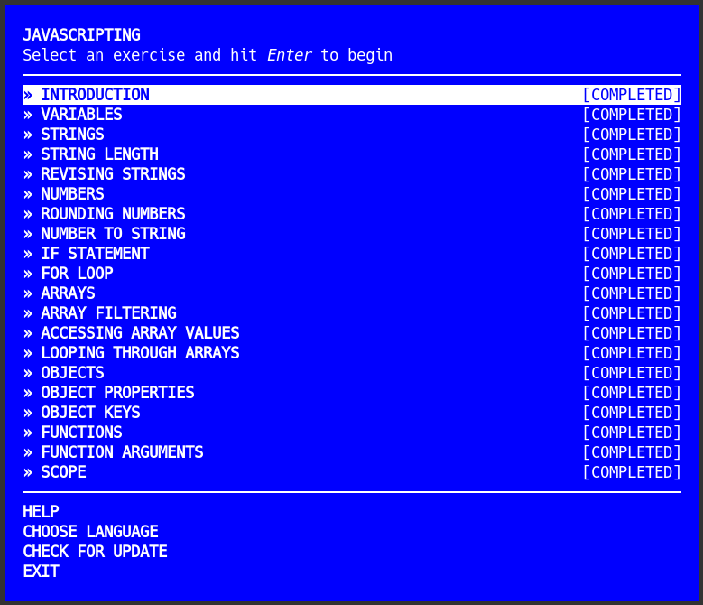
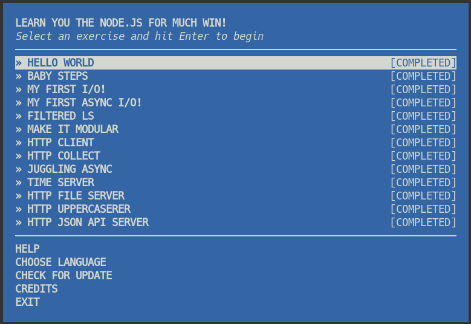

# Overview

This assignment has three primary directories, one for each of the programming language categories:

- HTML
- JavaScript
- Node.js

Each directory contains files related to the various exercises provided from the LearnYouHTML, JavaScripting, and LearnYouNode tutorial programs.

# Screenshots

# Video Demo

[YouTube](https://youtu.be/coMdzBqhsDQ)