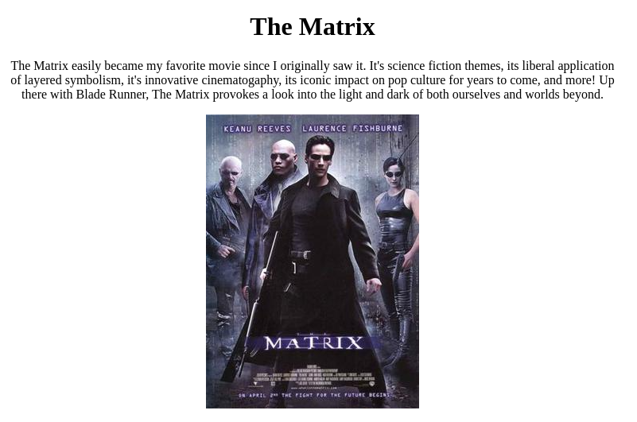
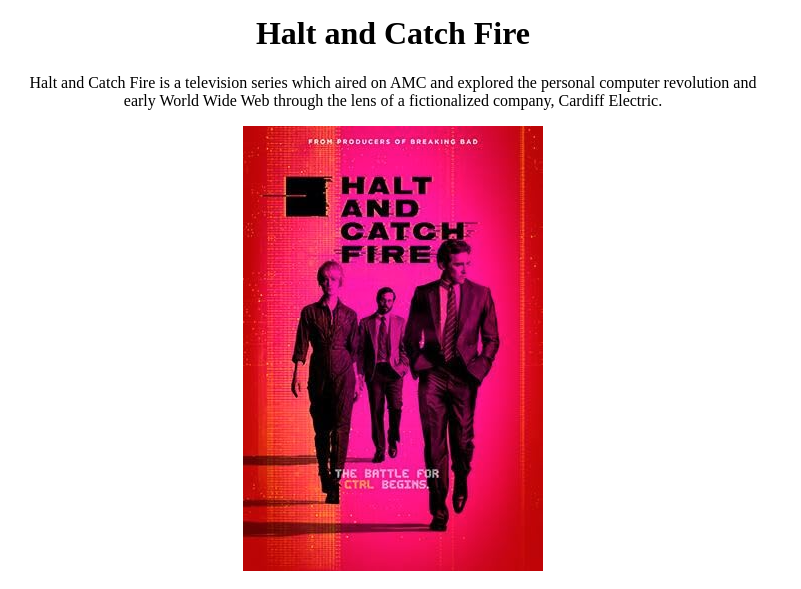
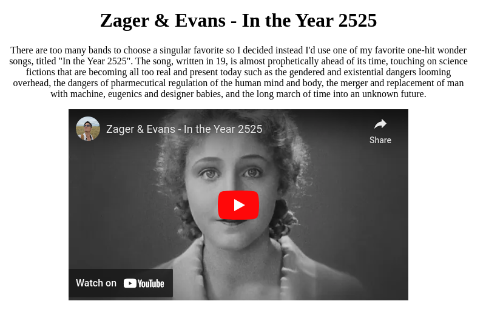

# Assignment 2

Assignment 2 utilizes express.js to create three simple pages showing some personal media favorites.

While not used, the cookie-parser package is shown installed for future assignments.

# Setup Instructions

To run the server, execute the following commands:
1. `npm install`
2. `node server.js`

# Video demo

[YouTube](https://youtu.be/WUSeVZOq0oA)

# Screenshots

