## Assignment 4, CS 433/533 Web Security, Fall 2023

Due: 2023-11-01

 
 

# Which public sites are framable?

### [Video Walkthrough](https://www.youtube.com/watch?v=liyuK8uYsyg)

 

## Generating frame responses

To generate each framed page, I used an HTML template (left) to copy and translate to each of the 100 websites (shown right for about.com).

    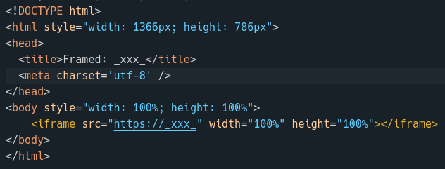
    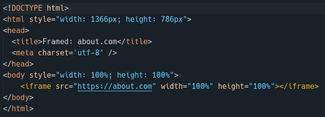

 
To accomplish this, I copied and tweaked my curl code from the third assignment to simply read the  url list, copy the template to the appropriate directory, and then use the `sed` command to replace the copied file's `_xxx_` string with the appropriate url. I embedded the `https://` prefix string for each embedded URL so that each will resolve using `https`

 

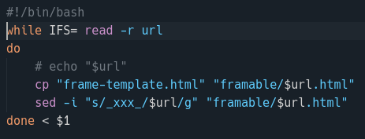

 

## Testing framed websites

The simple presentation server uses the `:url` path parameter from the request URL to select the appropriate generated html template and serve it back to the user.

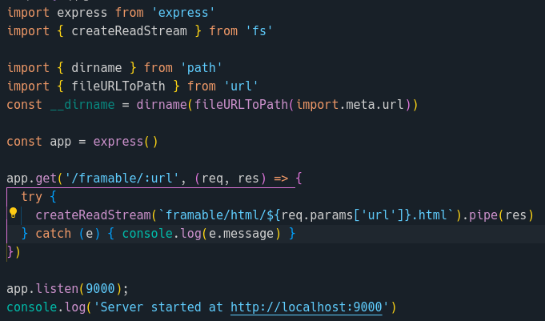

 

The majority of sites from my assigned pool were not natively framable. Out of the 100 provides sites, 31 were directly frameable, though 3 of those (freepik.com, forms.gle, and photos.google.com) returned a 400 or 403 error.

Of those, 69 sites which were not frameable:
* 11 had X-Frame-Options set to 'deny'
* 35 had X-Frame-Options set to 'sameorigin'
* 19 had a frame ancestors Content Security Policy

 

    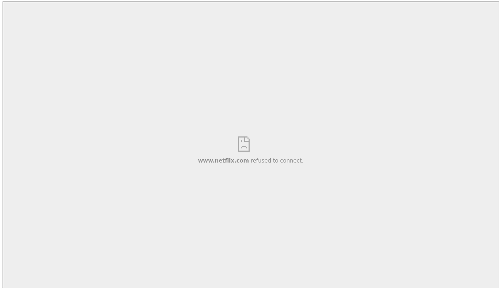
    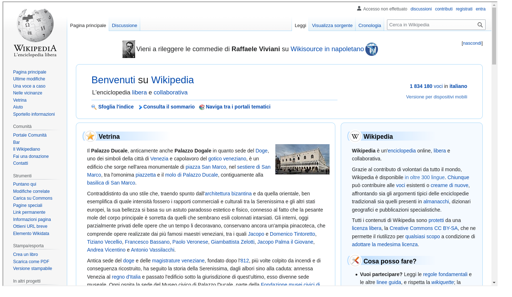

 

The table below details the results of each framing attempt. All URLs were framed using the `https://` protocol prefix. The endpoints of redirected URLs (ie. "https://about.com" -> "https://www.dotdashmeredith.com/" or "https://alibaba.com" -> "https://www.alibaba.com") are noted in their details cell, otherwise the URL did not change during framing.

 

## Framed Site Details

| URL | Is Frameable? | Details |
| :--- | :---: | :--- |
| about.com | Not Frameable | (https://www.dotdashmeredith.com/) X-Frame-Options = sameorigin |
| abril.com.br | Frameable | |
| admin.ch | Not Frameable | X-Frame-Options = sameorigin |
| alibaba.com | Not Frameable | (https://www.alibaba.com) X-Frame-Options = deny |
| amazon.es | Not Frameable | (https://www.amazon.es/) X-Frame-Options = sameorigin |
| amazon.it | Not Frameable | (https://www.amazon.it/) X-Frame-Options = sameorigin |
| amzn.to | Not Frameable | (https://www.amazon.com/) X-Frame-Options = sameorigin |
| android.com | Frameable | |
| apnews.com | Frameable | |
| archive.org | Frameable | |
| bbc.com | Frameable | |
| britannica.com | Frameable | |
| cbc.ca | Not Frameable | X-Frame-Options = sameorigin |
| clarin.com | Frameable | |
| cnet.com | Frameable | |
| cnil.fr | Not Frameable | ancestor violates the following Content Security Policy directive: "frame-ancestors self *.openstreetmap.org *.openlayers.org *.cnil.fr" |
| coininternet.com.co | Not Frameable | X-Frame-Options = sameorigin |
| cpanel.net | Not Frameable | X-Frame-Options = sameorigin |
| detik.com | Not Frameable | X-Frame-Options = sameorigin |
| developers.google.com | Not Frameable | X-Frame-Options = sameorigin |
| dropcatch.com | Not Frameable | ancestor violates the following Content Security Policy directive: "frame-ancestors self" |
| dw.com | Frameable | |
| e-monsite.com | Not Frameable | X-Frame-Options = sameorigin |
| espn.com | Not Frameable | (https://www.espn.com/) ancestor violates the following Content Security Policy directive: "frame-ancestors self asia.espn.com:* asia.espnqa.com:* *.espn.com:* *.espnqa.com:* *.espnsb.com:* *.espnsb.com *.espn.co.uk *.espndeportes.espn.com *.espn.com.br *.espn.com.mx *.espn.com.ve *.espn.com.ar *.espn.com.co *.espnfc.com.au *.espn.com.au *.espn.in *.espn.com.sg *.espn.cl *.espn.ph *.espn.ph:* *.espn.com.pe *.espn.com.gt *.espn.com.do *.espn.com.ec *.espn.com.uy *.espn.com.pa *.espn.co.cr qa.abcnews.go.com preview.abcnews.go.com abc7ny.com abc7.com *.abcotvssb.com preview.goodmorningamerica.com http://*.espnqa.com:* http://*.espn.com:* *.abcotvssb.com *.abcnews.go.com *.abcnews.go.com:* http://*.abcnews.go.com:* abc30.com abc7news.com abc13.com abc7chicago.com 6abc.com abc11.com *.goodmorningamerica.com qa.abc7.com qa.abc30.com qa.abc7news.com qa.abc13.com qa.abc7chicago.com qa.6abc.com qa.abc7ny.com qa.abc11.com *.abcnews.go.com:* abcnews.go.com qa.secsports.com *.secsports.com https://*.espn.com:* *.espnqa.com:*" |
| espn.go.com | Not Frameable | (https://www.espn.com/) ancestor violates the following Content Security Policy directive: "frame-ancestors self asia.espn.com:* asia.espnqa.com:* *.espn.com:* *.espnqa.com:* *.espnsb.com:* *.espnsb.com *.espn.co.uk *.espndeportes.espn.com *.espn.com.br *.espn.com.mx *.espn.com.ve *.espn.com.ar *.espn.com.co *.espnfc.com.au *.espn.com.au *.espn.in *.espn.com.sg *.espn.cl *.espn.ph *.espn.ph:* *.espn.com.pe *.espn.com.gt *.espn.com.do *.espn.com.ec *.espn.com.uy *.espn.com.pa *.espn.co.cr qa.abcnews.go.com preview.abcnews.go.com abc7ny.com abc7.com *.abcotvssb.com preview.goodmorningamerica.com http://*.espnqa.com:* http://*.espn.com:* *.abcotvssb.com *.abcnews.go.com *.abcnews.go.com:* http://*.abcnews.go.com:* abc30.com abc7news.com abc13.com abc7chicago.com 6abc.com abc11.com *.goodmorningamerica.com qa.abc7.com qa.abc30.com qa.abc7news.com qa.abc13.com qa.abc7chicago.com qa.6abc.com qa.abc7ny.com qa.abc11.com *.abcnews.go.com:* abcnews.go.com qa.secsports.com *.secsports.com https://*.espn.com:* *.espnqa.com:*" |
| evernote.com | Not Frameable | (https://evernote.com/) ancestor violates the following Content Security Policy directive: "frame-ancestors https://www.evernote.com https://stage.evernote.com https://app.preprod3.evernote.com" |
| facebook.com | Not Frameable | X-Frame-Options = deny |
| feedburner.com | Not Frameable | X-Frame-Options = deny |
| fifa.com | Not Frameable | (https://www.fifa.com/) ancestor violates the following Content Security Policy directive: "frame-ancestors self https://apps.monterosa.cloud https://mtsa-blog.fifa.com" |
| forms.gle | Frameable | 400 Response |
| foxnews.com | Frameable | |
| fr.wikipedia.org | Frameable | |
| freepik.com | Frameable | 403 Response |
| gmail.com | Not Frameable | (https://mail.google.com) X-Frame-Options = sameorigin |
| gnu.org | Not Frameable | X-Frame-Options = sameorigin |
| google.co.id | Not Frameable | (https://www.google.co.id) X-Frame-Options = sameorigin |
| google.de | Not Frameable | (https://www.google.de) X-Frame-Options = sameorigin |
| google.es | Not Frameable | (https://www.google.es) X-Frame-Options = sameorigin |
| gooyaabitemplates.com | Frameable | |
| hatena.ne.jp | Not Frameable | X-Frame-Options = deny |
| hindustantimes.com | Not Frameable | (https://www.hindustantimes.com/) X-Frame-Options = sameorigin |
| huawei.com | Not Frameable | (https://www.huawei.com/) X-Frame-Options = sameorigin |
| huffingtonpost.com | Not Frameable | (https://www.huffpost.com/) ancestor violates the following Content Security Policy directive: "frame-ancestors self *.huffpost.com *.huffingtonpost.com *.huffpost.net *.buzzfeed.com clients.opinary.com compass.pressekompass.net *.newsbreak.com *.newsbreakapp.com *.upday-content.com *.upday.com" |
| huffpost.com | Not Frameable | (https://www.huffpost.com/) ancestor violates the following Content Security Policy directive: "frame-ancestors self *.huffpost.com *.huffingtonpost.com *.huffpost.net *.buzzfeed.com clients.opinary.com compass.pressekompass.net *.newsbreak.com *.newsbreakapp.com *.upday-content.com *.upday.com" |
| ig.com.br | Frameable | |
| imageshack.com | Not Frameable | X-Frame-Options = sameorigin |
| indiatimes.com | Not Frameable | (https://www.indiatimes.com/) X-Frame-Options = sameorigin |
| it.wikipedia.org | Frameable | |
| java.com | Not Frameable | (https://www.java.com/) X-Frame-Options = sameorigin |
| m.wikipedia.org | Frameable | |
| mail.ru | Not Frameable | X-Frame-Options = sameorigin |
| marketingplatform.google.... | Not Frameable | 404 Response |
| mega.nz | Not Frameable | X-Frame-Options = deny |
| mozilla.org | Not Frameable | (https://www.mozilla.org) X-Frame-Options = deny |
| msn.com | Not Frameable | (https://www.msn.com/) ancestor violates the following Content Security Policy directive: "frame-ancestors self int1.msn.com ntp.msn.cn ntp.msn.com windows-int1.msn.com windows.msn.cn windows.msn.com www.bing.com www.msn.com mathsolver.microsoft.com mathsolver-dev.microsoft.com chrome-extension://lklfbkdigihjaaeamncibechhgalldgl" |
| myspace.com | Not Frameable | ancestor violates the following Content Security Policy directive: "frame-ancestors self" |
| nba.com | Frameable | |
| nbcnews.com | Not Frameable | (https://www.nbcnews.com/) X-Frame-Options = sameorigin |
| netflix.com | Not Frameable | (https://www.netflix.com/) X-Frame-Options = deny |
| netvibes.com | Not Frameable | (https://www.netvibes.com/) X-Frame-Options = deny |
| networkadvertising.org | Frameable | |
| news.yahoo.com | Not Frameable | ancestor violates the following Content Security Policy directive: "frame-ancestors self https://*.builtbygirls.com https://*.rivals.com https://*.engadget.com https://*.intheknow.com https://*.autoblog.com https://*.techcrunch.com https://*.yahoo.com https://*.aol.com https://*.huffingtonpost.com https://*.oath.com https://*.search.yahoo.com https://*.pnr.ouryahoo.com https://pnr.ouryahoo.com https://*.search.aol.com https://*.search.huffpost.com https://*.onesearch.com https://*.verizonmedia.com https://*.publishing.oath.com https://*.autoblog.com" |
| nginix.com | Not Frameable | (https://www.nginx.com/) ancestor violates the following Content Security Policy directive: "frame-ancestors self" |
| nih.gov | Not Frameable | (https://www.nih.gov/) ancestor violates the following Content Security Policy directive: "frame-ancestors self *.nih.gov *.youtube.com *.youtube-nocookie.com *.addthis.com com *.recaptcha.net" |
| ovhcloud.com | Not Frameable | (https://www.ovhcloud.com/) X-Frame-Options = sameorigin |
| photobucket.com | Frameable | |
| photos.google.com | Frameable | 403 Response |
| play.google.com | Not Frameable | (https://play.google.com/) X-Frame-Options = sameorigin |
| plos.org | Frameable | |
| prestashop.com | Not Frameable | (https://prestashop.com/) X-Frame-Options = deny |
| privacyshield.gov | Not Frameable | Connection reset, would not load |
| pt.wikipedia.org | Frameable | |
| quora.com | Not Frameable | (https://www.quora.com/) X-Frame-Options = sameorigin |
| rakuten.co.jp | Not Frameable | (https://www.rakuten.co.jp/) X-Frame-Options = deny |
| ria.ru | Frameable | |
| search.google.com | Not Frameable | (https://google.com/) X-Frame-Options = sameorigin |
| sendspace.com | Not Frameable | (https://www.sendspace.com/) X-Frame-Options = sameorigin |
| shutterstock.com | Frameable | |
| sky.com | Not Frameable | (https://www.sky.com/) ancestor violates the following Content Security Policy directive: "frame-ancestors self" |
| slideshare.net | Frameable | |
| target.com | Not Frameable | (https://www.target.com/) ancestor violates the following Content Security Policy directive: "frame-ancestors self https://*.target.com" |
| terra.com.br | Not Frameable | (https://www.terra.com.br/) X-Frame-Options = sameorigin |
| theatlantic.com | Frameable | |
| thesun.co.uk | Frameable | |
| thetimes.co.uk | Not Frameable | (https://www.thetimes.co.uk/) X-Frame-Options = sameorigin |
| tiktok.com | Not Frameable | (https://www.tiktok.com/) X-Frame-Options = sameorigin |
| ubuntu.com | Frameable | |
| video.google.com | Not Frameable | (https://www.google.com/) X-Frame-Options = sameorigin |
| vk.com | Not Frameable | X-Frame-Options = deny |
| w3.org | Not Frameable | (https://www.w3.org/) ancestor violates the following Content Security Policy directive: "frame-ancestors self https://cms.w3.org/" |
| walmart.com | Not Frameable | (https://www.walmart.com/) ancestor violates the following Content Security Policy directive: "frame-ancestors self *.wal.co *.walmart.com:* *.walmart.net *.walmartimages.com *.walmartlabs.com https://www-qa.walmart.com.mx" |
| weather.com | Not Frameable | X-Frame-Options = sameorigin |
| webmd.com | Frameable | |
| woocommerce.com | Not Frameable | (https://www.woo.com) X-Frame-Options = sameorigin |
| www.google.com | Not Frameable | X-Frame-Options = sameorigin |
| www.gov.br | Not Frameable | (https://www.gov.br/) ancestor violates the following Content Security Policy directive: "frame-ancestors self" |
| www.wikipedia.org | Frameable | |
| www.yahoo.com | Not Frameable | ancestor violates the following Content Security Policy directive: "frame-ancestors self https://*.builtbygirls.com https://*.rivals.com https://*.engadget.com https://*.intheknow.com https://*.autoblog.com https://*.techcrunch.com https://*.yahoo.com https://*.aol.com https://*.huffingtonpost.com https://*.oath.com https://*.search.yahoo.com https://*.pnr.ouryahoo.com https://pnr.ouryahoo.com https://*.search.aol.com https://*.search.huffpost.com https://*.onesearch.com https://*.verizonmedia.com https://*.publishing.oath.com https://*.autoblog.com" |
| ytimg.com | Not Frameable | Server address could not be found |

 
 

# Frame Path attack (5 points)

### [Video Walkthrough](https://www.youtube.com/watch?v=4-xTfVuTsqs)

 

For this part I mocked up a little scenario in which the Hulk has been imprisoned in a jail cell and we have to "_hack_" the jail cell door to help him escape. The main server code sets up a jail and a jailCell server running on two different ports. Each server simple streams an associated HTML file which handles the logic.

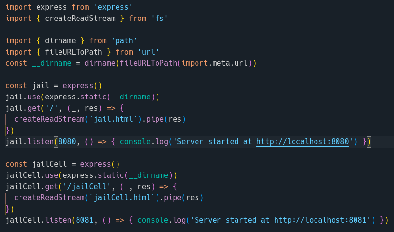

The jail HTML contains two buttons and a status text box for presentation but the main component is the iframe and pointing to the jail cell server.

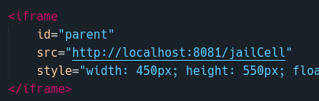

The jail cell HTML is shown below. The page script sets a `doorcode` cookie and has a simple message event listener which watches for incoming events (assumingly only from the jail cell origin). The vulnerable event listener "_leaks_" the page cookie when if it receives the 'H4ck3d!' message.

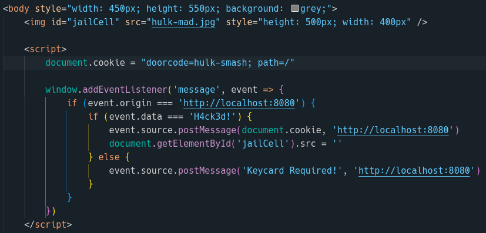

 

## Running the attack

The code for the jail is a little more involved. The `onclick` for the regular Open Door button attempts to send a message to open the door, but it will never succeed or reach the jail cell as it cannot communicate cross-origin.

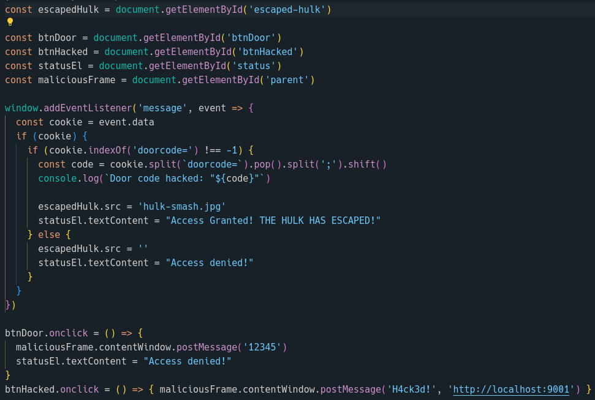

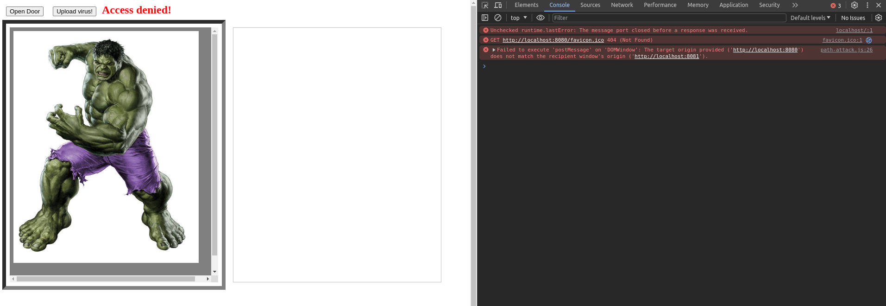

When the Upload virus! button is pressed, a 'virus' is sent to the jail cell keypad, masquerading its origin as that of the jail cell in order to communicate across frames. With the 'H4ck3d!' messaged passed to the jail cell keypad, the door opens and the Hulk is freed!

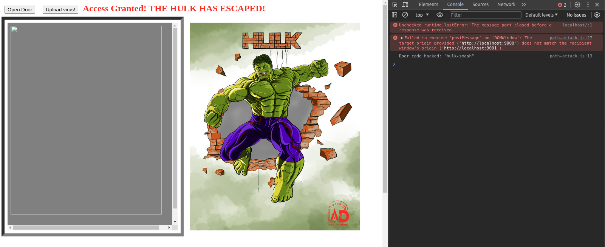

 
 

# Extra credit (up to 10 points, 1 per site)

### [Video Walkthrough](https://www.youtube.com/watch?v=K6EbPDYCWxI)

 

## Frame Busting arms race

There are a few popular methods for blocking frame embeds. One is to use javascript code to detect when the page is inside of a frame and "bust" out by setting the framed page as the main page. A server sending a `X-Frame-Options` header set to 'sameorigin' or 'deny' is an effective prevention measure and was the most common method utilized among the tested web pages, as seen from the Framed Site Details table. Another similar, but more effective method, is to set the "frame-ancestors" `Content Security Policy`. This directive is more secure as it checks the the full frame nesting stack, unlike `X-Frame-Options` which only checks the frame above.

Techniquess to defeat these methods are to catch a frame attempting to change it's location and prompt the user to cancel or programmatically cancel location change. I was unsuccessful in this method. Other methods include using nested iFrames to load content. If a site only utilized a `X-Frame-Options` header set to 'sameorigin', then one could find a way to recursively nest frames such that the desired frame is embedded within another. I was unsuccessful in this attempt as well. Another more bulletproof method is to use a man-in-the-middle proxy capable of stripping the response headers from the incoming requests from the target site, thus rendering the security nonexistant once it reaches the client-side browser.

I initially attempted this setup using a main server and proxy server in express.js. For the proxy server, I tried to disable the `X-Frame-Options` headers but this did not work to successfully bypass the frame security settings.

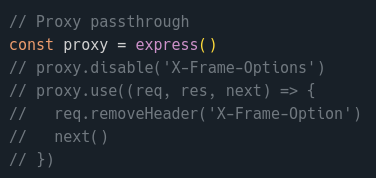

For this demo, I coded in an input and button for the user to provide a website to load on demand. Initally empty, the load button will update the iFrame's src to the proxy server with a query parameter set to the target URL.

The main server simply loads this html file to the user, while the proxy server uses JavaScript's built in `fetch()` function to retrieve the server response at the target URL, parse it to HTML text and pass back the HTML body, which is then loaded within the frame. This method was successful on all tested sites which did not have an error precondition. While this method works to frame the target website itself, not all page content from the target site is able to be loaded into the frame.

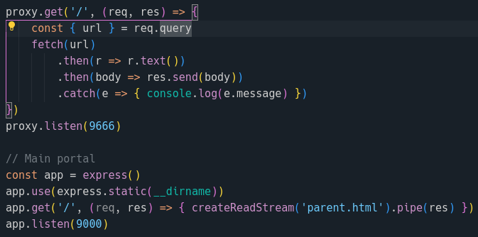

## Frame Proxy Results

| Site | Screenshot | Details |
| :---: | :---: | :--- |
| espn.com |  | Able to embed all visual elements and CSS |
| google.com | 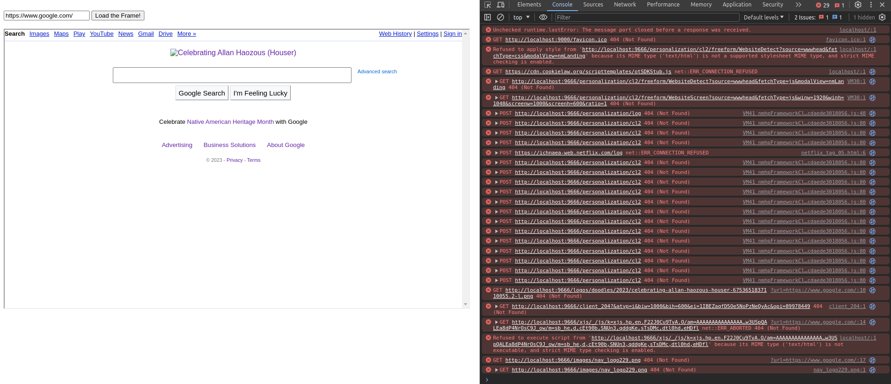 | Page framable but could not load image elements |
| huffpost.com |  | Page framable and all elements loaded |
| mozilla.com | 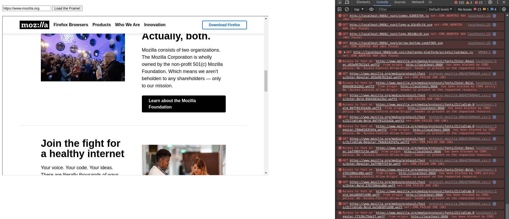 | Able to embed all visual elements and CSS |
| netflix.com | 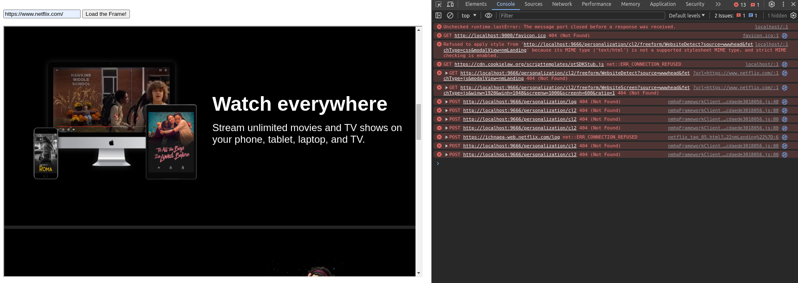 | Able to embed all visual elements and CSS |
| prestashop.com | 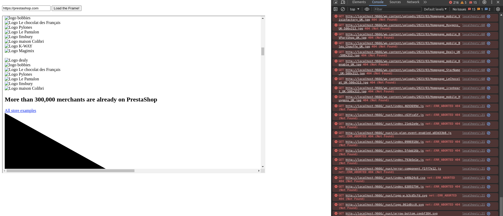 | Able to frame but could not load CSS or image content, only text and icons |
| sky.com | 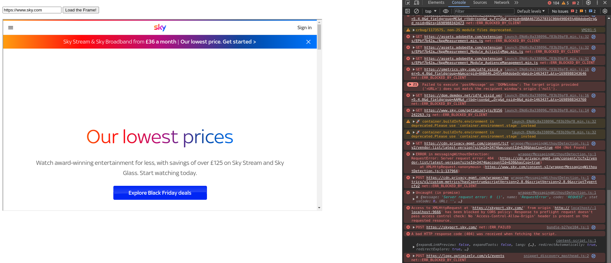 | Able to embed all visual elements and CSS |
| w3.com | 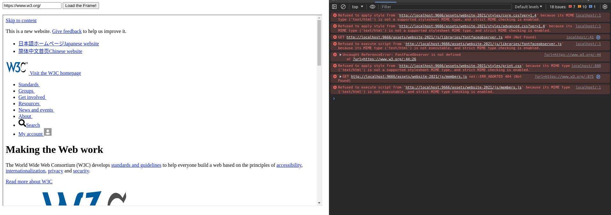 | Able to embed but unable to load CSS |
| walmart.com | 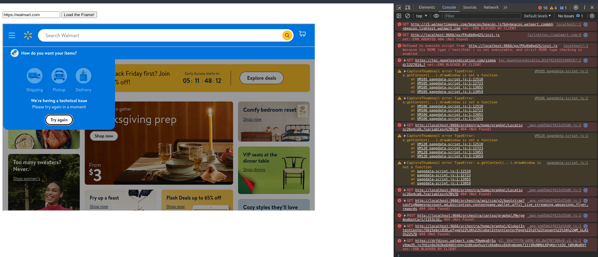 | Able to embed all visual elements and CSS |
| yahoo.com |  | Able to embed all visual elements and CSS, except advertisement frames |

 
 

# Extra credit (2 points)

* Week 5 lecture, slide 65 has a literary reference in its title.  To what work does that reference refer?

The reference on slide 65 refers to a scene from the original Toy Story movie in which Buzz Lightyear is trying to console Woody about his lost hat!

 
 
 

# Image Credits:
https://www.deviantart.com/perkunasloki/art/Incredible-Hulk-300101981
https://www.deviantart.com/leumasartdesigns/art/The-Incredible-Hulk-963402284