## Assignment 5, CS 433/533 Web Security, Fall 2023

## CORS: Blocking and reading responses from another origin

* Create node.js, HTML, and json files in the directory ```5.1``` that demonstrate Javascript running in one HTML file requesting a .json response from another origin.  Show how the json response from one server is blocked, and what is necessary to allow the response.


For this initial scenario we have some super secret data being kept on a server at the path: `/users/david/favorites`. There are three files for this scenario: a `data.json` file, a `server.js` script which initiates a producer and consumer HTTP server, and a `consumer.html` file which contains the content and logic for the scenario.

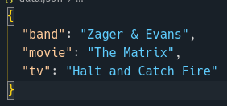

The server does not inherently set security policy headers so requests to this address are natively blocked from external origins. Here, the server producing the data is listening on port `9001` and the server consuming the data is using port `9000`.

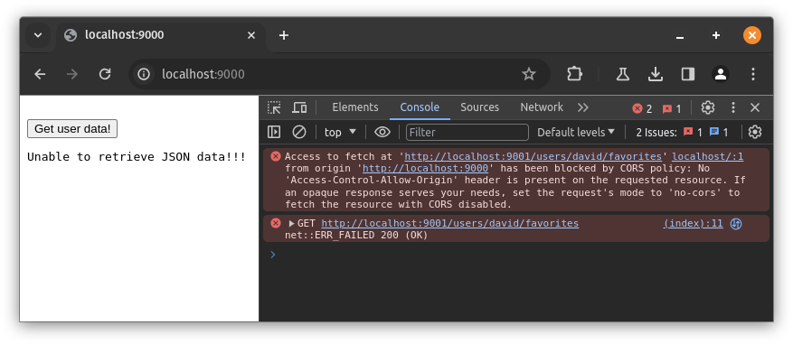

By setting setting the `Access-Control-Allow-Origin` header with a single origin or a wildcard (`*`) value, an exception can be made for one or all external origins requesting the data. Here, I have only allowed the client server at `localhost:9000`.

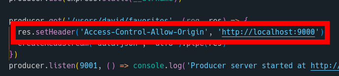

### YouTube Demo

[](https://www.youtube.com/watch?v=nnWfmwu9q0Y)


## CORS: Blocking and reading HTTP response headers from another origin

* Demonstrate how three custom HTTP response headers (```X-CS533f23-*```, where ```*``` corresponds to your three favorite things from assignment 2) are both blocked and then allowed by one server.

For this scenario, there is a button set up that performs a fetch request against our favorites server.

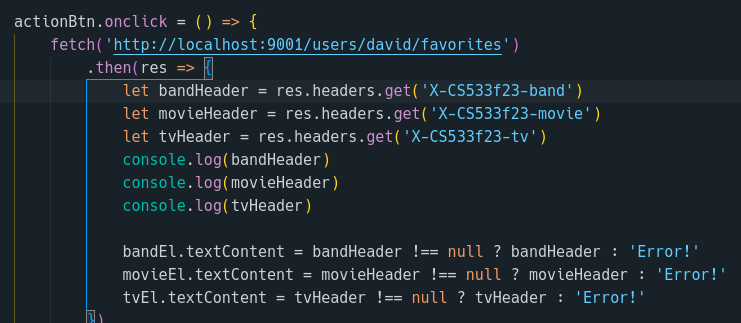

The favorites server has been upgraded to use custom data headers in addition to its original JSON data. The client server displays these favorites or an error message, depending on what is returned from the favorites server. These new custom data headers are sent to the client server upon request, as seen in the screenshot below.

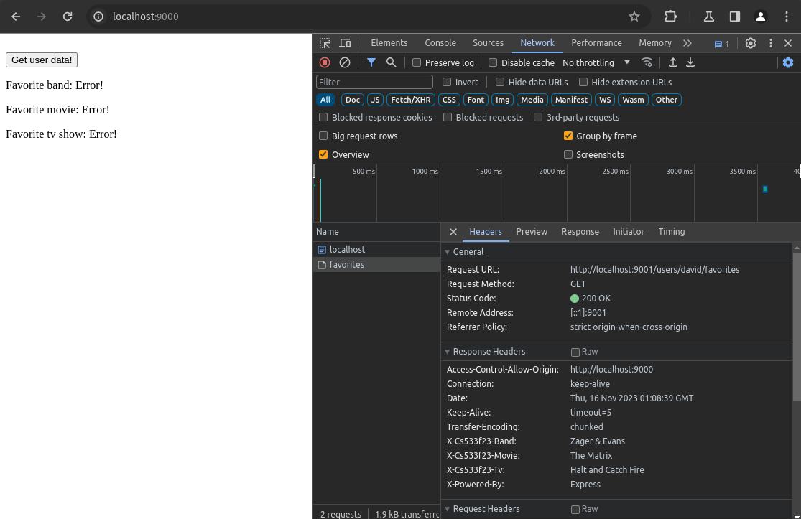

In order to remedy this, the new custom data headers need to be exposed to clients in order to be visible. This is done by setting an `Access-Control-Expose-Headers` header with a comma-delimited list of the custom data headers to be exposed to client servers.

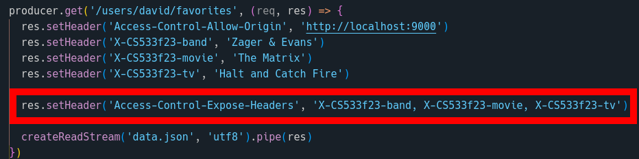

Now, after the server has been restarted, the client requests should be able to read the custom data headers set by the favorites server.

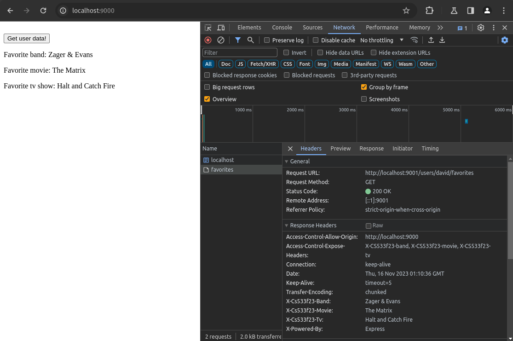


### YouTube Demo

[](https://www.youtube.com/watch?v=_MOLfAwuiAI)


## Content-Security-Policy: embedding from another site

* Find a site from assignment 4 that allowed embedding.  In directory ```5.3```, include the necessary files to demonstrate your local HTML file being allowed to embed the remote site as well as your local server prohibiting the embedding.

Here, I am reusing an html file that displays the Internet Archive website embedded in an iframe element.

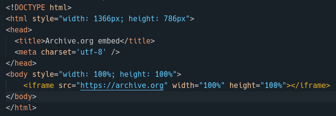

The Internet Archive does not impose policies against embedding so this works without an issue.

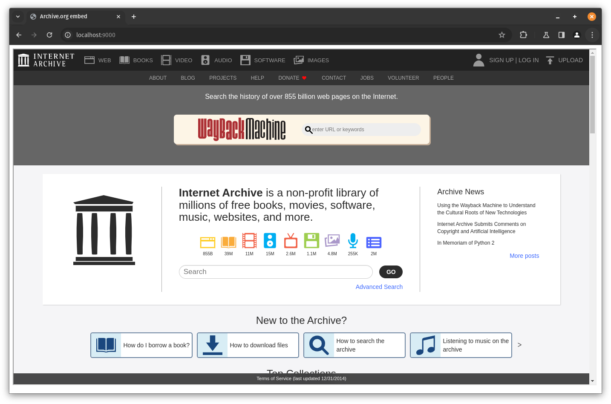

In order to block this ability, not from the Internet Archive, but client-side or within a local http server, a `Content-Security-Policy` header can be set. If this header is set with a `frame-src` directive set and accompanying origins, such as `example.com`, only content from those origins will be allowed to be embedded within the current page.

Setting this header using express.js was strangely unsucessful for me. Setting the header should have blocked the request but did nothing and continued to allow the Internet Archive embed.

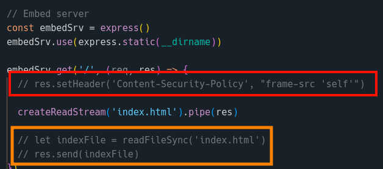

An alternative option is to using headers, per the [Mozilla Web Documentation](https://developer.mozilla.org/en-US/docs/Web/HTTP/CSP) is to set a `<meta>` tag within the HTML document and use a `htt=equiv` attribute.

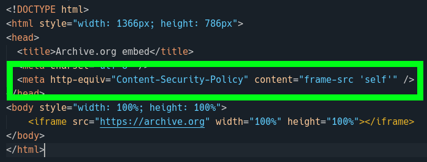

This method was successful in blocked the embed of the Internet Archive homepage.

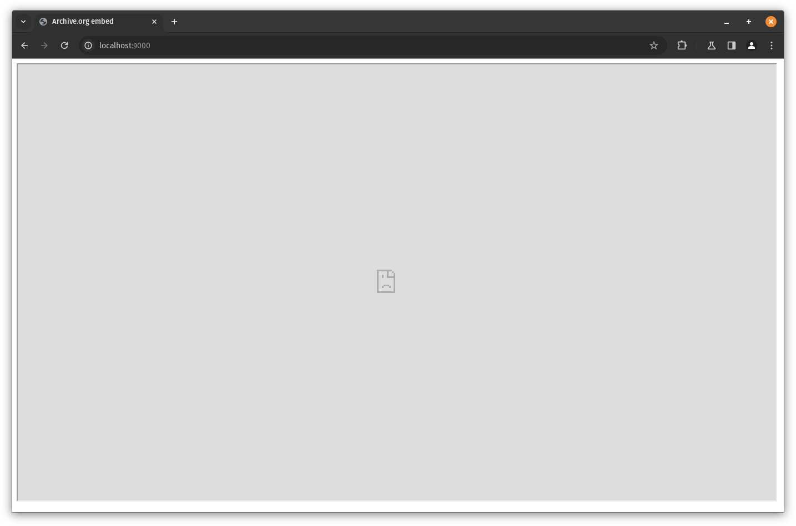


### YouTube Demo

[](https://www.youtube.com/watch?v=FX2z7MEOxfc)
