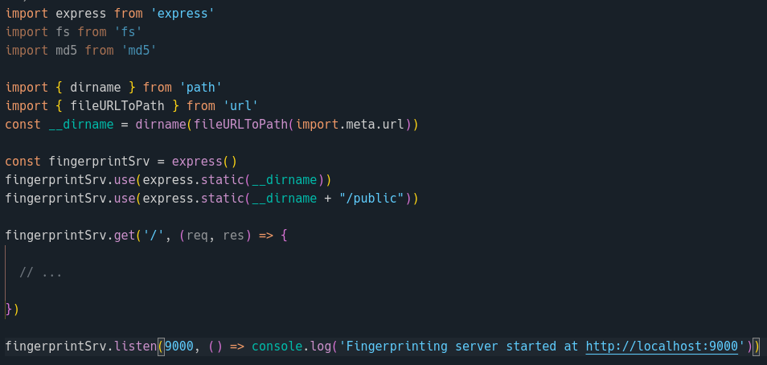
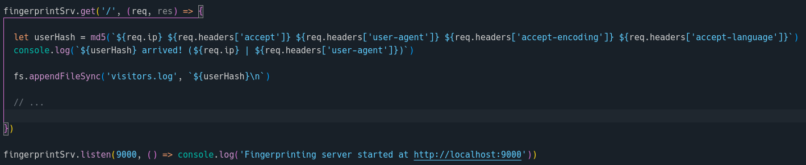
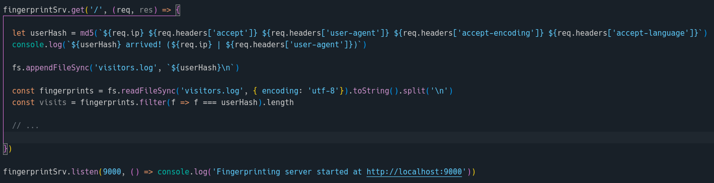
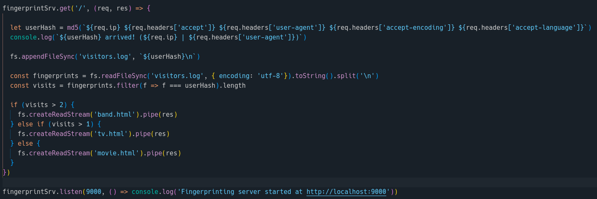
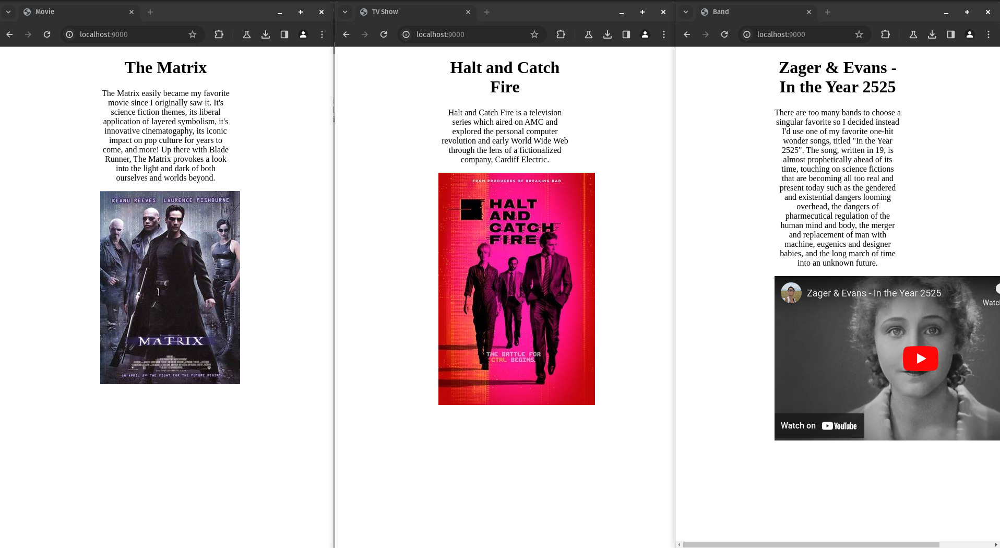

## Assignment 6, CS CS 433/533 Web Security, Fall 2023

### [YouTube Demo](https://youtu.be/xRI6_5IIm94)

### Fingerprint at least 5 different clients 

| Device | Browser | Fingerprint | User Agent |
| :--- | :--- | :--- | :--- |
| Laptop | Brave | 407afdecba205f912e1b8e954ed80a1a | Mozilla/5.0 (X11; Linux x86_64) AppleWebKit/537.36 (KHTML, like Gecko) Chrome/119.0.0.0 Safari/537.36 |
| Laptop | Firefox | 943bb41924e4c85cb80ff329aca7f411 | Mozilla/5.0 (X11; Linux x86_64; rv:120.0) Gecko/20100101 Firefox/120.0 |
| Laptop | Chromium | a10ac3c093e76b1dad47e122de6bef29 | Mozilla/5.0 (X11; Linux x86_64) AppleWebKit/537.36 (KHTML, like Gecko) Chrome/119.0.0.0 Safari/537.36 |
| Desktop | Brave | 2e44234d459cb2f311f5530943977a9e | Mozilla/5.0 (Windows NT 10.0; Win64; x64) AppleWebKit/537.36 (KHTML, like Gecko) Chrome/119.0.0.0 Safari/537.36 |
| Desktop | Firefox | dad6b1dd299cac2183829c0319cd7278 | Mozilla/5.0 (Windows NT 10.0; Win64; x64; rv:120.0) Gecko/20100101 Firefox/120.0 |
| Desktop | Chromium | 7642ea85121cb721398c9c8ce7b88917 | Mozilla/5.0 (Windows NT 10.0; Win64; x64) AppleWebKit/537.36 (KHTML, like Gecko) Chrome/119.0.0.0 Safari/537.36 |
| Phone | Brave | 91003cf1c357c1ad6ca643f406dc58da | Mozilla/5.0 (Linux; Android 10; K) AppleWebKit/537.36 (KHTML, like Gecko) Chrome/119.0.0.0 Mobile Safari/537.36 |
| Phone | Firefox | dd292d2bcc888e2a1715426c919cd957 | Mozilla/5.0 (Android 14; Mobile; rv:120.0) Gecko/120.0 Firefox/120.0 |
| Phone | Google Chrome | 8eef99826c0284d2084e348e355d0f2d | Mozilla/5.0 (Linux; Android 10; K) AppleWebKit/537.36 (KHTML, like Gecko) Chrome/119.0.0.0 Mobile Safari/537.36 |

To fingerprint each client, first I set up a simple server in express.js.

Then I used the `Accept`, `User-Agent`, `Accept-Language`, and `Accept-Encoding` headers, in addition to the connecting client's IP address, to generate an md5 hash value for each client visitor. The hash value is then stored in a locally kept log file.

The log file is immediately read and the number of visits for the current client, including the current visit, are reviewed and counted. The user is then served content based on the number of their previous visits.

### Extra credit (5 points)

For each client, the number of visits to the web server determins the content they will be served. If this is the first visit, the client will be served a page about the movie "The Matrix", on the second visit the client will see a page about the TV show "Halt and Catch Fire", and on all subsequent visits the client will be served an embeded YouTube video. This is depicted in the screenshot below, showing the first, second, and third sequential visits to the server using the same browser, across multiple windows.

