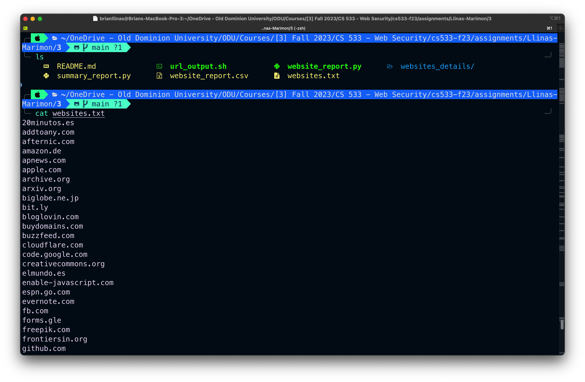
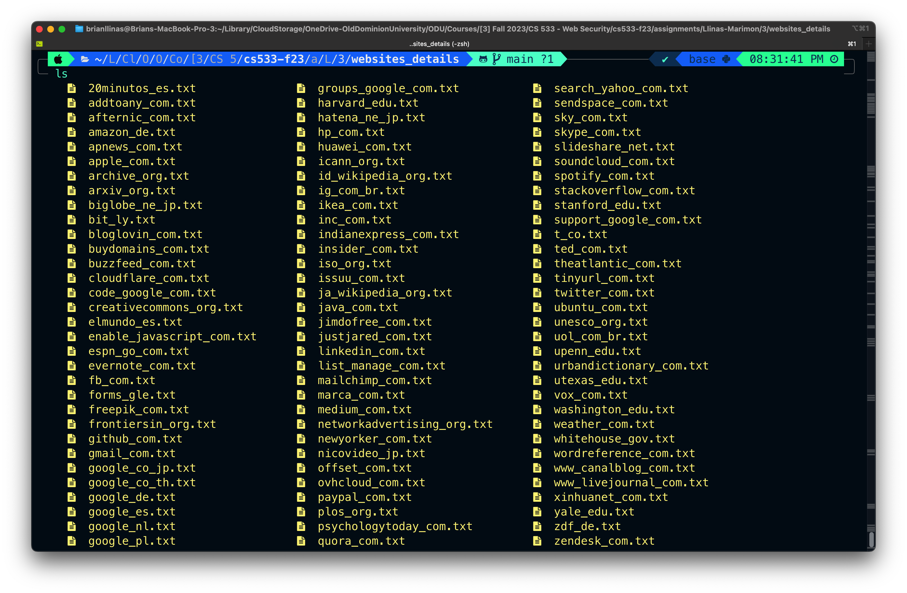
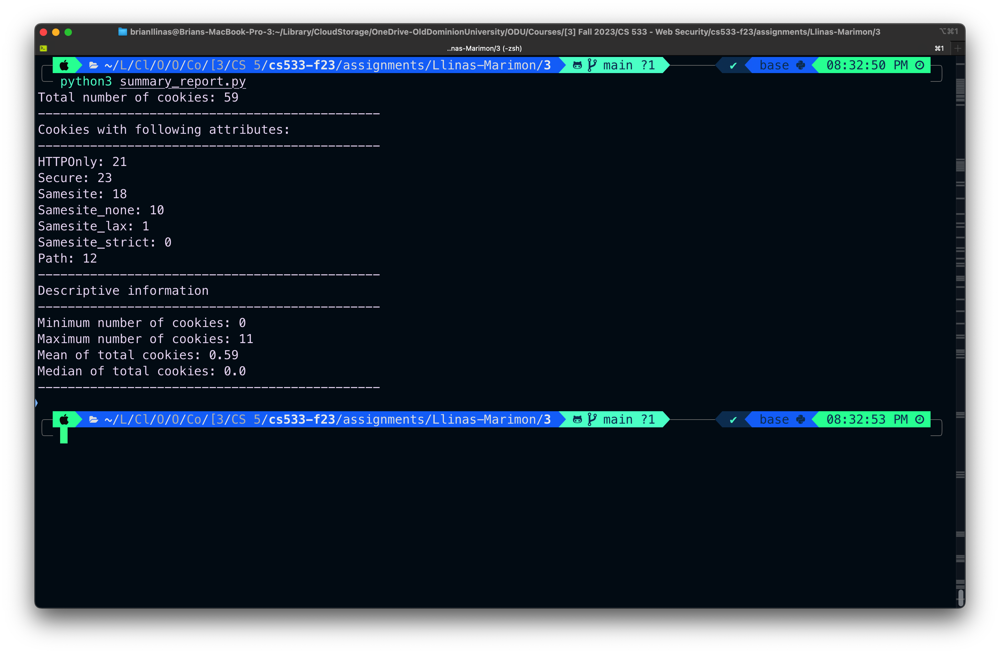

# Assignment 3

This repository contain the report for 100 of the Mozilla top 500 websites 

## List of directories and files

*  **Websites Assigned**
    * [websites.txt](websites.txt)
        * Assigned list of 100 websites
    * [websites_details](websites_details)
        * Contain text files including curl responses for each website from [websites.txt](websites.txt). 

* **Coding Files**
  * [url_output.sh](url_output.sh)
    * Used for extract the url responses for each website
  * [website_report.py](website_report.py)
    * Used for get the following:
        * The terminating status codes for each site. Note this is the final status code, not the 301s, 302, etc. that you may encounter on your way to the final status code. More on that below.
        * For each site, the number of different cookies that are set. Keep in mind that each HTTP reponse can have multiple "Set-Cookie:" headers.
        * For each cookie, extract the attributes: HttpOnly, Secure, SameSite (and the corresponding policy), Path (and the corresponding value). With this data you will answer:
            1. How many cookies set HttpOnly?
            2. How many cookies set Secure?
            3. How many cookies set SameSite? For those that set SameSite, how many are Strict? How many are Lax? How many are None?
            4. How many cookies set a Path? How many of those are values other than "/"?
  * [summary_report.py](summary_report.py)
    * Used for summarizing the entire table, getting the Min/Max/Mean/Median number of cookies for the 100 sites

* **Output files**
  * [website_report.csv](website_report.csv) 
    * Output file from [website_report.py](website_report.py)

## Summary

|url                   |status_code|total_cookies|sum_http_only|sum_secure|sum_same_site|sum_set_path|http_only|secure|same_site|path |same_site_none|same_site_lax|same_site_strict|
|----------------------|-----------|-------------|-------------|----------|-------------|------------|---------|------|---------|-----|--------------|-------------|----------------|
|freepik_com           |301        |0            |0            |0         |0            |0           |False    |False |False    |False|0             |0            |0               |
|marca_com             |301        |0            |0            |0         |0            |0           |False    |False |False    |False|0             |0            |0               |
|whitehouse_gov        |301        |0            |0            |0         |0            |0           |False    |False |False    |False|0             |0            |0               |
|iso_org               |301        |0            |0            |0         |0            |0           |False    |False |False    |False|0             |0            |0               |
|hp_com                |301        |3            |0            |0         |0            |2           |False    |False |False    |True |0             |0            |0               |
|google_pl             |301        |3            |2            |2         |1            |0           |True     |True  |True     |False|0             |0            |0               |
|huawei_com            |301        |0            |0            |0         |0            |0           |False    |False |False    |False|0             |0            |0               |
|quora_com             |308        |0            |0            |0         |0            |0           |False    |False |False    |False|0             |0            |0               |
|linkedin_com          |301        |0            |0            |0         |0            |0           |False    |False |False    |False|0             |0            |0               |
|frontiersin_org       |301        |0            |0            |0         |0            |0           |False    |False |False    |False|0             |0            |0               |
|www_livejournal_com   |301        |1            |0            |0         |0            |0           |False    |False |False    |False|0             |0            |0               |
|archive_org           |200        |0            |0            |0         |0            |0           |False    |False |False    |False|0             |0            |0               |
|jimdofree_com         |301        |0            |0            |0         |0            |0           |False    |False |False    |False|0             |0            |0               |
|yale_edu              |301        |0            |0            |0         |0            |0           |False    |False |False    |False|0             |0            |0               |
|mailchimp_com         |301        |2            |0            |2         |2            |2           |False    |True  |True     |True |2             |0            |0               |
|bloglovin_com         |403        |0            |0            |0         |0            |0           |False    |False |False    |False|0             |0            |0               |
|list_manage_com       |302        |2            |0            |0         |0            |0           |False    |False |False    |False|0             |0            |0               |
|slideshare_net        |301        |1            |0            |0         |0            |1           |False    |False |False    |True |0             |0            |0               |
|buydomains_com        |403        |1            |1            |0         |1            |0           |True     |False |True     |False|1             |0            |0               |
|google_ru             |301        |3            |2            |2         |1            |0           |True     |True  |True     |False|0             |0            |0               |
|elmundo_es            |301        |0            |0            |0         |0            |0           |False    |False |False    |False|0             |0            |0               |
|20minutos_es          |301        |0            |0            |0         |0            |0           |False    |False |False    |False|0             |0            |0               |
|urbandictionary_com   |301        |0            |0            |0         |0            |0           |False    |False |False    |False|0             |0            |0               |
|sky_com               |302        |0            |0            |0         |0            |0           |False    |False |False    |False|0             |0            |0               |
|groups_google_com     |301        |1            |1            |0         |0            |0           |True     |False |False    |False|0             |0            |0               |
|washington_edu        |302        |0            |0            |0         |0            |0           |False    |False |False    |False|0             |0            |0               |
|unesco_org            |302        |0            |0            |0         |0            |0           |False    |False |False    |False|0             |0            |0               |
|gmail_com             |301        |0            |0            |0         |0            |0           |False    |False |False    |False|0             |0            |0               |
|vox_com               |301        |1            |0            |1         |1            |1           |False    |True  |True     |True |0             |1            |0               |
|amazon_de             |301        |0            |0            |0         |0            |0           |False    |False |False    |False|0             |0            |0               |
|psychologytoday_com   |301        |0            |0            |0         |0            |0           |False    |False |False    |False|0             |0            |0               |
|insider_com           |301        |0            |0            |0         |0            |0           |False    |False |False    |False|0             |0            |0               |
|xinhuanet_com         |200        |0            |0            |0         |0            |0           |False    |False |False    |False|0             |0            |0               |
|enable_javascript_com |301        |0            |0            |0         |0            |0           |False    |False |False    |False|0             |0            |0               |
|plos_org              |301        |0            |0            |0         |0            |0           |False    |False |False    |False|0             |0            |0               |
|zdf_de                |301        |0            |0            |0         |0            |0           |False    |False |False    |False|0             |0            |0               |
|paypal_com            |301        |0            |0            |0         |0            |0           |False    |False |False    |False|0             |0            |0               |
|zendesk_com           |301        |0            |0            |0         |0            |0           |False    |False |False    |False|0             |0            |0               |
|google_co_jp          |301        |3            |2            |2         |1            |0           |True     |True  |True     |False|0             |0            |0               |
|evernote_com          |301        |0            |0            |0         |0            |0           |False    |False |False    |False|0             |0            |0               |
|theatlantic_com       |301        |4            |0            |0         |0            |4           |False    |False |False    |True |0             |0            |0               |
|ja_wikipedia_org      |301        |0            |0            |0         |0            |0           |False    |False |False    |False|0             |0            |0               |
|fb_com                |301        |0            |0            |0         |0            |0           |False    |False |False    |False|0             |0            |0               |
|hatena_ne_jp          |302        |1            |0            |0         |0            |0           |False    |False |False    |False|0             |0            |0               |
|apnews_com            |301        |0            |0            |0         |0            |0           |False    |False |False    |False|0             |0            |0               |
|code_google_com       |200        |0            |0            |0         |0            |0           |False    |False |False    |False|0             |0            |0               |
|www_canalblog_com     |301        |0            |0            |0         |0            |0           |False    |False |False    |False|0             |0            |0               |
|buzzfeed_com          |301        |0            |0            |0         |0            |0           |False    |False |False    |False|0             |0            |0               |
|upenn_edu             |301        |0            |0            |0         |0            |0           |False    |False |False    |False|0             |0            |0               |
|skype_com             |301        |0            |0            |0         |0            |0           |False    |False |False    |False|0             |0            |0               |
|soundcloud_com        |301        |0            |0            |0         |0            |0           |False    |False |False    |False|0             |0            |0               |
|indianexpress_com     |301        |0            |0            |0         |0            |0           |False    |False |False    |False|0             |0            |0               |
|forms_gle             |301        |0            |0            |0         |0            |0           |False    |False |False    |False|0             |0            |0               |
|stanford_edu          |302        |0            |0            |0         |0            |0           |False    |False |False    |False|0             |0            |0               |
|ikea_com              |301        |0            |0            |0         |0            |0           |False    |False |False    |False|0             |0            |0               |
|networkadvertising_org|301        |0            |0            |0         |0            |0           |False    |False |False    |False|0             |0            |0               |
|id_wikipedia_org      |301        |0            |0            |0         |0            |0           |False    |False |False    |False|0             |0            |0               |
|biglobe_ne_jp         |200        |0            |0            |0         |0            |0           |False    |False |False    |False|0             |0            |0               |
|google_nl             |301        |3            |2            |2         |1            |0           |True     |True  |True     |False|0             |0            |0               |
|icann_org             |301        |0            |0            |0         |0            |0           |False    |False |False    |False|0             |0            |0               |
|wordreference_com     |301        |0            |0            |0         |0            |0           |False    |False |False    |False|0             |0            |0               |
|utexas_edu            |301        |0            |0            |0         |0            |0           |False    |False |False    |False|0             |0            |0               |
|support_google_com    |301        |0            |0            |0         |0            |0           |False    |False |False    |False|0             |0            |0               |
|uol_com_br            |301        |0            |0            |0         |0            |0           |False    |False |False    |False|0             |0            |0               |
|twitter_com           |301        |0            |0            |0         |0            |0           |False    |False |False    |False|0             |0            |0               |
|nicovideo_jp          |301        |1            |0            |0         |0            |0           |False    |False |False    |False|0             |0            |0               |
|ubuntu_com            |301        |0            |0            |0         |0            |0           |False    |False |False    |False|0             |0            |0               |
|medium_com            |301        |1            |1            |0         |0            |0           |True     |False |False    |False|0             |0            |0               |
|arxiv_org             |301        |2            |0            |0         |0            |0           |False    |False |False    |False|0             |0            |0               |
|java_com              |504        |0            |0            |0         |0            |0           |False    |False |False    |False|0             |0            |0               |
|justjared_com         |301        |0            |0            |0         |0            |0           |False    |False |False    |False|0             |0            |0               |
|googleusercontent_com |N/A        |0            |0            |0         |0            |0           |False    |False |False    |False|0             |0            |0               |
|ig_com_br             |301        |0            |0            |0         |0            |0           |False    |False |False    |False|0             |0            |0               |
|ted_com               |301        |0            |0            |0         |0            |0           |False    |False |False    |False|0             |0            |0               |
|ovhcloud_com          |301        |0            |0            |0         |0            |0           |False    |False |False    |False|0             |0            |0               |
|spotify_com           |301        |0            |0            |0         |0            |0           |False    |False |False    |False|0             |0            |0               |
|github_com            |301        |0            |0            |0         |0            |0           |False    |False |False    |False|0             |0            |0               |
|weather_com           |301        |2            |0            |0         |0            |0           |False    |False |False    |False|0             |0            |0               |
|offset_com            |301        |0            |0            |0         |0            |0           |False    |False |False    |False|0             |0            |0               |
|bit_ly                |302        |0            |0            |0         |0            |0           |False    |False |False    |False|0             |0            |0               |
|newyorker_com         |301        |11           |0            |6         |4            |2           |False    |True  |True     |True |4             |0            |0               |
|addtoany_com          |301        |0            |0            |0         |0            |0           |False    |False |False    |False|0             |0            |0               |
|inc_com               |301        |0            |0            |0         |0            |0           |False    |False |False    |False|0             |0            |0               |
|google_es             |301        |3            |2            |2         |1            |0           |True     |True  |True     |False|0             |0            |0               |
|harvard_edu           |301        |0            |0            |0         |0            |0           |False    |False |False    |False|0             |0            |0               |
|researchgate_net      |301        |2            |2            |0         |1            |0           |True     |False |True     |False|1             |0            |0               |
|stackoverflow_com     |301        |1            |1            |0         |1            |0           |True     |False |True     |False|1             |0            |0               |
|t_co                  |301        |0            |0            |0         |0            |0           |False    |False |False    |False|0             |0            |0               |
|afternic_com          |301        |0            |0            |0         |0            |0           |False    |False |False    |False|0             |0            |0               |
|creativecommons_org   |302        |0            |0            |0         |0            |0           |False    |False |False    |False|0             |0            |0               |
|issuu_com             |301        |0            |0            |0         |0            |0           |False    |False |False    |False|0             |0            |0               |
|google_co_th          |301        |3            |2            |2         |1            |0           |True     |True  |True     |False|0             |0            |0               |
|search_yahoo_com      |301        |0            |0            |0         |0            |0           |False    |False |False    |False|0             |0            |0               |
|sendspace_com         |301        |0            |0            |0         |0            |0           |False    |False |False    |False|0             |0            |0               |
|cloudflare_com        |301        |1            |1            |0         |1            |0           |True     |False |True     |False|1             |0            |0               |
|apple_com             |301        |0            |0            |0         |0            |0           |False    |False |False    |False|0             |0            |0               |
|reddit_com            |301        |0            |0            |0         |0            |0           |False    |False |False    |False|0             |0            |0               |
|tinyurl_com           |301        |0            |0            |0         |0            |0           |False    |False |False    |False|0             |0            |0               |
|espn_go_com           |301        |0            |0            |0         |0            |0           |False    |False |False    |False|0             |0            |0               |
|google_de             |301        |3            |2            |2         |1            |0           |True     |True  |True     |False|0             |0            |0               |

* Total number of cookies for 100 websites: 59

**Summary of the cookies which have following attributes:**

* HTTPOnly - 21
* Secure - 23
* Samesite - 18
  * None - 10
  * Lax - 1
  * Strict - 0
* Path: 12 

## Min/Max/Mean/Median
**Minimum, maximum, mean, and median number of the cookies extracted from 100 websites**
  * Minimum number of cookies per site - 0
  * Maximum number of cookies per site - 11
  * Mean number of cookies - 0.59
  * Median number of cookies - 0
******

### Screenshots

* Viewing the list of the assigned websites.

* Received curl responses saved into text files separately.

* Running the code of cookie_report_summary.py 

