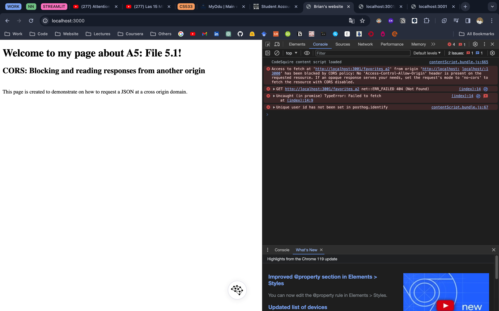
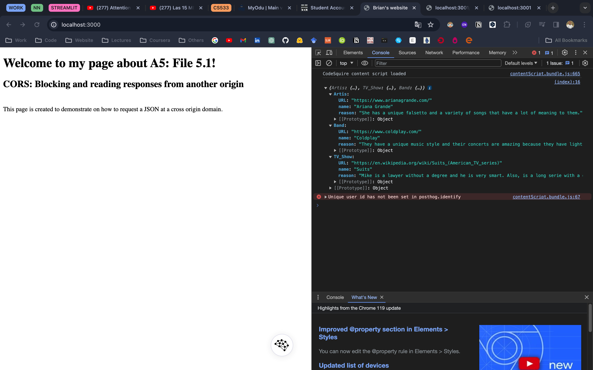
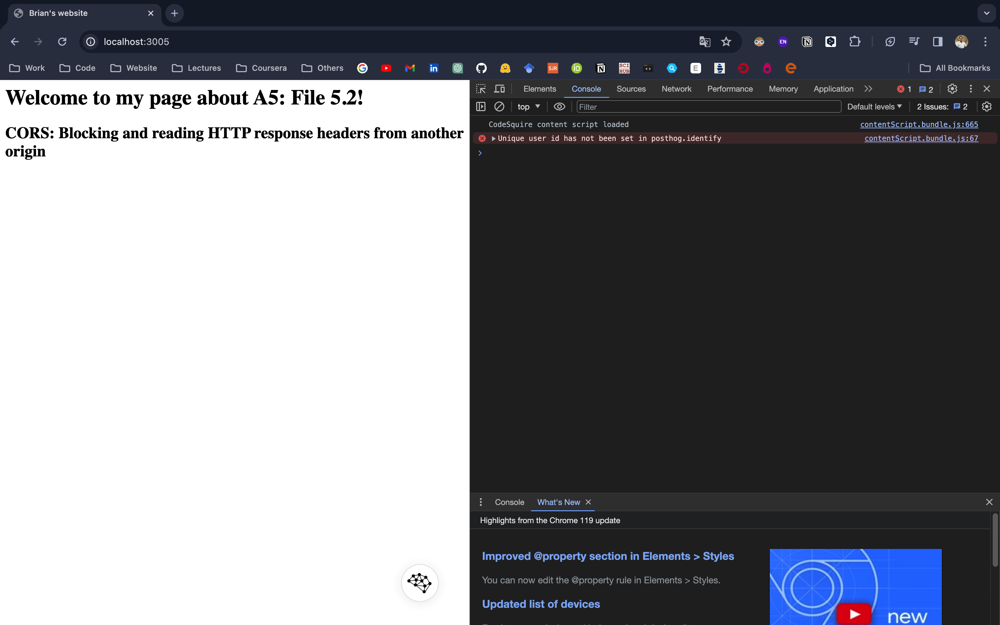
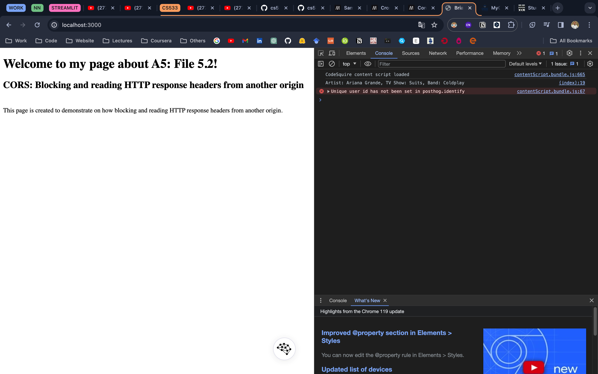
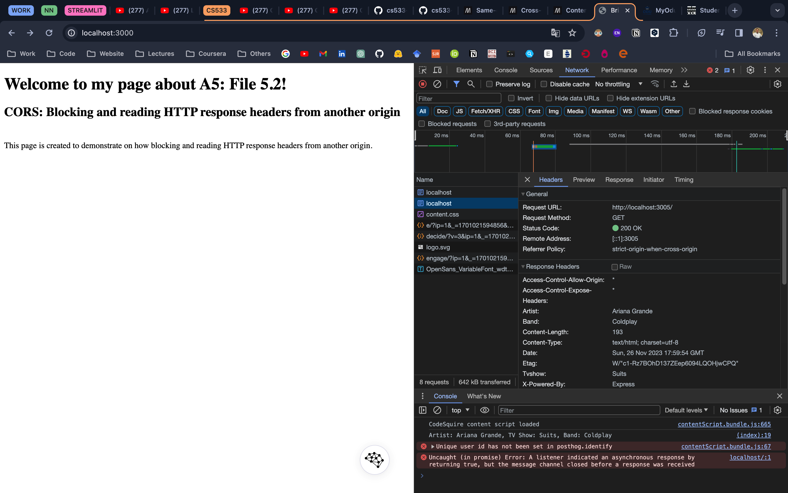
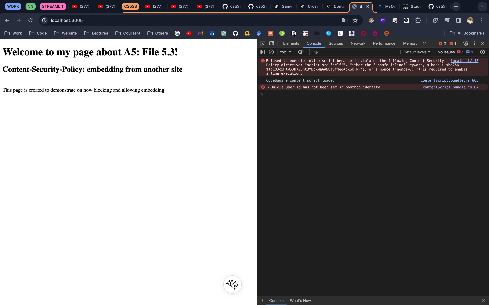
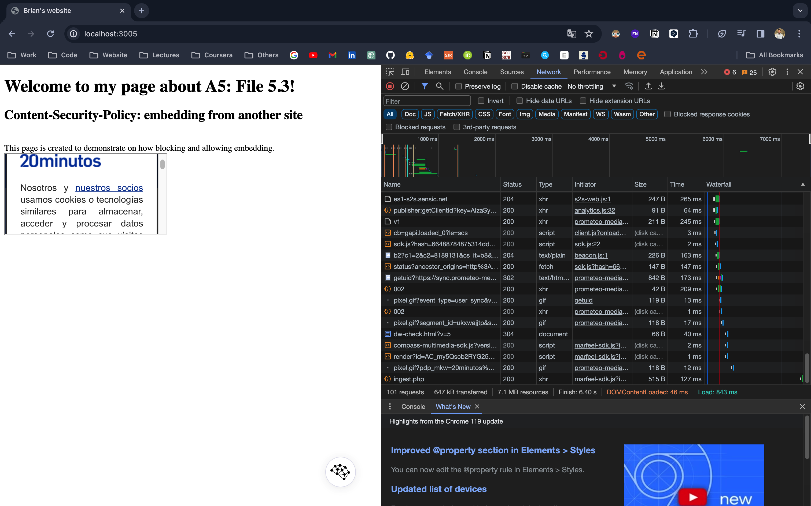

# Assignment 5 

## CORS: Blocking and reading responses from another origin

### List of files in 5.1

* [favorites_a2.json](5.1/favorites_a2.json) - contains the json file created with favourite band, TV show, and artist.
* [website_1.html](5.1/website_1.html) - html file trying to fetch json object.
* [server.js](5.1/server.js) - server used to host website_1.html.
* [server_deny.js](5.1/server_deny.js) - server preventing access.
* [server_allow.js](5.1/server_allow.js) - server allowing access.

### Youtube video is available at: https://youtu.be/iDzgWPW5wwU

### Summary

 1. Demonstrating the request to fetch favs.json from another origin is denied by CORS policy.

    

 2. Demonstrating the request to fetch favs.json from another origin is allowed after setting CORS headers.

    ```
    var cors = require('cors')
    app.use(cors())
    ```

    

## CORS: Blocking and reading HTTP response headers from another origin

### List of files in 5.2

* [website_2.html](5.2/website_2.html) - contains the html file trying to fetch response headers.
* [server.js](5.2/server.js) - server used to host website_2.html.
* [server_deny.js](5.2/server_deny.js) - server without Access-Control-Expose-Headers.
* [server_allow.js](5.2server_allow.js) - server with Access-Control-Expose-Headers.

### Youtube video is available at: https://youtu.be/-tPcjDp31AU

### Summary

 1. Custom response headers

```
res.set('artist', 'Ariana Grande')
res.set('tvshow', 'Suits')
res.set('band', 'Coldplay') 
```

2. Below sreenshot demonstrates how the response headers which are set on a remote origin are denied by the the html file hosted in localhost:4000.

 

3. Demonstrating how, html file fetch the response headers from a remote origin when the 'Access-Control-Expose-Headers' header is set. 

```
app.get("/", function (req, res) {
    res.set('Access-Control-Expose-Headers', '*')
    res.set('artist', 'Ariana Grande')
	  res.set('tvshow', 'Suits')
	  res.set('band', 'Coldplay') 
	  res.send("<html><head><title>Brian's website</title></head><body><h1>Welcome to my page about A5: File 5.2!</h1><h2>CORS: Blocking and reading HTTP response headers from another origin</h2></body></html>")
});
```

 

 

## Content-Security-Policy: embedding from another site

### List of files in 5.3

* [website_3.html](5.3/website_3.html) - html file with iframe
* [server_deny.js](5.3/server_deny.js) - server with Content-Security-Policy:"default-src 'self'; script-src 'self'".
* [server_allow.js](5.3server_allow.js) - server with Content-Security-Policy:"default-src 'self' https://www.adobe.com/; script-src 'self' 'unsafe-inline'"

### Youtube video is available at: https://youtu.be/WBEN89qpYqw

### Summary

1. Demonstrating the use of 'Content-Security-Policy' to deny the embedding of a site from a different origin.

```
'Content-Security-Policy', "default-src 'self'; script-src 'self'"
```

     


1. Demonstrating the use of 'Content-Security-Policy' to allow embedding of a site from a different origin.

```
'Content-Security-Policy', "default-src 'self' https://github.com/; script-src 'self' 'unsafe-inline'"
```

    
