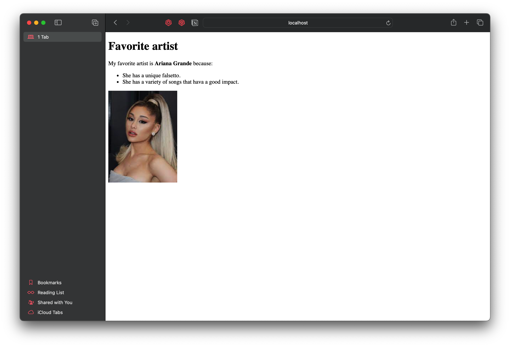

## Assignment 6 - Brian Llinas

## Fingerprinting different clients

### List of files in 6

* [website_1.html](website_1.html) - html file served to curl.
* [ariana-grande.html](ariana-grande.html) - html file served to Safari.
* [coldplay.html](coldplay.html) - html file served to Opera.
* [suits.html](suits.html) - html file served to FireFox.
* [favs.html](favs.html) - html file served to Google Chrome.
* [server.js](server.js) - server used to host kumu_1.html and create fingerprints.
* [visitors_log.json](visitors_log.json) - json file used to log visitor details.

### Summary

 1. Creating fingerprints.

Following code collects three different HTTP request headers using [req.get](https://expressjs.com/en/api.html#req.get) and concatenate them into a single string and save as a hash function using [md5](https://www.npmjs.com/package/md5).

```
 // collect reuqest headers
    header1 = req.get('User-Agent');
	header2 = req.get('Accept');
	header3 = req.get('Accept-Language');
	header4 = req.get('Accept-Encoding');

// concat features to create a string
    var fingerprint = header1.concat(header2, header3, header4);

// fingerprint into hash value
    var fingerprint_id = md5(fingerprint);
```

2. Serving 5 different html files to 5 browsers.

```
//serve file
    if (header1.includes('Safari')){
		res.sendFile(__dirname + "/ariana-grande.html");
	}else if (header1.includes('Firefox')){
		res.sendFile(__dirname + "/suits.html");
	} else if(header1.includes('curl')){
		res.sendFile(__dirname + "/website_1.html");
	}else if (header1.includes('OPR')){
		res.sendFile(__dirname + "/coldplay.html");
	}else {
		res.sendFile(__dirname + "/favs.html");
	}
```

3. Creating an array item for one visitor.

```
jsonData.visitors.push({
	id: fingerprint_id,
	User_Agent: header1,
	Accept: header2,
	Accept_Language: header3,
	Accept_Encoding: header4,
	last_visit_date: [new Date()],
	visit_count:1			
	});
			
	fs.writeFileSync('visitors_log.json', JSON.stringify(jsonData) + "\n", 'utf-8', (err) => {
	if (err) throw err;
	});

```

 4. Log visitor details to visitor_log.json.

The server follows the steps stated below when logging visitor details:

  i.   Access the log file and checks whether the fingerprint exists. <br>
  ii.  If fingerprint is found update the visit count and last visit date and update log file with new data. <br>
  iii. If the fingerprint is new, add new data to the file.

5. Example of log entries.

```
{
  "visitors": [
    {
      "id": "aa017ccaa64fff422458d88b8b451192",
      "User_Agent": "Mozilla/5.0 (Macintosh; Intel Mac OS X 10_15_7) AppleWebKit/537.36 (KHTML, like Gecko) Chrome/120.0.0.0 Safari/537.36",
      "Accept": "text/html,application/xhtml+xml,application/xml;q=0.9,image/avif,image/webp,image/apng,*/*;q=0.8,application/signed-exchange;v=b3;q=0.7",
      "Accept_Language": "en,es;q=0.9",
      "Accept_Encoding": "gzip, deflate, br",
      "last_visit_date": [
        "2023-12-15T05:53:37.209Z"
      ],
      "visit_count": 1
    },
    {
      "id": "65de97b558a1a788bd8409cd555c0ad5",
      "User_Agent": "Mozilla/5.0 (Macintosh; Intel Mac OS X 10_15_7) AppleWebKit/537.36 (KHTML, like Gecko) Chrome/120.0.0.0 Safari/537.36",
      "Accept": "text/html,application/xhtml+xml,application/xml;q=0.9,image/avif,image/webp,image/apng,*/*;q=0.8",
      "Accept_Language": "en-US,en",
      "Accept_Encoding": "gzip, deflate, br",
      "last_visit_date": [
        "2023-12-15T05:54:17.960Z"
      ],
      "visit_count": 1
    },
    {
      "id": "f33fcb4d26ab9063ea46168bcf271297",
      "User_Agent": "Mozilla/5.0 (Macintosh; Intel Mac OS X 10_15_7) AppleWebKit/605.1.15 (KHTML, like Gecko) Version/17.2 Safari/605.1.15",
      "Accept": "text/html,application/xhtml+xml,application/xml;q=0.9,*/*;q=0.8",
      "Accept_Language": "en-US,en;q=0.9",
      "Accept_Encoding": "gzip, deflate",
      "last_visit_date": [
        "2023-12-15T05:54:46.244Z"
      ],
      "visit_count": 1
    }
  ]
}
```

6. Screenshots of demonstrations with five different browsers.

* Google Chrome (device - Laptop, served html file - favs.html)  
 

* Opera (device - Laptop, served html file - coldplay.html)
 

* Safari (device - Laptop, served html file - ariana-grande.html)
 

* Firefox (device - Laptop, served html file - suits.html)
 

* curl (device - Laptop, served html file - website_1.html)
 

7. Screenshot of demonstration with tablet. (Browser - Safari)
 