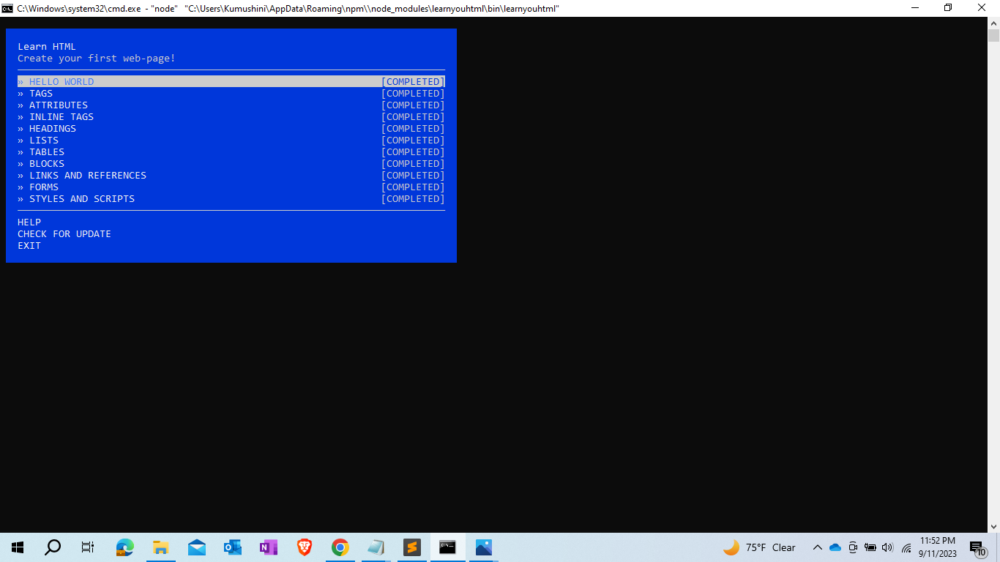
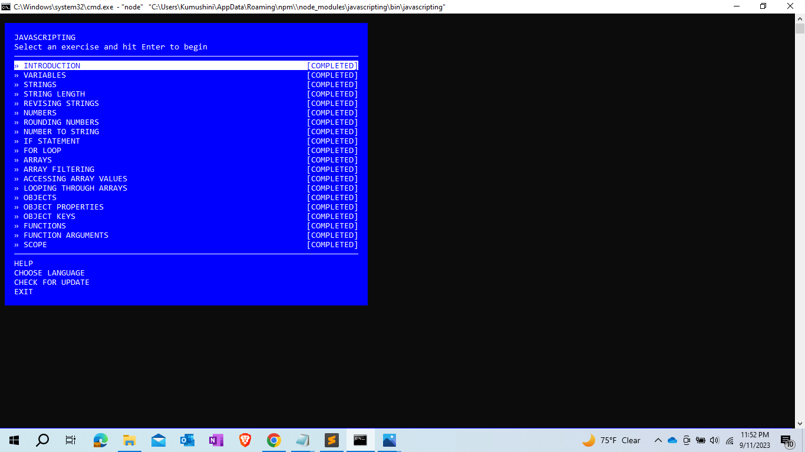
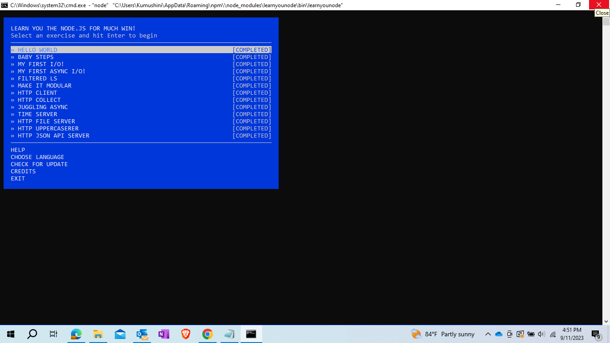

## Assignment 1 - Kumushini (01251889)

* The directories
  * [html](html)
    "This directory contains 11 html files per each task"
  * [javascript](javascript)
    "This directory contains 20 javascript files per each task"
  * [node](node)
   "This directory contains 14 javascript files per each task"

* Screen shot of completion of learnyouhtml. 

* Screen shot of completion of javascripting.
  

* Screen shot of completion of learnyounode.
  

* The video of the files and test completion pages is available at: [https://youtu.be/i1cYvm1NWJk](https://youtu.be/nnLLEWGHfjI)
