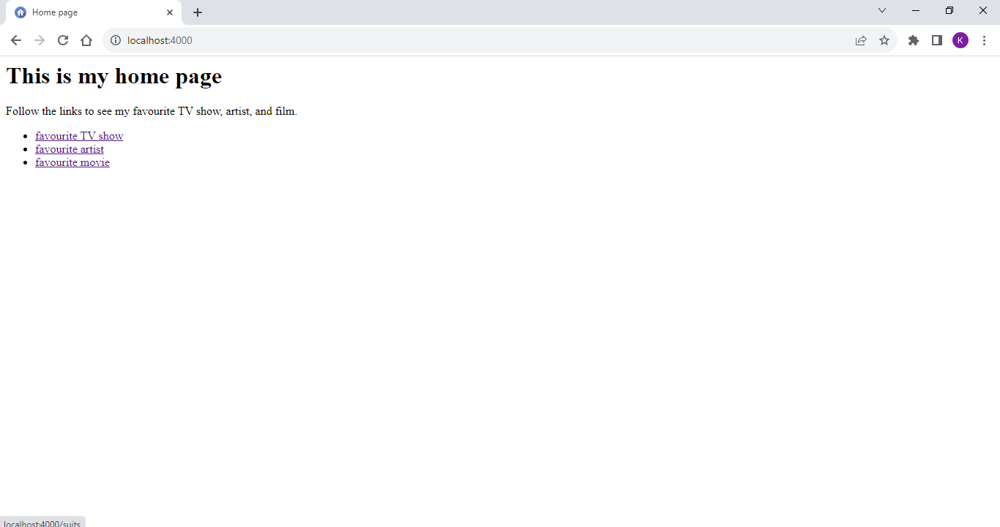
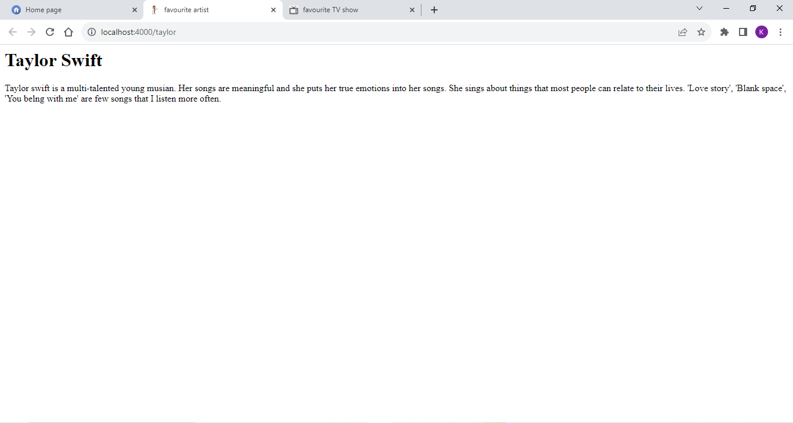
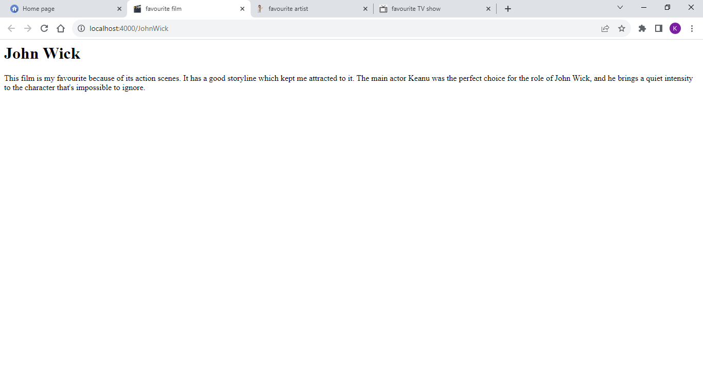
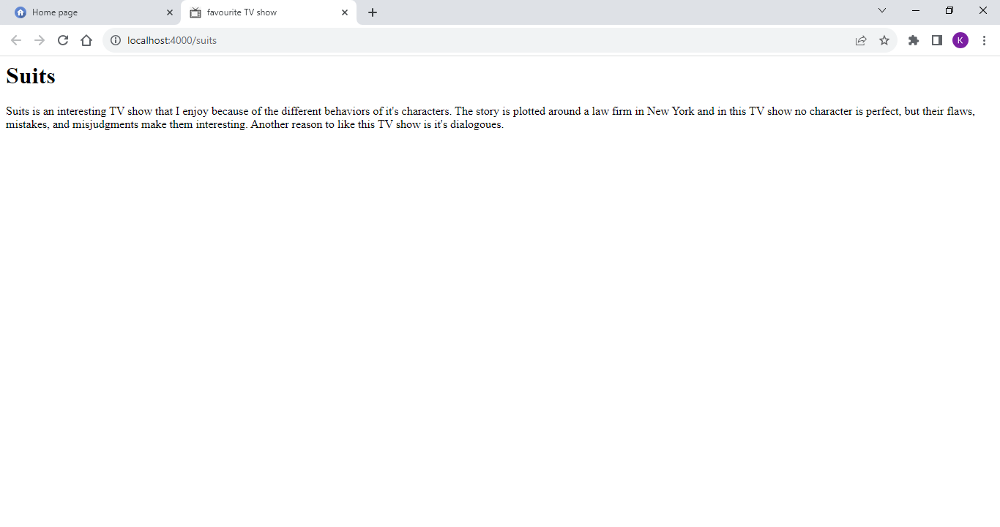

## Assignment 2 - Kumushini(01251889)

This directory contains files related to creating and running a node server on a local machine.

* **The files**
   * **index.js**
     -The javascript file created for setting up the server.
   * **home.html**
     -Html file referring to the home page.
     
   * Screenshot of [home.html](home.html) page
   <kbd></kbd>
   
* **The directories**
  * **html**
    -Contains following html files;
     
           taylor.html 
           johnwick.html 
           suits.html

  * Screenshot of [taylor.html](taylor.html) page
  <kbd></kbd>

  * Screenshot of [johnwick.html](johnwick.html) page
  <kbd></kbd>

  * Screenshot of [suits.html](suits.html) page
  <kbd></kbd>
  
  * **public/images**
    -Contains favicons.

  * Favicons used
  
  <kbd></kbd>
  <kbd></kbd>
  <kbd></kbd>
  <kbd></kbd>

  * **node_modules**
    -Contains node modules
         

* Youtube video link for viewing files, running server, and viewing output is available at: https://youtu.be/VMmlqgsRWRQ 
