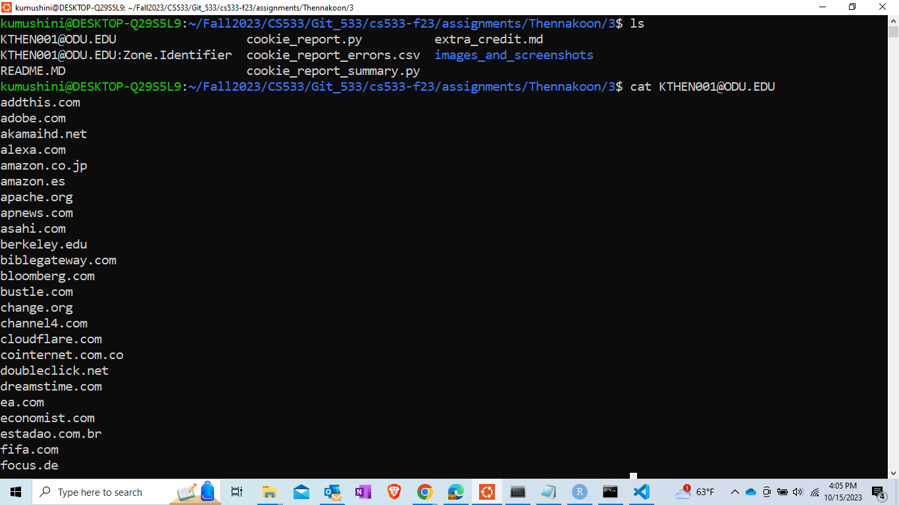
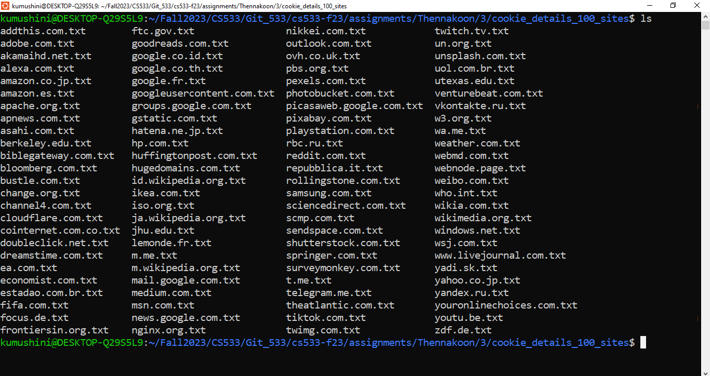
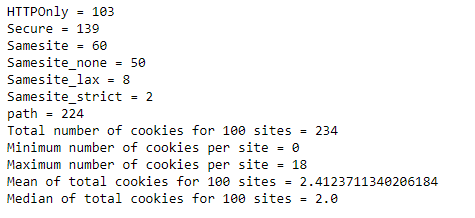

## Assignment 3 - Kumushini(01251889)

This directory contains details and an analysis of cookies set for 100 websites.

### List of directories and files

  *  [KTHEN001@ODU.EDU](KTHEN001@ODU.EDU)
    -Assigned list of 100 websites

  * **cookie_details_100_sites**
    -Contain text files including curl responses for each website. 

* **Code**
  * [curl_output.sh](curl_output.sh)
  * [cookie_report.py](cookie_report.py)
  * [cookie_report_summary.py](cookie_report_summary.py)

* **Output files**

  * [cookie_report.csv](cookie_report.csv) - Output file from cookie_report.py
  * [Data table](cookie_report_updated.csv) - **Cookie report** - updated table obtained from cookie_report.csv
  * [Data table with error responses](cookie_report_errors.csv) - Table containing error responses

*******

### Summary
* Total number of cookies for 100 sites - 234

**Summary of the cookies which have following attributes:**

* HTTPOnly - 103
* Secure - 139
* Samesite - 60
  * None - 50
  * Lax - 8
  * Strict - 2
* Path -224
  * Path other than "/" - 0

### Min/Max/Mean/Median
**Minimum, maximum, mean, and median number of the cookies extracted from 100 websites**
  * Minimum number of cookies per site - 0
  * Maximum number of cookies per site - 18
  * Mean number of cookies - 2.41
  * Median number of cookies - 2.0
******

### Screenshots

* Viewing the list of the assigned websites.

<kbd></kbd>

* Received curl responses saved into text files separately.

<kbd></kbd>

* Running the code of cookie_report_summary.py 

<kbd></kbd>

******

### Extra credit
* [extra_credit.md](extra_credit.md)

  

  
