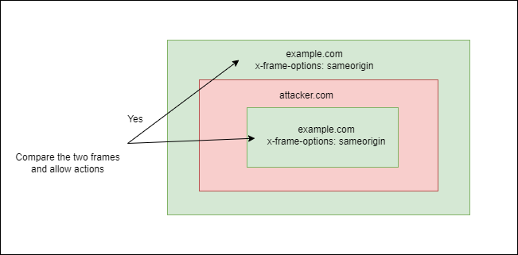
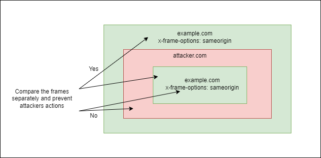

#### X frame options

X-frame options is a security feature in HTTP response header to protect websites from being used in an invisible frame by attackers. This controls whether a browser should be allowed to render a page in a frame, iframe, embed or object. This feature depends on whether the browser supports the X-frame-options.

* There are two possible directives as DENY and SAMEORIGIN.

  * **DENY**: Page cannot be displayed in a frame, regardless of the site attempting to do so.
  * **SAMEORIGIN**: The page can only be displayed if all ancestor frames are the same origin to the page itself.
 
#### Slide 48

1. The browsers were used to check the X-frame option “sameorigin” only against the top most window earlier. So attackers still can act on the site with multiple levels of embedding.

 <kbd></kbd>

2. But if the browser can implement a method to check all the cascading levels with X-frame option “sameorigin” and decide based on a condition, there is a less chance of being attacked.

<kbd></kbd>

The X-frame options header directive “Allow-from”, which is out of date, has been improved by content security policy directive “frame-ancestors” to provide a solution to the issue in (1.).

