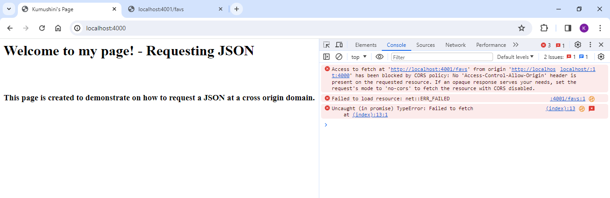
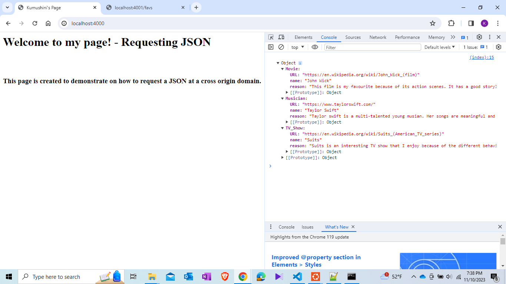
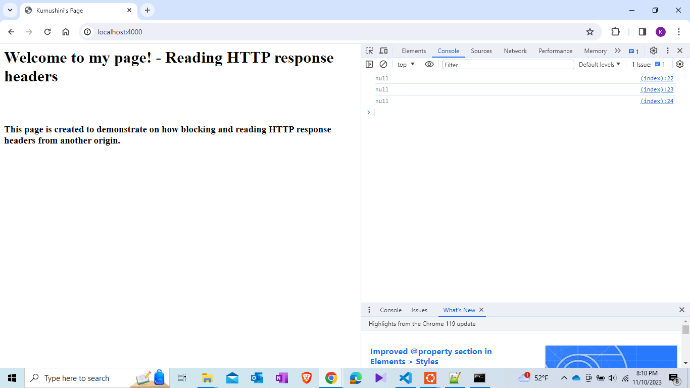
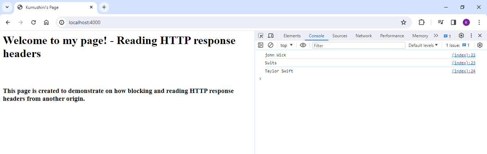
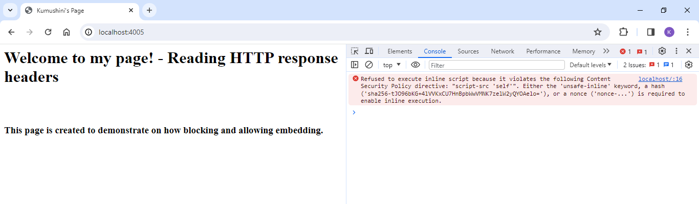
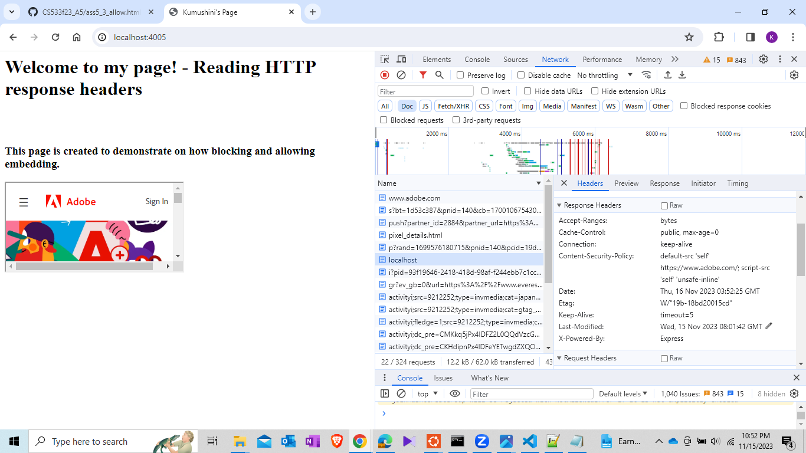
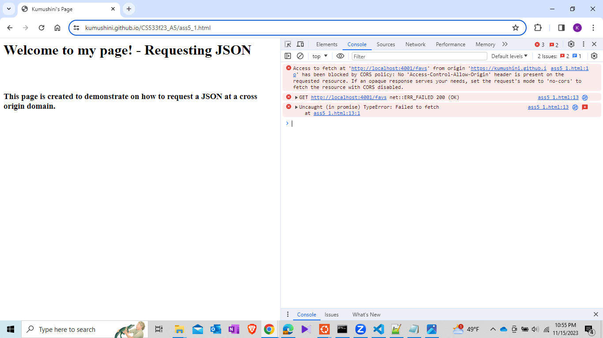
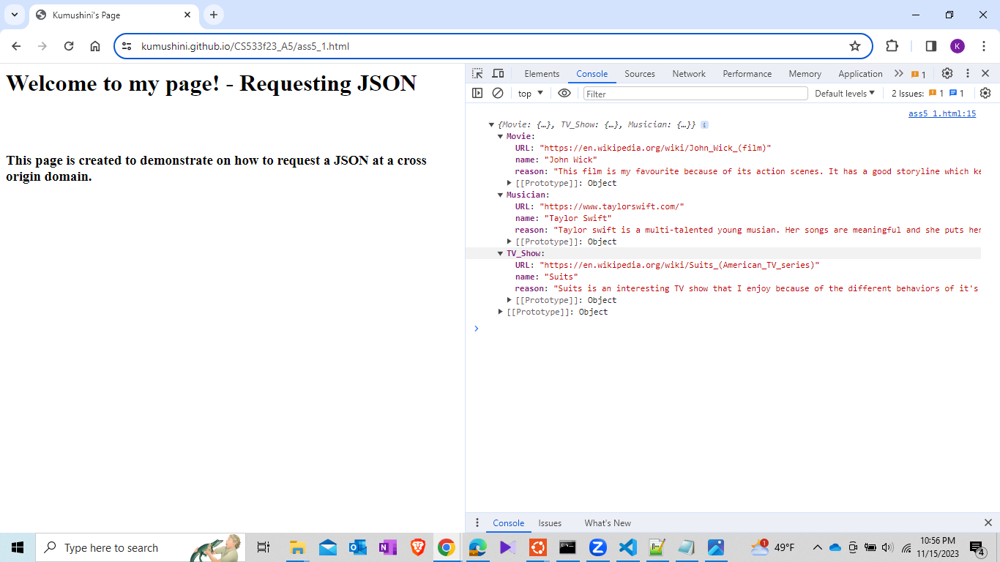
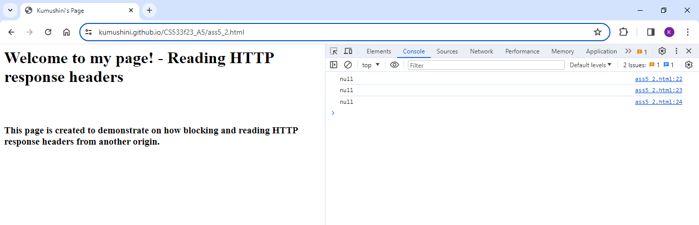

## Assignment 5 - Kumushini(01251889)

## CORS: Blocking and reading responses from another origin

### List of files in 5.1

* [favs.json](5.1/favs.json) - contains the json file created with favourite movie, TV show and artist.
* [kumu_1.html](5.1/kumu_1.html) - html file trying to fetch json object.
* [server.js](5.1/server.js) - server used to render kumu_1.html.
* [server_deny.js](5.1/server_deny.js) - server without CORS.
* [server_allow.js](5.1/server_allow.js) - server with CORS.

### Youtube video for framable is available at: https://youtu.be/Fe6UCZWEKRI

### Summary

 1.Demonstrating the request for the favs.json response from another origin is denied by CORS policy.

 <kbd></kbd>

 2. Demonstrating the request for the favs.json response from another origin is allowed when the 'Access-Control-Allow-Origin' header is set for the JSON response.

```
var cors = require('cors')
app.use(cors())

```

 <kbd></kbd>


## CORS: Blocking and reading HTTP response headers from another origin

### List of files in 5.2

* [kumu_2.html](5.2/kumu_2html) - contains the html file trying to fetch response headers.
* [server.js](5.2/server.js) - server used to render kumu_2.html.
* [server_deny.js](5.2/server_deny.js) - server without Access-Control-Expose-Headers.
* [server_allow.js](5.2server_allow.js) - server with Access-Control-Expose-Headers.

### Youtube video for framable is available at: https://youtu.be/wQn2ufQal2A

### Summary

 1. Custom response headers

```
res.set('Access-Control-Expose-Headers', '*')
res.set('X-CS533f23-movie', 'john Wick')
res.set('X-CS533f23-tvshow', 'Suits')
res.set('X-CS533f23-musician', 'Taylor Swift') 
```

2. Below sreenshot demonstrates how the response headers set on a remote origin are denied by the the html file host in localhost:4000

 <kbd></kbd>

3. Demonstrating how html file fetch the response headers from a remote origin when the 'Access-Control-Expose-Headers' header is set. 

  ```
  app.get("/", function (req, res) {
	res.set('Access-Control-Expose-Headers', '*')
  res.set('X-CS533f23-movie', 'john Wick')
	res.set('X-CS533f23-tvshow', 'Suits')
	res.set('X-CS533f23-musician', 'Taylor Swift') 
	res.send("<html><head><title>Kumushini's Page</title></head><body><h1>Welcome to my page! - Reading HTTP response headers</h1></body></html>")
});

  ```

 <kbd></kbd>

 <kbd></kbd>

## Content-Security-Policy: embedding from another site

### List of files in 5.3

* [kumu_3.html](5.2/kumu_2html) - html file with iframe
* [server_deny.js](5.3/server_deny.js) - server with Content-Security-Policy:"default-src 'self'; script-src 'self'".
* [server_allow.js](5.3server_allow.js) - server with Content-Security-Policy:"default-src 'self' https://www.adobe.com/; script-src 'self' 'unsafe-inline'"

### Youtube video for framable is available at: https://youtu.be/qg1ZtjqzGGo

### Summary

1. Demonstrating the use of 'Content-Security-Policy' to deny the embedding of a site from a different origin.

```
'Content-Security-Policy', "default-src 'self'; script-src 'self'"
```

 <kbd></kbd>


1. Demonstrating the use of 'Content-Security-Policy' to allow embedding of a site from a different origin.

```
'Content-Security-Policy', "default-src 'self' https://www.adobe.com/; script-src 'self' 'unsafe-inline'"
```

 <kbd></kbd>


## Extra credit

### List of files in 5.4

* [ass5_1.html](5.4/ass5_1.htmll) - html file to demonstrate -> CORS: Blocking and reading responses from another origin.
* [ass5_2.html](5.4/ass5_2.html) - html file to demonstrate ->CORS: Blocking and reading HTTP response headers from another origin.
* [ass5_3.html](5.4/ass5_3.html) - html file to demonstrate -> Content-Security-Policy: embedding from another site.
* [ass5_3_allow.html](ass5_3_allow.html) -  html file to demonstrate -> Content-Security-Policy: embedding from another site.
* [index.html](5.4/index.html) - html file hosted on github.

### Summary

1.Demonstrating the page hosted in github denying the request to fetch the JSON object from a different origin

 <kbd></kbd>

2.Demonstrating the page hosted in github allowing the request to fetch the JSON object from a different origin

 <kbd></kbd>

3.Demonstrating the page hosted in github denying the request to fetch the response headers from a different origin

 <kbd></kbd>

4.Demonstrating the page hosted in github allowing the request to fetch the response headers from a different origin

 <kbd></kbd>


### Youtube video for framable is available at: https://youtu.be/5MuF66G28LM

