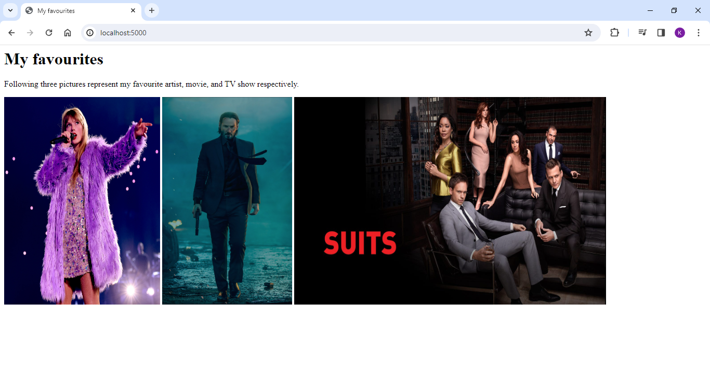
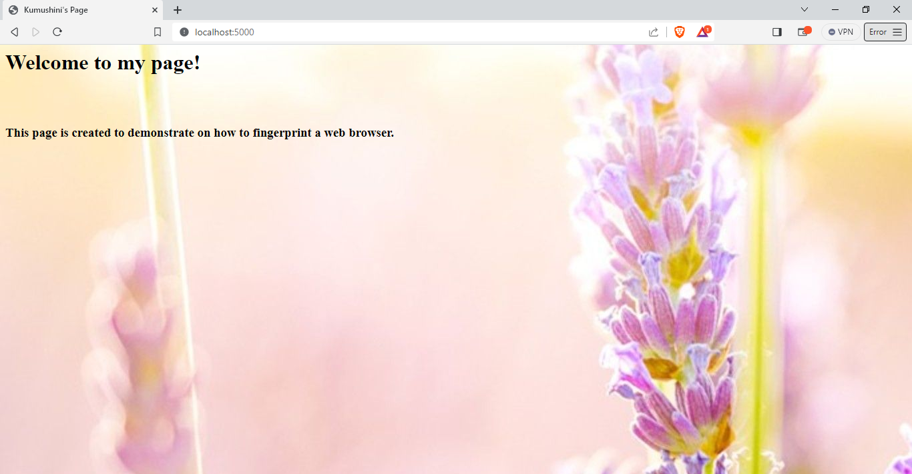
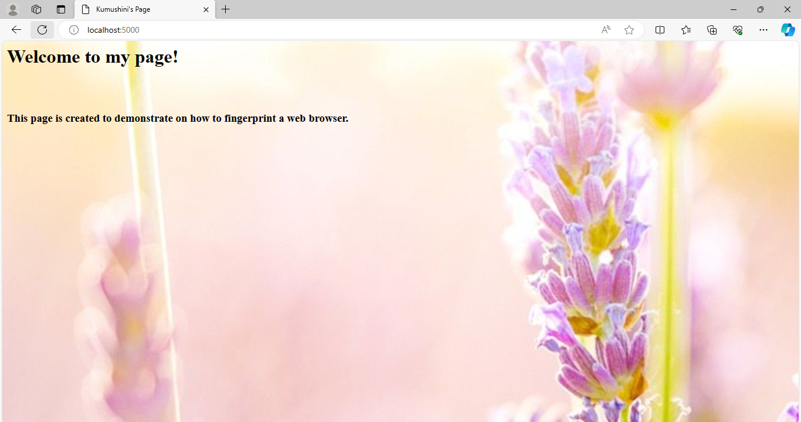
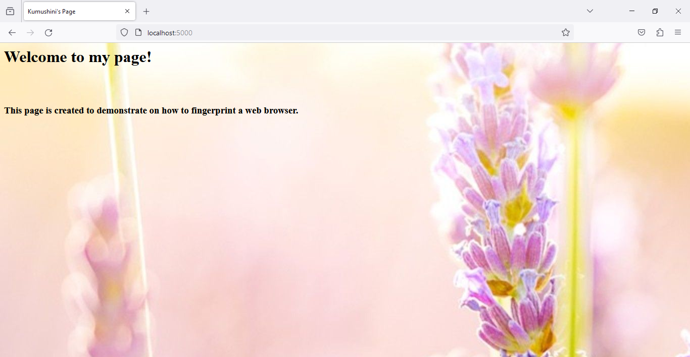

## Assignment 6 - Kumushini(01251889)

## Fingerprinting different clients

### List of files in 6

* [kumu_1.html](kumu_1.html) - html file served to different clients.
* [server.js](server.js) - server used to host kumu_1.html and create fingerprints.
* [visitors_log.json](visitors_log.json) - json file used to log visitor details.

### Youtube video is available at: https://youtu.be/sGveWuaThTk  

### Summary

 1. Creating fingerprints.

Following code collects three different HTTP request headers using [req.get](https://expressjs.com/en/api.html#req.get) and concatenate them into a single string and save as a hash function using [md5](https://www.npmjs.com/package/md5).

```
//collect request headers
	header1 = req.get('User-Agent');
	header2 = req.get('Accept');
	header3 = req.get('Accept-Language');
	header4 = req.get('Accept-Encoding');
	
//Concat features to creat a string
	var fingerprint = header1.concat(header2, header3, header4);
		
//fingerprint into hash value
	var fingerprint_id = md5(fingerprint);

```

2. Creating an array item for one visitor.

```
jsonData.visitors.push({
	id: fingerprint_id,
	User_Agent: header1,
	Accept: header2,
	Accept_Language: header3,
	Accept_Encoding: header4,
	last_visit_date: [new Date()],
	visit_count:1			
	});
			
	fs.writeFileSync('visitors_log.json', JSON.stringify(jsonData) + "\n", 'utf-8', (err) => {
	if (err) throw err;
	});

```

 3. Log visitor details to visitor_log.json.

The server follows the steps stated below when logging visitor details:

  i.   Access the log file and checks whether the fingerprint exists. <br>
  ii.  If fingerprint is found update the visit count and last visit date and update log file with new data. <br>
  iii. If the fingerprint is new, add new data to the file.


4. Screenshots of demonstrations with five different browsers.

* Google Chrome (device - Laptop)

 <kbd></kbd>


* Brave (device - Laptop)

 <kbd></kbd>


* Microsoft Edge (device - Laptop)

 <kbd></kbd>


* Firefox (device - Laptop)

 <kbd></kbd>


* curl (device - Laptop)

 <kbd></kbd>


4. Screenshot of demonstration with mobile phone.

 <kbd></kbd>


