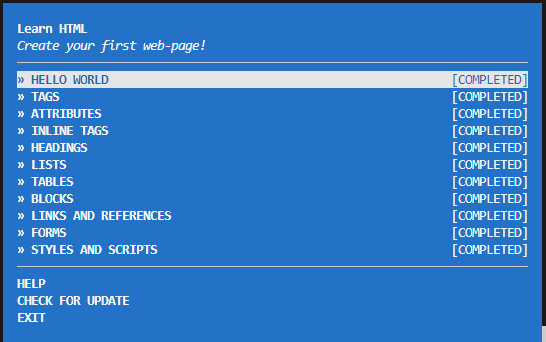

This assignment was about learning html, javascript, and node.
For each module we had to read, learn, code, and verify if our work was valid. 
By doing so showed our understnading and we could move on to the next module. 

For all my work done for assignment it can be found here: cs533-f23/assignments/patel/1

Below are Three screen shots, each showing my completion of html, javascript, and node. 

Youtube link : https://youtu.be/CyHGf0_9LyE