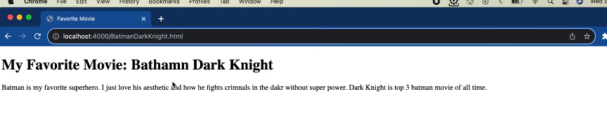
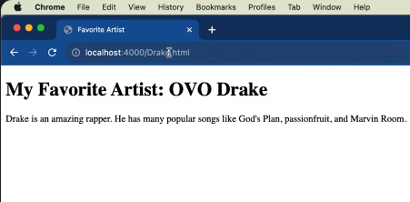
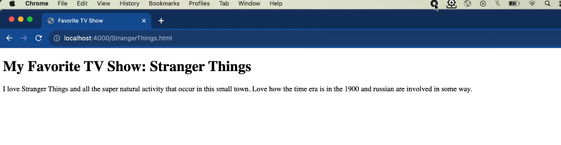

Assignment 2 

I created 3 html files which list my favorite Movie, Artist, and TV show. 
I then created a javascript code to connect to port 4000. 
It can be run by executing the following command: node server.js

Below is the screenshots of me connecting to the port displaying my favorite movie, artist, and tv show.

  

Youtube link: https://youtu.be/_lYT-KiF7aw